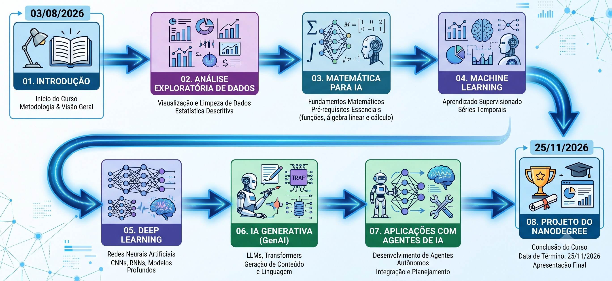
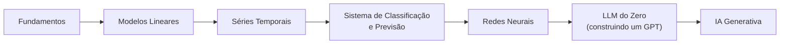

# Roadmap

Em uma imagem, este é o mapa dos conteúdos trabalhados no Nanodegree de
IA & ML:

<figure><figcaption></figcaption></figure>

Os conteúdos equilibram duas forças da área: fundamentos e novidades. As
bases da matemática e do aprendizado de máquina provavelmente não vão mudar,
e é por isso que trabalhamos esses conteúdos: uma base sólida importa. Por
outro lado, muita coisa nova apareceu nos últimos três anos. Abordamos essas
novidades dentro do contexto dos fundamentos, para que você fique bem
informado dos últimos avanços da área.


Em qualquer área sempre existem fundamentos. _Dominar os fundamentos é
essencial!_ Mas estar a par das tendências atuais é um segundo passo
importante.


## Como este curso funciona

Você não precisa saber programar bem, nem lembrar de cálculo, para
acompanhar. Cada aula parte de uma situação concreta, o preço de um
aluguel, a previsão de vendas de uma cafeteria, e só depois mostra a
matemática por trás dela.

As fórmulas aparecem sempre traduzidas para português simples, com um
exemplo numérico ao lado. Você não vai decorar símbolos: vai entender o que
cada um faz.

Cada aula tem três materiais, sempre juntos:

- **Esta página do GitBook**, com a teoria completa, para ler antes ou
  depois da aula.
- **Um slide de apoio**, usado durante a aula ao vivo.
- **Um notebook do Google Colab**, onde você roda o código e faz os
  exercícios.

Antes da primeira aula, leia [Antes de começar](antes-de-comecar.md). Leva
dois minutos e evita perder tempo de aula com configuração.

A única aula fora desse formato é a
[Aula 6](sistemas-de-ml/aula-06-sistema-ponta-a-ponta.md), que a turma
constrói no VS Code, no próprio computador, seguindo o README do projeto em
vez de slides.

## O caminho do curso

| Módulo | O que você aprende |
|---|---|
| [Fundamentos](fundamentos/contexto-historico.md) | De onde veio a IA, e o que separa um modelo de um produto |
| [Modelos Lineares](modelos-lineares/README.md) | Prever um número ou uma categoria a partir de dados, e entender por que o modelo decide o que decide |
| [Séries Temporais](series-temporais/README.md) | Prever o futuro de algo que muda com o tempo |
| [Sistemas de Classificação e Previsão](sistemas-de-ml/README.md) | Juntar um classificador e um modelo de previsão num sistema só |
| [Redes Neurais](redes-neurais/README.md) | Como uma rede neural aprende, do neurônio à imagem |
| [LLM do Zero](llm-do-zero/README.md) | Construir um modelo de linguagem, peça por peça, em PyTorch |
| [IA Generativa](ia-generativa/README.md) | Usar um modelo pronto, e construir uma aplicação em cima dele |

Todo termo técnico novo entra no [Glossário](glossario.md), que cresce ao
longo do curso: sempre que uma aula usa uma palavra difícil pela primeira
vez, ela aparece lá.
