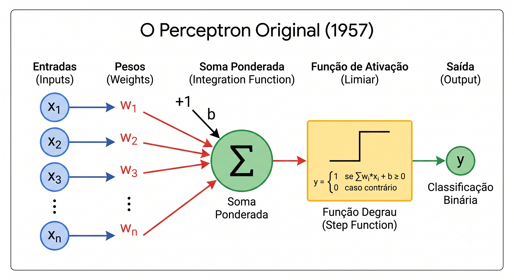

# 0. Contexto Histórico


**O que você leva desta página**

A IA não nasceu em 2022. Ela tem setenta anos, dois invernos e uma virada
de método que explica tudo o que você vai estudar neste curso. Saber essa
história é o que separa o encantamento ingênuo do ceticismo apressado.


## A pergunta que começou tudo

Em 1950, Alan Turing fez uma pergunta: uma máquina pode pensar?

Ele percebeu na hora que a pergunta era ruim. Ninguém consegue definir
"pensar" de um jeito que todo mundo aceite. Então trocou por outra, que dá
para testar: se você conversar com uma máquina e não conseguir dizer se do
outro lado tem uma pessoa, faz sentido chamar aquilo de inteligência?

A troca não resolveu nada. Deu à área um ponto de partida, e isso já foi
muito.

Seis anos depois, em 1956, a Conferência de Dartmouth batizou o campo:
**inteligência artificial**. É a data de nascimento oficial. O entusiasmo
era enorme, e as previsões também: muita gente achava que em poucas
décadas as máquinas fariam quase todo trabalho intelectual humano.

Os computadores da época eram lentos, caros e limitadíssimos.

## O perceptron: a semente

No mesmo período apareceu o **perceptron**, a primeira tentativa séria de
copiar um neurônio. A ideia cabe em uma frase: receba várias entradas,
combine com pesos, produza uma resposta.

<figure><figcaption>Entradas, pesos, uma soma, uma resposta. É a Aula 1 deste curso, e é de 1958.</figcaption></figure>

Guarde esse desenho. Ele é literalmente a Aula 1 do nosso curso: uma soma
de entradas, cada uma com o seu peso. O que mudou de 1958 para cá não foi
a ideia, foi a escala.

O perceptron plantou a semente das redes neurais. E plantou algo maior: a
suspeita de que a inteligência de uma máquina talvez não precisasse vir de
regras escritas à mão.

## A IA simbólica, e por que ela travou

Nos anos 1960 a área viveu uma fase de otimismo. Sistemas simbólicos
resolviam teoremas. O programa [ELIZA](https://www.masswerk.at/elizabot/)
simulava uma conversa e impressionava as pessoas.

<figure><figcaption>Joseph Weizenbaum escreveu ELIZA em 1966. Ele passou o resto da vida alertando contra o que as pessoas achavam que ela era.</figcaption></figure>

ELIZA ensinou uma lição que vale exatamente igual hoje: **uma conversa
simples já causa a impressão de compreensão**. Parecia inteligência. Era
manipulação de regras.

O problema apareceu quando tentaram sair do laboratório. A IA simbólica
funciona escrevendo regras do tipo "se acontecer X, faça Y". Isso vai bem
em domínios pequenos e controlados. E fracassa no bom senso, na ambiguidade
da linguagem e na bagunça da vida real.

Escrever à mão todas as regras do mundo é impossível. Não é difícil: é
impossível.


**A IA simbólica não morreu**

Ela virou ferramenta especializada. A biblioteca
[SymPy](https://www.sympy.org/en/index.html) faz matemática simbólica e é
excelente naquilo. E existe uma linha de pesquisa ativa em arquiteturas
[neuro-simbólicas](https://arxiv.org/abs/2305.00813), que tentam juntar as
duas abordagens.


## Dois invernos

Na década de 1970 veio o primeiro recuo, e o nome que ficou é bom demais
para não usar: **o primeiro inverno da IA**. O entusiasmo esfriou, as
promessas pareceram exageradas, o dinheiro sumiu. O relatório Lighthill, de
1973, criticou os resultados da área no Reino Unido e ajudou a fechar a
torneira.

A pesquisa não parou. O robô Shakey e os primeiros trabalhos em aprendizado
por reforço mantiveram viva a ideia de máquinas que agem e aprendem.

Nos anos 1980 veio a recuperação, com os **sistemas especialistas**. A
mudança de estratégia foi esperta: em vez de imitar toda a inteligência
humana, resolver uma tarefa só. Diagnosticar uma doença. Apoiar uma decisão
de crédito. O método era reunir numa base o conhecimento de especialistas
humanos, e em muitos casos funcionou.

No mesmo período, a **retropropagação** deu às redes neurais um jeito
prático de ajustar pesos a partir dos erros. É o gradiente descendente da
nossa Aula 1.

E veio o segundo obstáculo. Os sistemas especialistas dependiam de
conhecimento humano inserido a mão: caro, lento e difícil de manter. Sem
dados abundantes e sem infraestrutura, envelheciam depressa. Resultado:
**segundo inverno**.

| Ciclo | Quando | O que empolgou | O que travou |
|---|---|---|---|
| Otimismo simbólico | 1956 a 1973 | teoremas, ELIZA | regras não cobrem o mundo real |
| Primeiro inverno | 1973 a 1980 | | corte de financiamento |
| Sistemas especialistas | 1980 a 1987 | diagnóstico, retropropagação | conhecimento a mão é caro |
| Segundo inverno | 1987 a 1993 | | falta de dados e de máquina |
| Aprendizado de máquina | 1990 em diante | a Web gerando dados | (a virada que ficou) |

## A virada: parar de escrever regras

Nos anos 1990 aconteceu a mudança que sustenta este curso inteiro, e ela
foi silenciosa. A Web começou a produzir dados em volume nunca visto, e a
expressão "inteligência artificial" perdeu espaço para uma mais modesta:
**aprendizado de máquina**.

A troca de nome escondia uma troca de método:

| Abordagem | Quem escreve a regra |
|---|---|
| Programação tradicional | uma pessoa escreve as regras, e o programa segue |
| Aprendizado de máquina | você dá exemplos, e o programa acha a regra sozinho |

Pense em filtrar spam. Escrever à mão todas as regras que separam spam de
e-mail legítimo é aquele problema impossível de novo. Mas mostre ao
programa alguns milhares de exemplos marcados, e ele encontra sozinho as
combinações de palavras, formatos e comportamentos que denunciam spam.

É esse o movimento. E é exatamente o que você vai fazer na Aula 1, com
aluguéis em vez de spam.

## O que fez a coisa funcionar

Nos anos 2000 a internet passou a gerar um volume gigantesco de dados. Ao
mesmo tempo, as **GPUs**, criadas para jogos, se revelaram perfeitas para
treinar redes grandes.

O avanço da IA não veio de uma descoberta milagrosa. Veio de três coisas
chegando juntas:

| Ingrediente | O que trouxe |
|---|---|
| Algoritmos | redes profundas melhor compreendidas |
| Dados | a internet inteira, gerada de graça pelos usuários |
| Máquina | GPUs, capazes de milhares de contas em paralelo |

Tire qualquer um dos três e nada acontece. Foi preciso os três.

Na década de 2010 o **aprendizado profundo** virou protagonista. Visão
computacional, fala e linguagem deram saltos. Assistentes virtuais
apareceram no bolso de todo mundo. A IA saiu do laboratório e entrou no
produto.

## O que veio junto, e não é bonito

O avanço trouxe problemas novos, e vale nomear os quatro que mais aparecem:

| Problema | O que acontece |
|---|---|
| Viés herdado | o modelo aprende o preconceito que estava nos dados |
| Erro desigual | reconhecimento facial que erra mais em uns grupos que em outros |
| Alucinação | resposta errada com aparência de resposta certa |
| Deepfake | áudio e vídeo falsos, difíceis de distinguir do real |

E uma lição que a história repete: **vencer um teste específico não é
entender o mundo**. Modelos que batem recordes em benchmarks ainda tropeçam
em dirigir numa rua caótica.

Desde 2020 estamos na era generativa. Modelos escrevem texto, imagem,
código e áudio com fluência surpreendente, e a IA deixou de ser uma peça
escondida dentro de sistemas corporativos para virar um assistente com quem
você conversa. O alcance cresceu, e os debates sobre desinformação e
direito autoral cresceram junto.

## A leitura que interessa

Olhe a tabela dos ciclos de novo. Entusiasmo, decepção, método novo,
recursos novos, nova onda. Isso não é fracasso: é uma área aprendendo com
os próprios limites.

Daí a lição para quem está começando:

> Inteligência artificial não é mágica. É um campo construído com
> hipóteses, experimentos, erros e revisões, por pessoas, com dados de
> pessoas, e limitado pelas escolhas dessas pessoas.

Entender a história evita os dois extremos que mais atrapalham: o
encantamento ingênuo, que acha que a máquina pensa, e o ceticismo
apressado, que acha que não mudou nada.

A pergunta de Turing continua aberta, e hoje ela tem uma versão mais útil:
que tipo de inteligência queremos construir, e para servir a que tipo de
sociedade?

## Cola

| Conceito | O que significa |
|---|---|
| Teste de Turing | trocar "a máquina pensa?" por "você percebe que não é gente?" |
| Dartmouth (1956) | a conferência que batizou a área |
| Perceptron | o primeiro neurônio artificial: entradas, pesos, uma resposta |
| IA simbólica | resolver por regras escritas à mão; trava fora do laboratório |
| Inverno da IA | período de descrédito e corte de financiamento (1973 e 1987) |
| Sistemas especialistas | uma tarefa só, com conhecimento humano numa base de regras |
| Retropropagação | o jeito de ajustar pesos a partir do erro |
| Aprendizado de máquina | dar exemplos em vez de escrever as regras |
| Os três ingredientes | algoritmos, dados e GPUs, chegando juntos |
| Era generativa | de 2020 em diante: o modelo produz texto, imagem, código e áudio |

## Explique sem olhar

1. Por que Turing trocou a pergunta "a máquina pode pensar?" por outra?
2. O que ELIZA ensinou, e por que a lição vale hoje?
3. Qual é a diferença de método entre programação tradicional e aprendizado de máquina?
4. Por que a IA não decolou nos anos 1980, se a retropropagação já existia?
5. Cite os três ingredientes da virada dos anos 2000, e diga o que acontece se faltar um.

## Para ir além

- [ELIZA, funcionando no navegador](https://www.masswerk.at/elizabot/): converse cinco minutos com o programa de 1966 e veja quanto tempo leva para você perceber o truque.
- [Arquiteturas neuro-simbólicas](https://arxiv.org/abs/2305.00813): a linha de pesquisa que tenta juntar regras e aprendizado.
- [Glossário](../glossario.md): para revisar qualquer termo novo desta página.

## Bibliografia

Bentley, P. J. (2025). _A história da inteligência artificial para quem tem pressa: o nascimento de uma nova era em apenas 200 páginas_ (A. Gordirro, Trad.). Rio de Janeiro: Editora Valentina.
