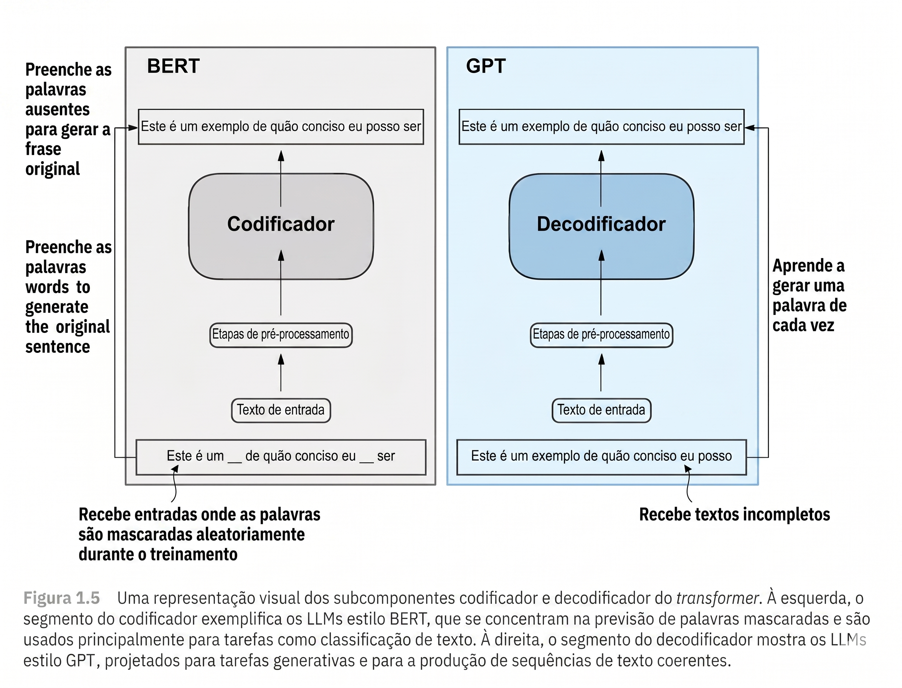
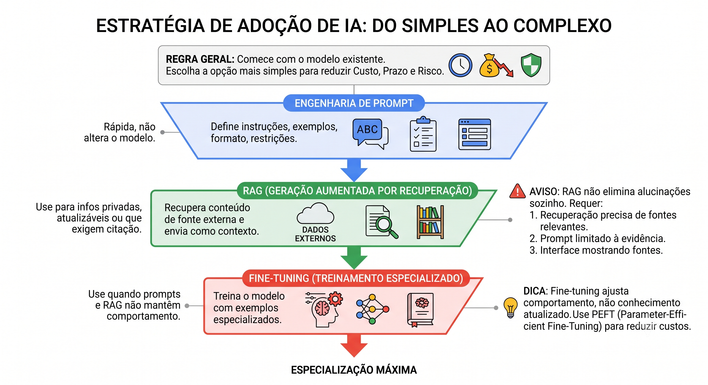
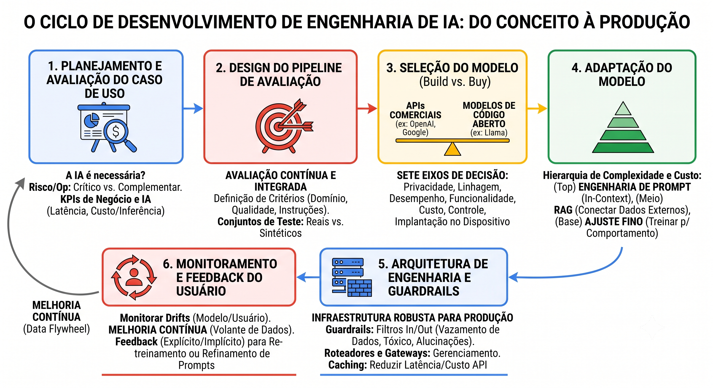

# 2. Engenharia de IA


**O que você leva desta página**

Engenharia de ML é treinar o seu modelo. Engenharia de IA é adaptar um
modelo que já existe. Você vai ver o que muda no trabalho, as três formas
de adaptar um modelo de fundação, e por que a parte difícil não é fazer
funcionar.


## A fronteira mudou de lugar

Até pouco tempo, usar IA de ponta exigia laboratório e infraestrutura cara.
Hoje, uma chave de API e vinte linhas de Python colocam um modelo estado da
arte dentro do seu produto.

**Engenharia de IA** é construir aplicações em cima de modelos de fundação
já treinados. E o trabalho não é chamar a API. É definir o problema, dar
contexto ao modelo, avaliar as respostas e operar o sistema com segurança.

| | Engenharia de ML | Engenharia de IA |
|---|---|---|
| O modelo | a equipe treina e mantém o seu | alguém já treinou |
| O trabalho central | dados e treino | contexto, avaliação e operação |
| Onde está o risco | o modelo não aprende | o modelo responde bem, e errado |


**A regra dos 80%**

Sair do zero a 80% e ter uma demonstração que funciona é fácil. Ir de 80% a
95% e ter um produto que aguenta produção é o trabalho inteiro.

Toda a diferença mora em avaliação, dados confiáveis, controle de acesso e
monitoramento. Nenhuma dessas coisas aparece na demonstração.


## A unidade de tudo: o token

Modelos de linguagem não leem texto como você. Eles trabalham com
**tokens**, que são pedaços de texto.

Um token pode ser uma palavra inteira, um pedaço dela ou um caractere só. A
divisão muda de modelo para modelo e de idioma para idioma. Em inglês,
`can't` costuma virar `can` e `'t`.

Por que não usar palavras inteiras? Por três motivos:

| Motivo | O que ganha |
|---|---|
| Cobertura | o modelo monta palavras que nunca viu, com pedaços que conhece |
| Eficiência | o vocabulário fica muito menor que uma lista de palavras |
| Flexibilidade | texto, código e símbolos usam a mesma representação |

Token não é detalhe técnico: é a unidade de **custo** e de **limite**. Você
paga por token, e a janela de contexto se mede em tokens. E a janela precisa
caber tudo: as instruções, os documentos recuperados, o histórico da
conversa e a resposta que está sendo gerada.

Uma regra aproximada para o inglês: 100 tokens dão umas 75 palavras. Em
português rende menos.


**Português custa mais caro**

Os grandes modelos treinaram os tokenizadores deles quase todo em inglês,
então o inglês comprime melhor. A mesma frase em português vira
mais tokens: mais custo e menos espaço na janela.

Vale testar em [gpt-tokenizer.dev](https://gpt-tokenizer.dev/): escreva uma
frase em português e a tradução dela, e compare a contagem.

Você vai construir um tokenizador desses do zero na Aula 9, e vai ver a
compressão acontecer com o texto do Machado de Assis.


## Como o modelo prevê: autorregressão

Modelos generativos são sistemas probabilísticos. Eles estimam a
probabilidade do próximo token, dado tudo que veio antes.

Em "Why does the chicken cross the ___", o modelo dá probabilidade alta a
`road`. Escolhe um token, cola no fim da frase, e repete. Cada palavra que
ele escreve vira entrada da próxima.

Por isso o nome: **modelo autorregressivo**. A família GPT inteira é assim.

E aqui está a consequência que gera quase todo mal-entendido sobre IA:

> O modelo não consulta uma fonte de verdade. Ele gera a continuação mais
> provável. Uma resposta fluida pode estar completamente errada.

<figure><figcaption>Autorregressivo prevê o que vem depois. Mascarado preenche buracos no meio.</figcaption></figure>

Existe outra família, os modelos **mascarados**, como o BERT. Eles
preenchem lacunas no meio do texto, e são bons em classificação e análise
de sentimento. Para gerar texto, código e diálogo, os autorregressivos
dominaram.

## O truque que permitiu a escala: auto-supervisão

Durante anos, rotular dados a mão foi o gargalo do ML. Para ensinar um
modelo a distinguir gato de cachorro, alguém tinha que marcar cada foto.

A **auto-supervisão** resolve isso de um jeito quase óbvio depois que você
vê: o próprio dado já contém a resposta. Em texto, o que veio antes é o
contexto, e o próximo token é o alvo.

Veja a frase "I love street food" virando seis exemplos de treino:

| Entrada (contexto) | Alvo (próximo token) |
|---|---|
| `<BOS>` | I |
| I | love |
| I love | street |
| I love street | food |
| I love street food | . |
| I love street food . | `<EOS>` |

Nenhuma pessoa rotulou nada. `<BOS>` e `<EOS>` são tokens especiais que
marcam começo e fim de sequência.

Agora multiplique isso por toda a internet. É daí que saem os modelos de
fundação, e é exatamente esse par entrada/alvo que você vai montar na
Aula 9.

## Modelos de fundação e multimodalidade

Um **modelo de fundação** aprende padrões amplos com um volume enorme de
dados, e depois se adapta a muitas tarefas sem precisar treinar de novo do
zero.

Muitos são **multimodais**: processam combinações de texto, imagem, áudio e
vídeo. Modelos como o CLIP aprendem a relação entre uma imagem e a
descrição dela, e esses pares substituem boa parte da rotulagem manual.

O modelo entrega capacidade geral. Quem transforma capacidade em valor é a
aplicação.

## As três formas de adaptar, da mais barata para a mais cara

A regra é começar pela mais simples que resolva. Cada degrau custa mais
dinheiro, mais prazo e mais risco.

<figure><figcaption>Suba um degrau só quando o de baixo não resolver.</figcaption></figure>

| Técnica | O que faz | Quando usar |
|---|---|---|
| **Engenharia de prompt** | define instruções, exemplos, formato e limites | sempre; é o primeiro degrau |
| **RAG** | busca conteúdo numa fonte externa e manda junto no contexto | informação privada, que muda, ou que precisa de citação |
| **Ajuste fino** | treina o modelo com exemplos especializados | quando prompt e RAG não seguram o comportamento |

Duas confusões que custam caro:

**RAG não cura alucinação sozinho.** Ele só ajuda se a busca trouxer a
fonte certa, se o prompt mandar responder apenas com base nas evidências, e
se a interface mostrar de onde veio a resposta. Sem os três, você trocou
uma alucinação por uma alucinação com aparência de fonte.

**Ajuste fino não é base de conhecimento.** Ele muda comportamento, tom e
formato. Ele não mantém a informação atualizada. Para conhecimento que
muda, use RAG. Técnicas de **PEFT** (*parameter-efficient fine-tuning*)
baixam bastante o custo do treino, mas não mudam essa divisão de tarefas.

Você constrói um RAG do zero na Aula 14.

## O ciclo de uma aplicação de IA

O processo é iterativo, e difere do ciclo de ML tradicional por gastar quase
nada em treino e quase tudo em **adaptação e avaliação**.

<figure><figcaption>Seis etapas. A segunda é a que todo mundo pula, e é a que decide o projeto.</figcaption></figure>

**1. Planejar e avaliar o caso de uso.** Antes de qualquer código: a IA é a
ferramenta certa aqui? Ela é crítica ao produto ou enfeite? E como vamos
medir sucesso, em métrica de negócio e em latência e custo por resposta?

**2. Desenhar o pipeline de avaliação.** Esta é a etapa mais difícil, e a
mais pulada. Como os modelos de fundação respondem de forma aberta, você
precisa de critérios escritos e de um conjunto de casos de teste, real ou
sintético, para saber se uma mudança melhorou ou piorou.

**3. Escolher o modelo.** API comercial ou modelo aberto hospedado por
você? A decisão pesa sete eixos: privacidade dos dados, linhagem do modelo,
desempenho, funcionalidades, custo, controle e possibilidade de rodar no
dispositivo.

**4. Adaptar.** Os três degraus da seção anterior, na ordem.

**5. Arquitetura e guardrails.** O que separa protótipo de produto:

| Peça | Para que serve |
|---|---|
| Guardrails | filtram entrada e saída: dado sensível, conteúdo tóxico, alucinação grave |
| Roteadores e gateways | mandam cada pedido ao modelo certo e controlam custo |
| Cache | guardam respostas repetidas, e cortam latência e conta |

**6. Monitorar e coletar feedback.** Depois no ar, acompanhe os desvios de
comportamento do modelo e do usuário. O feedback, explícito ou implícito,
alimenta o que se chama de **volante de dados**: o uso melhora o sistema,
que atrai mais uso.

## Avaliar é testar o que dá errado

Monte um conjunto de casos que represente a realidade: os comuns, os
difíceis e os maliciosos. Em cada resposta, olhe correção, completude,
formato e presença de fonte.

E teste de propósito as três falhas previsíveis:

| Falha | O que acontece |
|---|---|
| Alucinação | a resposta inventa um fato ou uma fonte |
| Instrução maliciosa | um documento tenta mudar as regras da sua aplicação |
| Vazamento | dado pessoal ou interno aparece no prompt ou na resposta |

A segunda merece atenção. Se a sua aplicação lê documentos que outras
pessoas escreveram, alguém pode esconder instruções lá dentro. O modelo não
distingue por conta própria o que é conteúdo e o que é ordem.

Defina limites claros, filtre dado sensível, controle o acesso às fontes e
mantenha revisão humana onde a decisão pesa.

## Onde isso rende de verdade

IA generativa ajuda mais em tarefas repetitivas, com bastante contexto
disponível e resultado que alguém consegue revisar.

| Caso | O que faz |
|---|---|
| Assistente interno | responde com base em políticas, manuais e documentação da casa |
| Extração de documentos | transforma PDF e imagem em dado estruturado |
| Apoio ao desenvolvimento | explica, testa, refatora e documenta código |

O objetivo não é automatizar tudo. É montar fluxos verificáveis, onde
pessoa e sistema entregam mais juntos do que separados.

## Cola

| Conceito | O que significa |
|---|---|
| Engenharia de IA | construir aplicações com modelos que outra pessoa treinou |
| Token | o pedaço de texto que o modelo processa, e a unidade de custo |
| Janela de contexto | quantos tokens cabem: instruções, documentos, histórico e resposta |
| Autorregressivo | prevê o próximo token e realimenta o que gerou |
| Mascarado | preenche lacunas no meio do texto (BERT) |
| Auto-supervisão | o próprio dado fornece o alvo, sem rotulagem humana |
| Modelo de fundação | treinado em escala, adaptável a muitas tarefas |
| Engenharia de prompt | instruções, exemplos e formato; o degrau mais barato |
| RAG | buscar contexto numa fonte externa e mandar junto |
| Ajuste fino | treinar com exemplos para mudar comportamento, tom ou formato |
| Guardrail | filtro de entrada e saída, contra vazamento e conteúdo tóxico |
| Volante de dados | o uso gera feedback, que melhora o sistema, que atrai mais uso |

## Explique sem olhar

1. Qual é a diferença de trabalho entre engenharia de ML e engenharia de IA?
2. Por que a mesma frase custa mais em português que em inglês?
3. O que significa dizer que o modelo é autorregressivo, e qual o risco disso?
4. Nas três formas de adaptar um modelo, quando você sobe do prompt para o RAG?
5. Por que RAG sozinho não resolve alucinação?
6. Qual etapa do ciclo todo mundo pula, e o que acontece por causa disso?

## Para ir além

- [Um tokenizador no navegador](https://gpt-tokenizer.dev/): cole uma frase em português e a tradução em inglês, e compare a contagem.
- [AI Engineering](https://www.oreilly.com/library/view/ai-engineering/9781098166298/), de Chip Huyen: o livro que organiza esta página.
- [Aula 13, Modelos de Fundação](../ia-generativa/aula-13-modelos-de-fundacao.md) e [Aula 14, Uma Aplicação de Verdade](../ia-generativa/aula-14-aplicacao-rag.md): onde você constrói o RAG.
- [Glossário](../glossario.md): para revisar qualquer termo novo desta página.

## Bibliografia

Huyen, C. (2025). _AI Engineering: Building Applications with Foundation Models_. O'Reilly Media.
