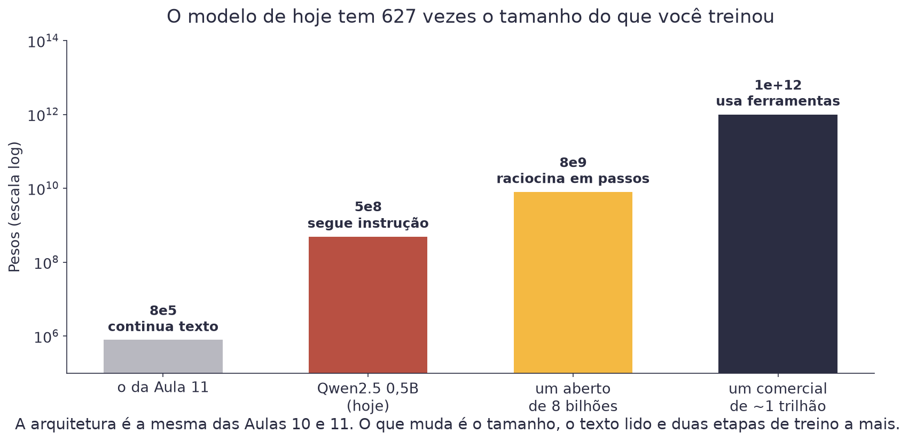
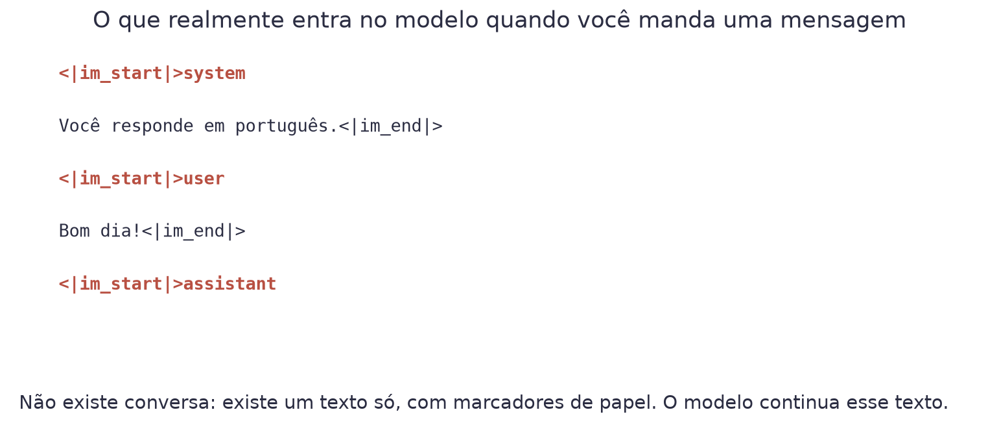
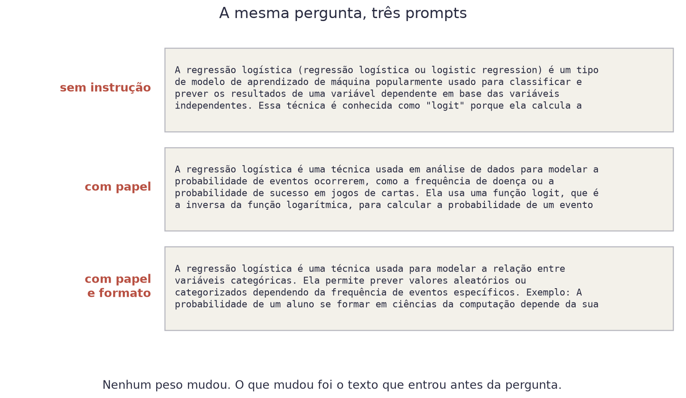
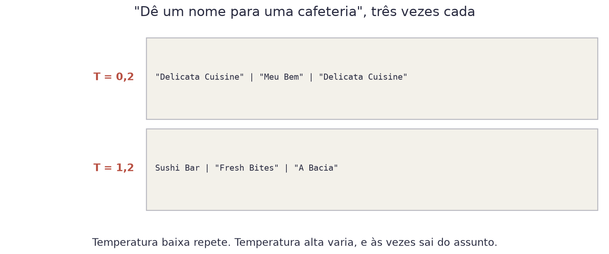
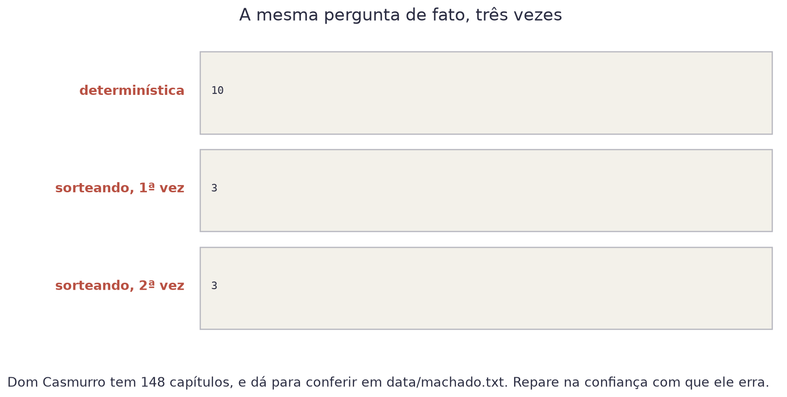

# Aula 13 — Modelos de Fundação


**O que você leva desta aula**

Você vai rodar um modelo de 494 milhões de pesos no Colab, sem chave de
API nem cadastro, entender o que realmente acontece quando você "conversa"
com um deles, e sair sabendo escrever um prompt que funciona.


## De 787 mil para 494 milhões

Na Aula 11 você treinou um modelo de 787.584 pesos, em 40 minutos de
processador. Ele continua texto e escreve com a grafia de 1899. É um
modelo de verdade, e é pequeno.

<figure><figcaption>Cada barra é cerca de mil vezes a anterior. A arquitetura é a mesma nas quatro.</figcaption></figure>

O modelo de hoje tem 627 vezes o tamanho do seu. Ele se chama
**Qwen2.5-0.5B-Instruct**, é aberto, e cabe em uma pasta de 1 gigabyte.

Ele já tem sucessor: a família Qwen3 saiu em 2025, com um modelo de 0,6
bilhão no mesmo papel, e outros vão sair depois dela. O curso fica na
versão 2.5 porque medimos todos os números desta página nela. Trocar
de modelo é mudar uma linha, e o resto do código continua igual. Essa é
uma das graças de usar a biblioteca padrão.

Um **modelo de fundação** (*foundation model*) é um modelo grande, treinado
uma vez em muito texto, que serve de base para muitas tarefas diferentes
sem precisar de treino novo. "Fundação" no sentido de alicerce: você
constrói em cima.

## As três etapas

O que separa um continuador de texto de um assistente são duas etapas de
treino a mais, e nenhuma delas usa técnica nova.

| Etapa | O que faz | Onde você viu |
|---|---|---|
| Pré-treino | prever o próximo token, em trilhões de tokens | Aula 11 |
| Ajuste por instrução | treinar em pares de pergunta e resposta boa | é a mesma perda |
| Ajuste por preferência | treinar com pessoas comparando duas respostas | é o mesmo gradiente |

O `-Instruct` no nome do modelo quer dizer exatamente isso: ele passou
pelas três. A versão sem o sufixo passou só pela primeira, e se comporta
como o seu modelo da Aula 12.

## Rodar: três linhas

```python
from transformers import AutoModelForCausalLM, AutoTokenizer

tokenizador = AutoTokenizer.from_pretrained("Qwen/Qwen2.5-0.5B-Instruct")
modelo = AutoModelForCausalLM.from_pretrained("Qwen/Qwen2.5-0.5B-Instruct")
```

A biblioteca `transformers` já vem no Colab. Na primeira vez ela baixa 1
gigabyte do Hugging Face, que é o repositório público onde quase todo
modelo aberto mora. Não há cadastro, chave nem cobrança.


**Sobre a paciência**

No processador, esse modelo gera cerca de 1 a 4 tokens por segundo. Uma
resposta de 100 tokens leva de meio minuto a um minuto e meio. Ligar a GPU
T4 gratuita do Colab (Ambiente de execução, Alterar o tipo de ambiente de
execução) deixa isso dezenas de vezes mais rápido. Sem GPU funciona igual,
só devagar.


## Não existe conversa

Este é o ponto que muda a forma de pensar. Quando você manda uma mensagem
para um modelo, não existe conversa nenhuma. Existe um texto só, com
marcadores, e o modelo continua esse texto exatamente como na Aula 12.

<figure><figcaption>O que sai do molde de conversa é isto: um texto com marcadores de papel.</figcaption></figure>

Os "papéis" (`system`, `user`, `assistant`) são **tokens especiais** que o
modelo aprendeu no ajuste por instrução. Nada mais. O molde termina em
`<|im_start|>assistant`, e o modelo faz a única coisa que sabe: continua.

É por isso que a chamada é assim:

```python
mensagens = [
    {"role": "system", "content": "Você é professor de estatística."},
    {"role": "user", "content": "Explique o que é uma regressão logística."},
]
texto = tokenizador.apply_chat_template(mensagens, tokenize=False,
                                        add_generation_prompt=True)
```

Cada modelo tem o seu molde, com marcadores diferentes. O
`apply_chat_template` usa o molde certo para o modelo que você carregou.

## O prompt é o único controle que você tem

Você não vai treinar esse modelo. O que você controla é o texto que entra
antes da pergunta. Três peças, nesta ordem:

| Peça | O que faz |
|---|---|
| Papel | quem o modelo deve ser, e para quem ele fala |
| Contexto | o que ele precisa saber e não sabe |
| Tarefa e formato | o que fazer, e em que forma entregar |

Veja a diferença na mesma pergunta:

<figure><figcaption>Nenhum peso mudou entre as três. O que mudou foi o texto que entrou antes.</figcaption></figure>

Duas coisas para reparar, e as duas são honestas.

**A primeira**: definir o papel encurtou a resposta e trocou o jargão por
exemplo concreto. Funcionou.

**A segunda**: o terceiro prompt pedia "exatamente três itens, cada um com
no máximo quinze palavras". O modelo não obedeceu. Um modelo de 0,5
bilhão de pesos segue instruções de conteúdo razoavelmente bem, e
instruções de formato mal. Modelos maiores obedecem; esse não.

## Poucos exemplos valem mais que muita explicação

Quando o formato importa, mostrar funciona melhor que mandar. Coloque dois
ou três exemplos no próprio prompt:

```
Classifique o comentário como POSITIVO ou NEGATIVO.

Comentário: o café estava frio.
Resposta: NEGATIVO

Comentário: atendimento rápido e simpático.
Resposta: POSITIVO

Comentário: esperei quarenta minutos.
Resposta:
```

Isso se chama **few-shot** (poucos exemplos), e o nome contrasta com
**zero-shot**, que é pedir sem exemplo nenhum. Repare que nada foi
treinado: os exemplos são só texto, e a única coisa que eles fazem é
tornar o padrão óbvio para a continuação.

## Os parâmetros: já conhecidos

Tudo o que a Aula 12 ensinou continua valendo, com os mesmos nomes.

| Parâmetro | O que faz |
|---|---|
| `temperature` | divide os logits: baixa concentra, alta espalha |
| `top_p` | fica com os mais prováveis até somarem p |
| `max_new_tokens` | quantos tokens gerar antes de parar |
| `do_sample=False` | desliga o sorteio: sempre o mais provável |

<figure><figcaption>Três chamadas iguais em cada linha. A temperatura decide se elas dão a mesma resposta.</figcaption></figure>

Uma regra prática: para extrair informação de um texto, use
`do_sample=False` e tenha respostas reproduzíveis. Para gerar variação,
suba a temperatura e aceite que cada chamada devolve outra coisa.

## Ele não sabe dizer "não sei"

Agora a parte que importa no trabalho. Pergunte um fato que dá para
conferir:

<figure><figcaption>Dom Casmurro tem 148 capítulos. Dá para contar em <code>data/machado.txt</code>.</figcaption></figure>

Ele respondeu 10, depois 3, depois 3. Nenhuma vez respondeu "não sei", e
nenhuma vez hesitou. Não é aleatoriedade: é o que a Aula 12 já explicou.
O modelo estima qual token é provável, e "10" é um número provável depois
de "Dom Casmurro tem". Verdadeiro e falso não são categorias que existam
ali dentro.

Volte à figura dos três prompts e leia de novo a segunda resposta. Ele diz
que a função logit "é a inversa da função logarítmica". Você sabe da Aula
3 que ela é a inversa da sigmoide, e conseguiu ver o erro na hora.

Guarde essa sensação. **Você só pega o erro em assunto que já conhece.**


**Erro do dia**

Pedir conta a um modelo de linguagem. Ele prevê tokens, e o token que vem
depois de "17 × 24 =" é o que costuma vir em textos parecidos, não o
resultado da multiplicação. Modelos grandes acertam contas pequenas de
tanto terem visto, e erram as grandes com a mesma confiança. Se precisa de
conta, use uma calculadora, e deixe o modelo escrever o texto em volta.


## Aberto ou por API

Existem dois caminhos para usar um modelo de fundação, e a escolha é de
projeto, não de gosto.

| | Modelo aberto (o de hoje) | Modelo por API |
|---|---|---|
| Onde roda | na sua máquina ou no seu servidor | no servidor de outra empresa |
| Custo | processamento seu, e nada por pergunta | por token, e cresce com o uso |
| Privacidade | o dado não sai de casa | o dado sai de casa |
| Qualidade | boa nos grandes, limitada nos pequenos | hoje, a melhor disponível |
| Controle | você escolhe a versão, e ela não muda | a versão muda quando a empresa quiser |

O critério que decide na prática costuma ser um só: se o dado não pode
sair da empresa, o modelo aberto deixa de ser opção e passa a ser
requisito.

## Explique sem olhar

O teste mais honesto de que você entendeu é tentar explicar sem ler.
Feche esta página e responda em voz alta, como se explicasse para um
colega. Onde travar, é ali que falta entender: volte à seção.

1. O que o molde de conversa faz com a lista de mensagens?
2. Que duas etapas de treino separam um continuador de texto de um assistente?
3. Por que você só pega o erro do modelo em assunto que já conhece?

## Cola da aula

| Conceito | O que significa |
|---|---|
| Modelo de fundação | Modelo grande, treinado uma vez, que serve de base para muitas tarefas |
| Hugging Face | O repositório público de onde vêm os modelos abertos |
| Molde de conversa | O texto com marcadores que traduz mensagens em um texto só |
| Papéis | `system`, `user` e `assistant`: tokens especiais, nada mais |
| Prompt de sistema | O texto que define quem o modelo é antes da conversa |
| Zero-shot | Pedir sem exemplo nenhum |
| Few-shot | Colocar dois ou três exemplos dentro do prompt |
| `do_sample=False` | Sempre o token mais provável: resposta reproduzível |

## Materiais

- **Notebook desta aula, no Google Colab:** [](https://colab.research.google.com/github/klein-natan/nanodegree-AI-Atitus/blob/main/notebooks/aula-13-modelos-de-fundacao.ipynb)
- Slides desta aula: entregues em sala.

## Para ir além

- [Qwen2.5-0.5B-Instruct no Hugging Face](https://huggingface.co/Qwen/Qwen2.5-0.5B-Instruct): a página do modelo, com a licença e os detalhes de treino. O sucessor, [Qwen3-0.6B](https://huggingface.co/Qwen/Qwen3-0.6B), roda com o mesmo código.
- [Documentação do `transformers`](https://huggingface.co/docs/transformers/conversations): o guia oficial de conversas, com todos os parâmetros de geração.
- [Guia de Engenharia de Prompt](https://www.promptingguide.ai/pt): as técnicas de prompt organizadas, em português.
- [Glossário](../glossario.md): para revisar qualquer termo novo desta aula.
