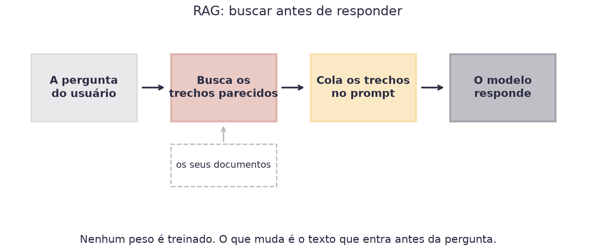
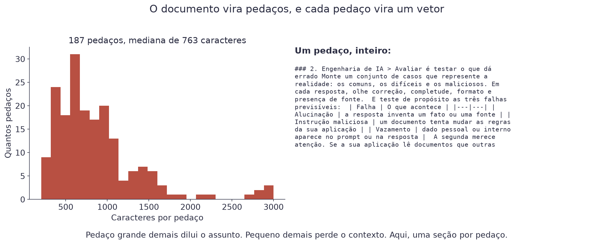
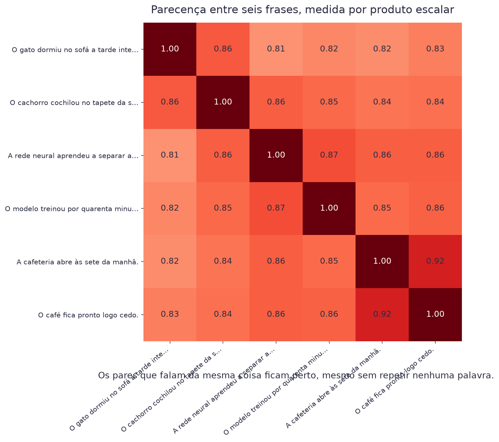
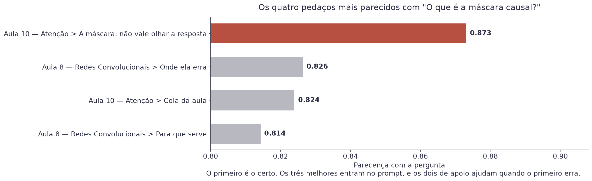
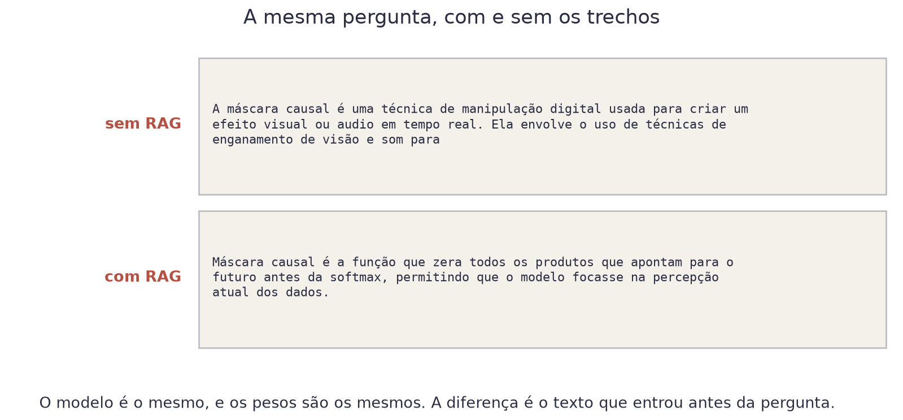
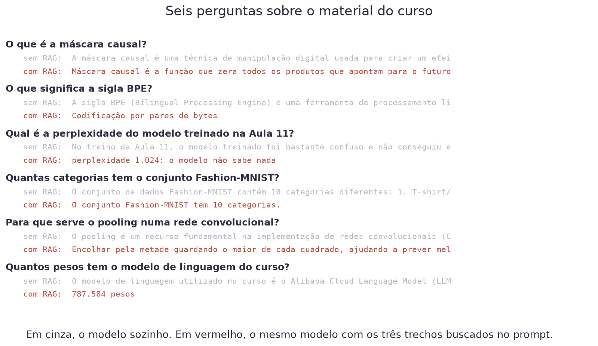

# Aula 14 — Uma Aplicação de Verdade


**O que você leva desta aula**

Você vai construir um assistente que responde perguntas sobre este curso,
usando dois modelos abertos e nenhuma chave de API. E vai medir se ele
funciona, que é a parte que quase ninguém faz.


## O problema

Pergunte ao modelo da Aula 13 o que significa a sigla BPE. Ele responde,
com toda a segurança do mundo, que é o *Bilingual Processing Engine*, uma
ferramenta da Microsoft.

Isso não existe. E a resposta certa, "codificação por pares de bytes",
está escrita na página da Aula 9 deste curso, que ele nunca leu.

O problema não é o modelo estar errado. É ele nunca ter visto o seu
documento. E isso vale para todo documento que importa no trabalho:
o manual interno, o contrato, a norma da empresa, o histórico do cliente.

**Por que não treinar o modelo com o seu documento?** Porque custa caro,
demora, precisa de muito mais texto do que você tem, e vira obsoleto no
dia em que o documento muda. Treinar não é a resposta.

## RAG: buscar antes de responder

A resposta é bem mais simples. Antes de mandar a pergunta ao modelo,
procure no seu documento os trechos que falam do assunto, e cole eles no
prompt.

<figure><figcaption>Quatro etapas. Só a última usa o modelo de linguagem.</figcaption></figure>

Isso se chama **RAG** (*retrieval-augmented generation*, geração aumentada
por busca). O nome é feio e a ideia é simples: o modelo continua sendo o
mesmo, com os mesmos pesos. O que muda é o texto que entra antes da
pergunta.

Repare no que isso resolve de imediato:

| Problema | Como o RAG resolve |
|---|---|
| O modelo não conhece o seu documento | você coloca o trecho no prompt |
| O documento mudou ontem | você busca no documento de hoje |
| Você precisa saber de onde veio a resposta | você sabe qual trecho usou |
| O dado é sigiloso | com modelo aberto, nada sai da sua máquina |

## Dividir o documento em pedaços

O primeiro passo é prático. Você não coloca o documento inteiro no prompt:
não cabe na janela de contexto, e mesmo se coubesse, encheria de texto
irrelevante.

<figure><figcaption>Uma seção por pedaço; o título acompanha o texto na busca.</figcaption></figure>

O tamanho do pedaço é a primeira decisão do projeto, e ela tem um
compromisso claro:

| Pedaço | O que acontece |
|---|---|
| Grande demais | vários assuntos no mesmo vetor, e a busca fica imprecisa |
| Pequeno demais | a frase perde o contexto e vira ambígua |
| Do tamanho de uma seção | costuma funcionar, e é o que usamos aqui |

Aqui foram 187 pedaços, um por seção das páginas do curso, com mediana de
763 caracteres.

## Transformar texto em vetor

Agora a parte interessante. Para achar os pedaços que falam de um assunto,
você precisa comparar significado, e não palavras. A pergunta "o que é a
máscara causal?" tem que encontrar um trecho que talvez nem repita essas
palavras.

A solução usa a mesma ideia da Aula 10. Passe o texto por um modelo, pegue
os vetores de todos os tokens e tire a média:

$$v = \frac{1}{n}\sum_{i=1}^{n} h_i$$

| Símbolo | Significado |
|---|---|
| `hᵢ` | o vetor que o modelo produziu para o token `i` |
| `n` | quantos tokens o texto tem |
| `v` | o vetor da frase inteira |

O resultado é o **embutimento de frase** (*sentence embedding*). Aqui ele
tem 384 números, e o modelo que o produz é o `multilingual-e5-small`, com
118 milhões de pesos, treinado para que frases parecidas caiam perto.

Depois de normalizar os vetores para tamanho 1, comparar dois textos é o
produto escalar da Aula 10:

<figure><figcaption>"O gato dormiu no sofá" e "o cachorro cochilou no tapete" não têm palavra em comum, e ficam perto.</figcaption></figure>

Esse número tem nome: **similaridade do cosseno**. Com vetores de tamanho
1, ela é exatamente o produto escalar, e vai de −1 (opostos) a 1
(idênticos).

## A busca

Com todos os 187 pedaços virados em vetor, buscar é uma multiplicação de
matriz e um `topk`:

```python
vetor_pergunta = embutir(["query: O que é a máscara causal?"])[0]
notas = vetores @ vetor_pergunta
melhores = torch.topk(notas, 3)
```

<figure><figcaption>O primeiro é a seção certa. Os três melhores entram no prompt: os dois de apoio ajudam quando o primeiro erra.</figcaption></figure>

Num projeto grande, com milhões de pedaços, essa multiplicação vira lenta
e você guarda os vetores numa **base vetorial**, que é um banco de dados
especializado em achar vizinhos rápido. Com 187 pedaços, uma matriz
resolve.


**Por que não buscar por palavra**

Buscar por palavra funciona, é barato, e falha exatamente onde dói: quando
a pergunta usa palavras diferentes das do documento. Na prática, sistemas
sérios fazem os dois e juntam os resultados. Isso se chama busca híbrida.


## Montar o prompt

O prompt aumentado é literalmente uma colagem:

```python
contexto = "\n\n".join(pedacos[i][:900] for i in melhores.indices)
prompt = (f"Use apenas o texto abaixo para responder.\n\n{contexto}\n\n"
          f"Pergunta: {pergunta}\n"
          "Responda em uma frase curta, só com o que está no texto.")
```

Três detalhes que fazem diferença, e todos vieram de tentar:

| Detalhe | Por quê |
|---|---|
| "Use apenas o texto abaixo" | reduz a chance de ele responder de memória |
| Cortar em 900 caracteres | prompt curto é mais rápido e o modelo se perde menos |
| "Responda em uma frase curta" | sem isso, um modelo pequeno divaga |

<figure><figcaption>Mesmo modelo, mesmos pesos. A diferença inteira está no texto que entrou antes.</figcaption></figure>

## Medir, que é a parte que ninguém faz

Uma demonstração que funciona não prova nada. Monte um conjunto de
perguntas cuja resposta você conhece, e conte quantas o sistema acerta.
Aqui são seis, todas sobre aulas que você já assistiu:

<figure><figcaption>Seis perguntas, dois modos. Em cinza o modelo sozinho, em vermelho o mesmo modelo com os trechos.</figcaption></figure>

O placar honesto: **quatro certas, uma parcial, uma errada**.

| Pergunta | Sem RAG | Com RAG |
|---|---|---|
| Máscara causal | "manipulação digital" | certo |
| BPE | "Bilingual Processing Engine" | certo |
| Perplexidade da Aula 11 | divagou | **errado**: pegou 1.024 em vez de 31,8 |
| Categorias do Fashion-MNIST | certo | certo |
| Pooling | genérico | quase: inventou "ajudando a prever melhor as categorias" |
| Pesos do modelo do curso | "Alibaba Cloud Language Model" | certo |

Duas leituras importam.

**A primeira**: onde ele errou a perplexidade, a busca tinha trazido o
trecho certo. O trecho tem uma tabela com várias linhas, e o modelo pegou
a linha errada. **O problema não foi buscar, foi ler.** Um modelo maior
resolveria; um prompt melhor talvez.

**A segunda**: na pergunta do Fashion-MNIST, ele já sabia. RAG não é
sempre necessário. Ele é necessário quando o assunto é seu, e não do
mundo.


**Erro do dia**

Achar que RAG acaba com a alucinação. Ele reduz muito, e não elimina. O
modelo ainda pode misturar dois trechos, pegar a linha errada de uma
tabela, ou completar com o que ele acha que faz sentido. Você continua
precisando conferir, e continua precisando medir.


## O que fazer quando não está bom

Uma lista de conserto, na ordem em que vale a pena tentar:

| Sintoma | O que mexer |
|---|---|
| A busca traz trecho irrelevante | mude o tamanho do pedaço |
| A busca acerta e a resposta erra | modelo maior, ou prompt mais específico |
| A resposta inventa detalhe | peça citação do trecho, e confira |
| A resposta é longa e vaga | limite o formato no prompt |
| Está lento | menos trechos, ou trechos menores |

O que existe depois disso, e que este curso não cobre: **reordenação**
(passar os 20 melhores por um modelo mais caro que reordena), **busca
híbrida** (palavra mais vetor) e **agentes** (o modelo decide sozinho
quando buscar, quando calcular e quando responder).

## O caminho inteiro

Vale olhar para trás. Em catorze aulas, você:

| Módulo | O que construiu |
|---|---|
| Modelos lineares | uma reta que prevê preço, e uma fronteira que decide |
| Séries temporais | uma previsão de venda com sazonalidade e feriado |
| Sistema de ponta a ponta | um sistema rodando, com interface |
| Redes neurais | uma rede que enxerga fotos |
| LLM do zero | um modelo de linguagem treinado por você |
| IA generativa | uma aplicação sobre um modelo de fundação |

Nenhuma dessas coisas é mágica, e você sabe disso porque montou todas.

## Materiais

- **Notebook desta aula, no Google Colab:** [](https://colab.research.google.com/github/klein-natan/nanodegree-AI-Atitus/blob/main/notebooks/aula-14-aplicacao-rag.ipynb)
- Slides desta aula: entregues em sala.
- Documento: [`curso.txt`](https://github.com/klein-natan/nanodegree-AI-Atitus/blob/main/data/curso.txt)

## Para ir além

- [multilingual-e5-small no Hugging Face](https://huggingface.co/intfloat/multilingual-e5-small): o modelo de busca desta aula, com os prefixos `query:` e `passage:` explicados.
- [MTEB](https://huggingface.co/spaces/mteb/leaderboard): o placar público de modelos de embutimento, com uma aba para português.
- [Retrieval-Augmented Generation (Lewis et al., 2020)](https://arxiv.org/abs/2005.11401): o artigo que deu nome à técnica. A introdução é legível; o resto é para quem quiser ir fundo.
- [Glossário](../glossario.md): para revisar qualquer termo novo desta aula.
