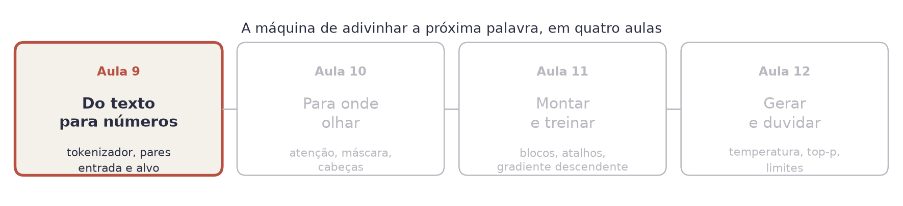
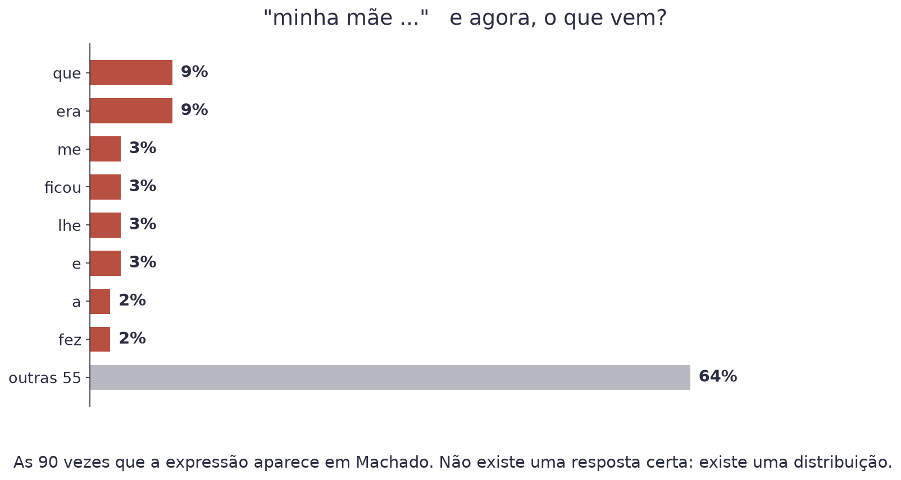
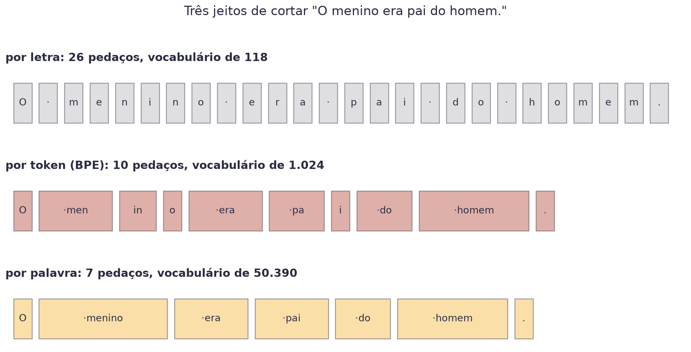
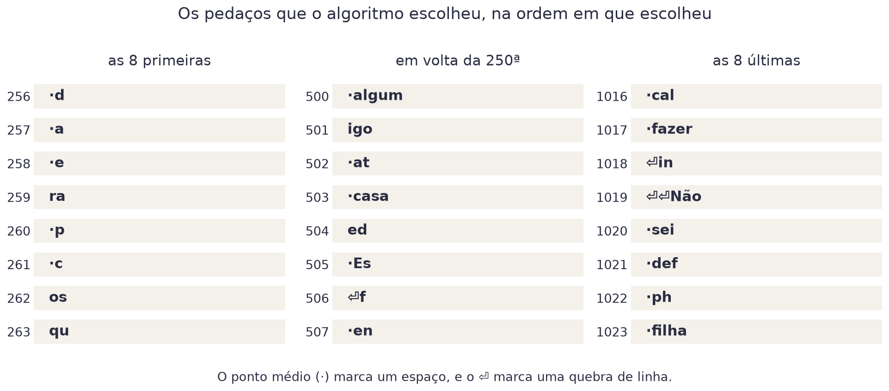
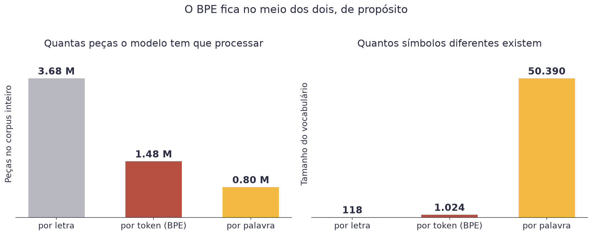
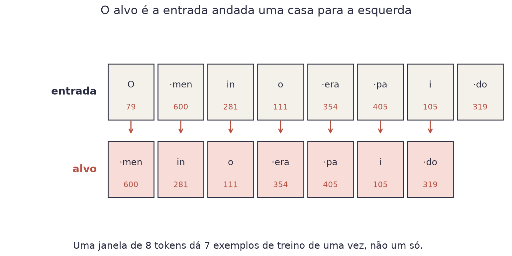

# Aula 9 — Do Texto aos Números


**O que você leva desta aula**

Você vai entender o que um modelo de linguagem faz (é uma coisa só, e é
mais simples do que parece), por que ninguém trabalha com letras nem com
palavras inteiras, e vai escrever o tokenizador que as próximas três aulas
usam.


## Onde estamos

<figure><figcaption>Quatro aulas para construir a máquina inteira. Esta é a primeira peça.</figcaption></figure>

## O que um LLM faz

Um modelo de linguagem grande faz **uma** coisa: recebe um pedaço de texto
e devolve as probabilidades do que vem em seguida. Só isso. Conversar,
resumir, traduzir e programar são tudo consequência de repetir essa
resposta muitas vezes.

Comece pelo que é fácil de conferir. Aqui estão as continuações de
"minha mãe" nas 90 vezes em que a expressão aparece nos livros de Machado
de Assis:

<figure><figcaption>Nenhuma continuação passa de 9%. A resposta certa não é uma palavra, é uma distribuição.</figcaption></figure>

Repare que não existe resposta certa. Existem 63 continuações diferentes, e
a mais provável aparece em menos de uma vez a cada dez. É por isso que a
saída do modelo é uma **distribuição de probabilidade**, exatamente como a
softmax da Aula 8 produzia para as dez categorias de roupa. Só que aqui as
categorias são todas as continuações possíveis.

## O material da obra

Nas próximas quatro aulas você constrói um modelo desses do zero. Ele vai
ser pequeno (787.584 pesos, contra centenas de bilhões dos modelos
comerciais) e vai treinar no processador do seu computador, sem placa de
vídeo.

O texto que ele vai ler é toda a prosa de Machado de Assis: onze obras,
3.676.878 caracteres, 623.120 palavras. Está em domínio público, e o
arquivo mora em `data/machado.txt`.


**O detalhe que vai voltar em todas as aulas**

Esses livros são de 1880 a 1908, com a grafia da época: "elle", "cousa",
"difficil", "pharmacia". O modelo vai aprender a escrever assim, porque é
o que ele viu. Guarde essa observação. Ela é a coisa mais importante que
este curso tem a dizer sobre modelos de linguagem.


## A unidade errada, duas vezes

Antes de qualquer conta, uma decisão: qual é a peça mínima que o modelo
manipula?

<figure><figcaption>A mesma frase, cortada de três jeitos. O ponto médio marca um espaço dentro da peça.</figcaption></figure>

**Palavra inteira** parece o óbvio, e não funciona. O corpus tem 50.390
palavras diferentes, e essa é só a contagem de Machado. Pior: na primeira
palavra que o modelo nunca viu, ele não tem entrada nenhuma para usar.
Nomes próprios, erros de digitação e palavras novas quebram tudo.

**Letra** resolve o vocabulário: são 118 caracteres diferentes, e nada
fica de fora. Mas a frase acima vira 26 peças em vez de 7. Como o custo do
modelo cresce com o número de peças, você paga quase quatro vezes mais
para dizer a mesma coisa.

## O meio-termo: BPE

A solução usada por todos os modelos modernos se chama **codificação por
pares de bytes** (*byte pair encoding*, ou BPE). A regra cabe em uma frase:

> Encontre o par de peças vizinhas mais comum no texto, junte as duas numa
> peça nova, e repita.

Faça à mão, com o texto `banana banana banana`:

| Passo | Par mais comum | Como cada `banana` fica |
|---|---|---|
| 0 | | `b` `a` `n` `a` `n` `a` |
| 1 | `a`+`n`, 6 vezes | `b` `an` `an` `a` |
| 2 | `b`+`an`, 3 vezes | `ban` `an` `a` |
| 3 | `ban`+`an`, 3 vezes | `banan` `a` |

Em três passos, `banana` saiu de seis peças para duas. Nenhum linguista
escolheu essas peças: elas saíram da contagem.

Num texto minúsculo como esse, vários pares empatam (`na` também aparece 6
vezes no passo 1) e o programa desempata por uma regra fixa. Em texto de
verdade o empate no topo quase nunca acontece.

Rodando isso no corpus inteiro até chegar a 1.024 peças, é isto o que sai:

<figure><figcaption>As primeiras fusões são pedaços de duas letras. As últimas já são palavras inteiras.</figcaption></figure>

Leia as três colunas na ordem. No começo o algoritmo junta o que é comum
em qualquer texto em português (`ra`, `os`, `qu`). No fim, já sobrou
espaço para palavras inteiras que Machado usa muito (`fazer`, `sei`,
`filha`). O vocabulário é um retrato do corpus.

## Bytes, para nada ficar de fora

Um detalhe que parece técnico e não é. O BPE não começa das letras: começa
dos **bytes**. Todo texto do mundo, em qualquer língua, é uma sequência de
bytes, e existem exatamente 256 valores possíveis.

A consequência: o vocabulário inicial tem 256 peças e cobre tudo. O
modelo nunca encontra um caractere que ele não saiba representar. Um
emoji, um ideograma chinês ou um nome próprio esquisito viram vários
bytes, e o modelo processa sem reclamar.

Um efeito colateral divertido: `ã` ocupa dois bytes em UTF-8, então no
começo do treino ele é duas peças. A fusão número 268 junta os dois. O
algoritmo aprendeu a letra `ã` sozinho, contando.

$$\text{vocabulário} = 256 \text{ bytes} + 768 \text{ fusões} = 1024$$

| Símbolo | Significado |
|---|---|
| 256 | os valores possíveis de um byte, a base de tudo |
| 768 | quantas vezes você mandou juntar o par mais comum |
| 1024 | o tamanho final da tabela, escolhido por você |

Exemplo: com 768 fusões, o corpus de 3.676.878 caracteres vira 1.484.827
tokens. São 2,48 caracteres por token.

## Codificar e decodificar

Com a tabela pronta, converter texto em números é mecânico:

```python
tokens = tokenizador.codificar("O menino era pai do homem.")
# [79, 600, 281, 111, 354, 405, 105, 319, 724, 46]

tokenizador.decodificar(tokens)
# 'O menino era pai do homem.'
```

Uma regra que não tem exceção: **codificar e decodificar têm que usar a
mesma tabela de fusões**. Se você treinar o modelo com uma tabela e usar
outra na hora de conversar com ele, os números vão significar outra coisa,
e a saída vira lixo.

<figure><figcaption>O BPE fica no meio de propósito: poucas peças e vocabulário pequeno, ao mesmo tempo.</figcaption></figure>

Os dois gráficos contam a mesma escolha por dois lados. Por letra, o
vocabulário é minúsculo mas o texto fica longo. Por palavra, o texto fica
curto mas o vocabulário explode. O BPE não vence em nenhum dos dois, e é
aceitável nos dois.

## Do texto para o lote de treino

Falta uma peça: como esses números viram exemplos de treino.

A tarefa é prever o próximo token. Então o exemplo é simplesmente a mesma
sequência, andada uma casa:

<figure><figcaption>Entrada e alvo são o mesmo texto, com uma casa de diferença.</figcaption></figure>

Repare no detalhe que faz a coisa toda ser barata: uma janela de 8 tokens
não dá **um** exemplo de treino. Dá 7. O modelo prevê o token 2 olhando o
1, prevê o 3 olhando o 1 e o 2, e assim por diante, tudo na mesma passada.

Com janelas de 128 tokens e lotes de 32, cada passo de treino corrige os
pesos usando 4.096 previsões de uma vez.

O tamanho da janela tem nome: **janela de contexto**. É o quanto o modelo
consegue olhar para trás. A sua vai ser de 128 tokens, uns 300 caracteres.
Os modelos comerciais estão na casa das centenas de milhares.


**Erro do dia**

Treinar o tokenizador de novo antes de usar o modelo. Cada treino de BPE
sorteia empates de um jeito, e a tabela sai diferente. O tokenizador é
parte do modelo: salve os dois juntos, sempre. Nesta aula, o arquivo é
`data/machado_bpe.json`.


## Explique sem olhar

O teste mais honesto de que você entendeu é tentar explicar sem ler.
Feche esta página e responda em voz alta, como se explicasse para um
colega. Onde travar, é ali que falta entender: volte à seção.

1. Por que nem letra nem palavra inteira servem como unidade?
2. O que o BPE faz a cada passo, e quando ele para?
3. Por que uma janela de 8 tokens dá 7 exemplos de treino, e não um?

## Cola da aula

| Conceito | O que significa |
|---|---|
| Modelo de linguagem | Devolve a probabilidade de cada continuação possível |
| Corpus | O monte de texto usado para treinar |
| Token | A peça mínima que o modelo manipula |
| Tokenizador | O programa que converte texto em tokens e de volta |
| BPE | Juntar o par de peças mais comum, repetidas vezes |
| Vocabulário | Quantos tokens diferentes existem na tabela |
| Janela de contexto | Quantos tokens o modelo enxerga de uma vez |
| Entrada e alvo | A mesma sequência, com uma casa de diferença |

## Materiais

- **Notebook desta aula, no Google Colab:** [](https://colab.research.google.com/github/klein-natan/nanodegree-AI-Atitus/blob/main/notebooks/aula-09-do-texto-aos-numeros.ipynb)
- Slides desta aula: entregues em sala.
- Corpus: [`machado.txt`](https://github.com/klein-natan/nanodegree-AI-Atitus/blob/main/data/machado.txt)
- Tokenizador pronto: [`machado_bpe.json`](https://github.com/klein-natan/nanodegree-AI-Atitus/blob/main/data/machado_bpe.json)

## Para ir além

- [Tiktokenizer](https://tiktokenizer.vercel.app/): cole qualquer texto e veja como o tokenizador do GPT o corta, token por token.
- [Machado de Assis no Project Gutenberg](https://www.gutenberg.org/ebooks/author/2109): as obras completas de onde saiu o corpus.
- [Let's build the GPT Tokenizer (Andrej Karpathy)](https://www.youtube.com/watch?v=zduSFxRajkE): duas horas construindo o mesmo BPE desta aula, com todos os detalhes que ficaram de fora. Em inglês.
- [Build a Large Language Model (From Scratch)](https://www.manning.com/books/build-a-large-language-model-from-scratch): o livro que inspirou a ordem desta aula. Constrói um GPT em PyTorch, peça por peça, em inglês.
- [Glossário](../glossario.md): para revisar qualquer termo novo desta aula.
