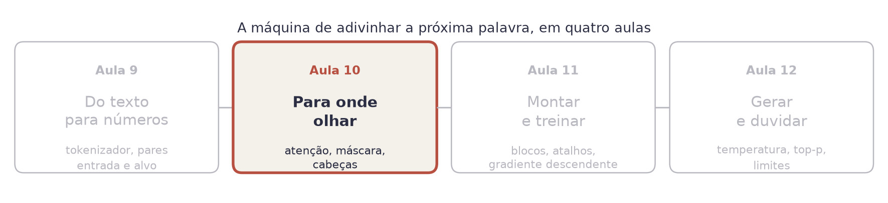
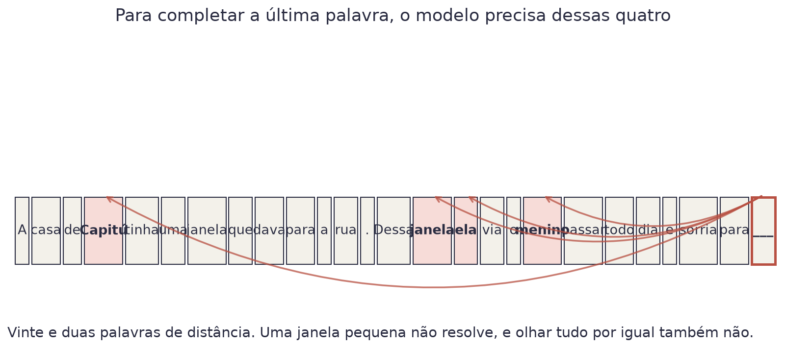
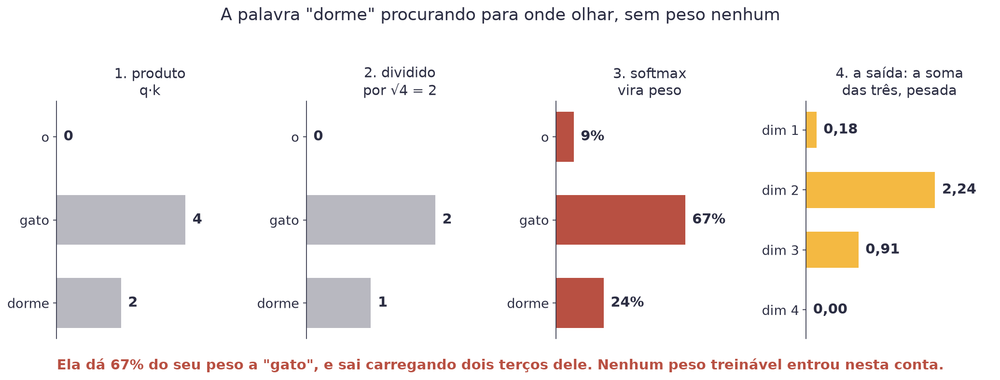
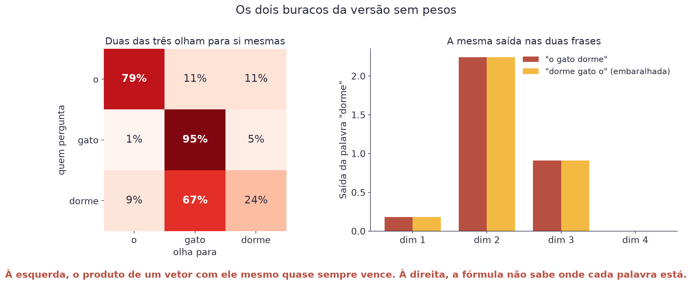
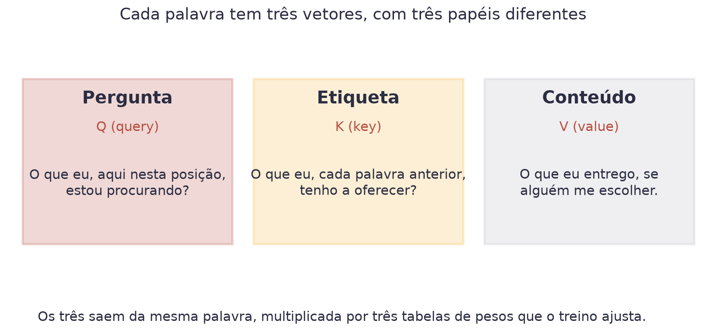
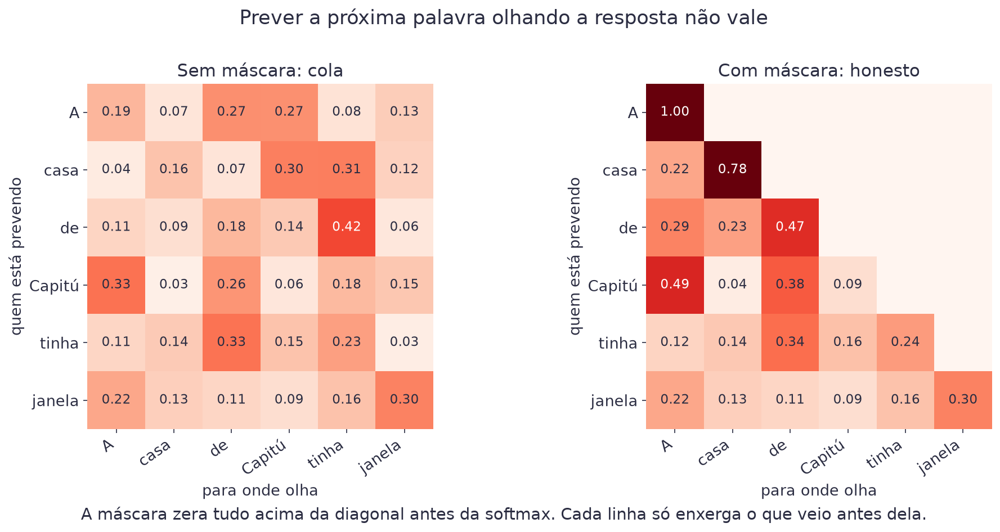
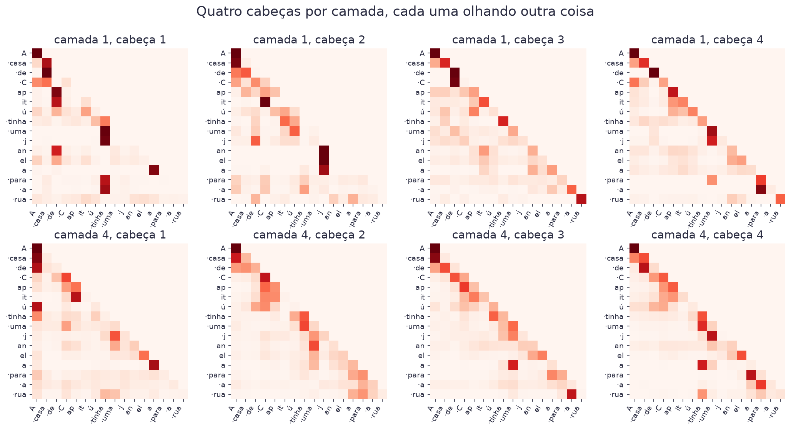
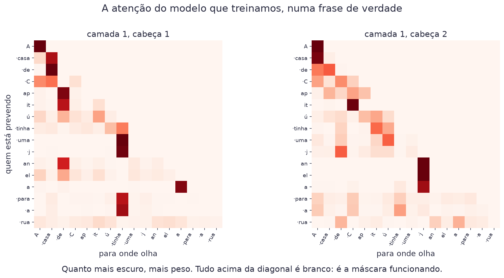
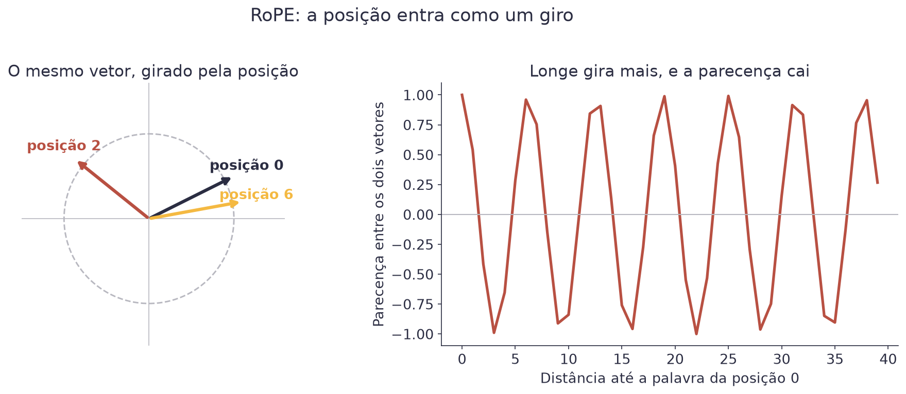

# Aula 10 — Atenção


**O que você leva desta aula**

Você vai calcular à mão o peso de atenção de uma palavra, entender por que
a máscara causal é obrigatória, e ler o mapa de atenção do modelo que
vamos treinar. É a única peça realmente nova de um transformer.


## Onde estamos

<figure><figcaption>A Aula 9 entregou uma fila de números. Esta aula ensina o modelo a escolher para onde olhar dentro dela.</figcaption></figure>

## O problema

Leia esta frase e complete a última palavra:

<figure><figcaption>Para completar a última palavra, o modelo precisa voltar 22 posições.</figcaption></figure>

Você completou sem esforço, porque leu a frase inteira e reteve as quatro
palavras que importam. O modelo precisa fazer o mesmo, e tem duas saídas
ruins pela frente.

**Saída ruim 1: olhar só as últimas palavras.** Barato, e perde tudo o que
está longe. Foi assim que os modelos funcionavam antes de 2017.

**Saída ruim 2: somar todas as palavras anteriores por igual.** Aí "de",
"uma" e "para" pesam tanto quanto "Capitú". A informação some no meio da
média.

A resposta é uma terceira coisa: deixar cada posição **escolher** para onde
olhar, com pesos que o treino ajusta. Isso se chama **atenção**
(*attention*).

## Antes: a palavra vira um vetor

Cada token da Aula 9 é um número inteiro, e número inteiro não serve para
fazer conta de parecença. O primeiro passo do modelo é trocar cada token
por uma linha de uma tabela:

```python
embutir = nn.Embedding(1024, 128)   # 1.024 tokens, 128 números cada
```

Essa tabela se chama **embutimento** (*embedding*). São 131.072 pesos, que
o treino ajusta como quaisquer outros. Depois dela, o token 600 deixou de
ser "o número 600" e virou um ponto num espaço de 128 dimensões, onde
palavras parecidas ficam perto.

## Primeiro, a versão sem peso nenhum

Antes de qualquer coisa treinável, vale ver que a ideia central da atenção
funciona **sem nenhum peso novo**. Só com os vetores que já temos.

Tome três palavras e quatro números por palavra, para caber na página:

| Palavra | Vetor |
|---|---|
| `o` | (2, 0, 0, 0) |
| `gato` | (0, 3, 1, 0) |
| `dorme` | (0, 1, 1, 0) |

A palavra `dorme` quer saber para onde olhar. São quatro passos, e você
pode fazer os quatro à mão.

**Passo 1: medir parecença com cada palavra.** Multiplique casa com casa e
some. Isso se chama **produto escalar**, e é a mesma conta da convolução da
Aula 8:

$$q \cdot k = \sum_{i=1}^{d} q_i k_i$$

| Símbolo | Significado |
|---|---|
| `q` | o vetor da palavra que está perguntando |
| `k` | o vetor de uma das palavras da frase |
| `d` | quantos números tem cada vetor (aqui, 4) |

Exemplo: `dorme` com `o` dá `0·2 + 1·0 + 1·0 + 0·0 = 0`. Com `gato` dá
`0 + 3 + 1 + 0 = 4`. Com ela mesma dá `0 + 1 + 1 + 0 = 2`. Vetores
apontando para o mesmo lado dão número alto; perpendiculares dão zero.

**Passo 2: dividir pela raiz de `d`.** Aqui, `√4 = 2`. Os três números
viram 0, 2 e 1. Já explico por quê.

**Passo 3: passar pela softmax**, a mesma da Aula 8, que transforma
qualquer trio de números em pesos que somam 100%: **9%, 67% e 24%**.

**Passo 4: somar os vetores, pesados por esses números.**

$$z = 0{,}09 \cdot (2,0,0,0) + 0{,}67 \cdot (0,3,1,0) + 0{,}24 \cdot (0,1,1,0)$$

| Símbolo | Significado |
|---|---|
| `z` | o vetor de saída da posição `dorme` |
| os três pesos | quanto ela decidiu olhar para cada palavra |
| os três vetores | as próprias palavras, sem transformação nenhuma |

O resultado é `(0,18, 2,24, 0,91, 0)`. Repare: `dorme` saiu carregando dois
terços de `gato`. A palavra deixou de ser só ela mesma e virou ela mesma
**mais o contexto**.

<figure><figcaption>Quatro passos, três palavras, números pequenos. É a atenção inteira, e ainda não há um peso treinável.</figcaption></figure>

**Por que dividir pela raiz de `d`?** Quanto mais dimensões, maiores os
produtos escalares, só por haver mais parcelas na soma. Números grandes
fazem a softmax virar tudo-ou-nada: 99,9% numa palavra e quase zero nas
outras. A divisão mantém a distribuição espalhada, e com isso o gradiente
continua existindo.

## Os dois buracos da versão sem pesos

A versão de cima funciona, e tem dois defeitos. Os dois dá para medir, e o
resto da aula é tapar um de cada vez.

<figure><figcaption>Buraco 1: a palavra olha para si mesma. Buraco 2: embaralhar a frase não muda nada.</figcaption></figure>

**Buraco 1: vira espelho.** Faça a mesma conta para as três palavras:

| Quem pergunta | olha `o` | olha `gato` | olha `dorme` |
|---|---|---|---|
| `o` | **79%** | 11% | 11% |
| `gato` | 1% | **95%** | 5% |
| `dorme` | 9% | **67%** | 24% |

Em duas das três linhas, a palavra olha principalmente para si mesma. Não é
azar: o produto escalar de um vetor com ele mesmo é o comprimento dele ao
quadrado, o maior valor que ele consegue tirar de qualquer comparação.

E tem um problema mais fundo por trás. Parecença de embutimento é **uma**
relação: palavras de sentido próximo ficam perto. Mas `dorme` não precisa
procurar sinônimos de `dorme`. Precisa procurar o **sujeito** dela, que é
`gato`, e sujeito não é sinônimo de nada. Uma relação só, fixa, não cobre
isso.

**Buraco 2: a frase virou um saco de palavras.** Embaralhe "o gato dorme"
para "dorme gato o" e refaça a conta. A saída de cada palavra é idêntica.
Nada na fórmula diz onde cada palavra está, então "o gato mordeu o
cachorro" e "o cachorro mordeu o gato" são a mesma coisa para ela.

Tapamos o buraco 1 agora, com pesos treináveis. O buraco 2 fica para o fim
da aula.

## Os três papéis

A atenção de verdade dá três vetores a cada palavra, obtidos multiplicando
o vetor da palavra por três tabelas de pesos diferentes:

<figure><figcaption>A mesma palavra, vista de três jeitos. O treino ajusta as três tabelas de pesos.</figcaption></figure>

Pense numa biblioteca. Você chega com uma **pergunta** (o Q da posição
atual). Cada livro tem uma **etiqueta** na lombada (o K de cada palavra
anterior). Você compara a sua pergunta com todas as etiquetas, escolhe os
livros mais parecidos, e lê o **conteúdo** deles (o V).

A diferença para a biblioteca de verdade: aqui você não escolhe um livro
só. Você lê todos, em proporções diferentes.

## A fórmula inteira

$$\text{Atenção}(Q, K, V) = \text{softmax}\!\left(\frac{Q K^{\top}}{\sqrt{d}}\right) V$$

| Símbolo | Significado |
|---|---|
| `Q K^T` | todos os produtos escalares de todas as perguntas com todas as etiquetas |
| `√d` | a raiz da dimensão, que segura o tamanho dos números |
| `softmax` | transforma os números em pesos que somam 1 |

São os mesmos quatro passos que você já fez à mão. A única diferença: em
vez de comparar as palavras com elas mesmas, o modelo compara o `Q` de uma
com o `K` da outra, e entrega o `V`. Três tabelas a mais, e nada de
conceito novo.

E é isso que resolve o espelho da seção anterior. Como `Q` e `K` saem de
tabelas diferentes, o produto de uma palavra com ela mesma deixa de ser
automaticamente o maior. O treino é quem decide quem olha para quem.

## A máscara: não vale olhar a resposta

Existe um problema que o desenho acima esconde. Se cada posição olha todas
as outras, a posição 3 olha a posição 4, que é justamente a palavra que ela
deveria prever.

<figure><figcaption>À esquerda o modelo cola. À direita, cada linha só enxerga o que veio antes dela.</figcaption></figure>

A correção é a **máscara causal**: antes da softmax, troque por menos
infinito todos os produtos que apontam para o futuro. A softmax de menos
infinito é zero, então esses pesos somem.

```python
mascara = torch.triu(torch.ones(n, n), diagonal=1).bool()
pontos = pontos.masked_fill(mascara, float("-inf"))
```

O nome "causal" vem daí: a informação só corre do passado para o futuro,
nunca ao contrário.


**Erro do dia**

Esquecer a máscara. O modelo treina lindamente, a perda cai para quase
zero, e você comemora. Na hora de gerar texto, ele não tem mais o futuro
para copiar, e a saída vira lixo. É o erro mais frustrante desta aula,
porque o sintoma aparece longe da causa.


## Quatro cabeças, quatro olhares

Uma atenção só tem que decidir tudo com um conjunto de pesos. Na prática,
o modelo roda várias em paralelo, cada uma com sua própria tabela de Q, K e
V, e junta os resultados no fim. Cada uma se chama **cabeça** (*head*).

O nosso modelo tem 4 cabeças por camada. Como o vetor tem 128 números,
cada cabeça trabalha com 32. O custo total é o mesmo de uma cabeça de 128,
e o que se ganha é a variedade:

<figure><figcaption>As oito cabeças, na mesma frase. Nenhuma faz o que a outra faz.</figcaption></figure>

Agora olhe de perto duas delas, na frase "A casa de Capitú tinha uma janela
para a rua":

<figure><figcaption>Cada linha é uma posição prevendo. Cada coluna é para onde ela olhou.</figcaption></figure>

Duas coisas para reparar. Primeira: o canto de cima à direita é todo
branco. É a máscara funcionando, no modelo de verdade. Segunda: "Capitú"
aparece cortado em quatro tokens (`·C`, `ap`, `it`, `ú`), porque um
vocabulário de 1.024 não tem espaço para nomes próprios. Os pedaços de uma
palavra costumam se olhar entre si, e é isso que remonta a palavra.

Dá para medir o que cada camada faz. Numa frase de 34 tokens, a média de
quão longe cada cabeça olha:

| Camada | Distância média | Peso na palavra anterior |
|---|---|---|
| 1 | 5,5 tokens | 17% |
| 2 | 2,8 tokens | 33% |
| 3 | 2,2 tokens | 39% |
| 4 | 2,8 tokens | 31% |

A primeira camada espalha o peso por toda a frase. As de cima ficam bem
mais locais, com um terço do peso na palavra imediatamente anterior.
Ninguém programou essa divisão de trabalho: ela sai do treino.

## O buraco 2, enfim: a posição

Ficou uma dívida lá atrás. Nem Q, nem K, nem V, nem a máscara, nem as
quatro cabeças resolveram o saco de palavras: embaralhe a frase e a conta
dá o mesmo. Todas essas peças mexem em *quem olha para quem*, e nenhuma
delas sabe *onde* cada palavra está.

A correção precisa entrar antes dos produtos escalares, mexendo nos
vetores. A solução moderna se chama **RoPE** (*rotary position embedding*):
gire o vetor de cada palavra por um ângulo proporcional à posição dela.

<figure><figcaption>Duas palavras próximas giram ângulos parecidos, e continuam parecidas. Longe, a parecença cai.</figcaption></figure>

Girar tem uma propriedade que serve à perfeição aqui: quando você gira
dois vetores e compara os dois, o que sobra na comparação é a **diferença**
entre os dois ângulos. Ou seja, o produto escalar passa a depender da
distância entre as duas palavras, e não da posição absoluta de cada uma. O
modelo trata igual uma frase que aparece no começo e no fim do texto.

Não precisa saber a fórmula do giro para seguir adiante. Precisa saber o
buraco que ele tampa, e você acabou de medir esse buraco.

## O preço da janela

Uma conta que explica muita notícia. Para uma janela de `n` tokens, a
atenção calcula `n × n` produtos escalares. Dobrar a janela quadruplica o
custo.

| Janela | Produtos por cabeça |
|---|---|
| 128 (o nosso) | 16.384 |
| 1.000 | 1 milhão |
| 100.000 | 10 bilhões |

É por isso que janela grande é caro, e por que cada modelo novo anuncia a
janela dele como se fosse uma conquista. É.

## Materiais

- **Notebook desta aula, no Google Colab:** [](https://colab.research.google.com/github/klein-natan/nanodegree-AI-Atitus/blob/main/notebooks/aula-10-atencao.ipynb)
- Slides desta aula: entregues em sala.
- Modelo treinado: [`mini_llm.pt`](https://github.com/klein-natan/nanodegree-AI-Atitus/blob/main/data/mini_llm.pt)

## Para ir além

- [Attention Is All You Need](https://arxiv.org/abs/1706.03762): o artigo de 2017 que apresentou o transformer. Difícil, mas vale ver o desenho da página 3.
- [The Illustrated Transformer](https://jalammar.github.io/illustrated-transformer/): a explicação visual mais conhecida, com animações de cada passo.
- [Attention in transformers, step-by-step (3Blue1Brown)](https://www.youtube.com/watch?v=eMlx5fFNoYc): a conta desta aula, animada. Em inglês, com legendas.
- [Build a Large Language Model (From Scratch)](https://www.manning.com/books/build-a-large-language-model-from-scratch): o livro que inspirou a ordem desta aula. Constrói um GPT em PyTorch, peça por peça, em inglês.
- [Glossário](../glossario.md): para revisar qualquer termo novo desta aula.
