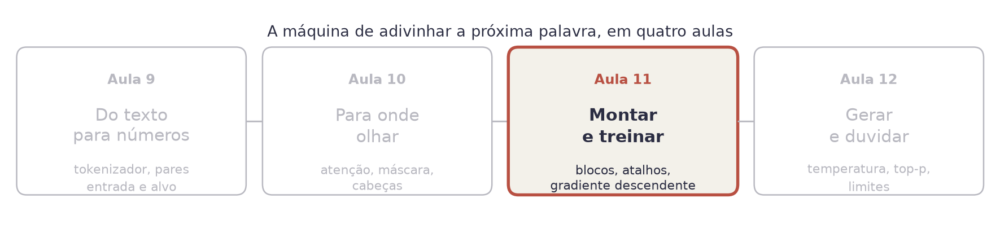
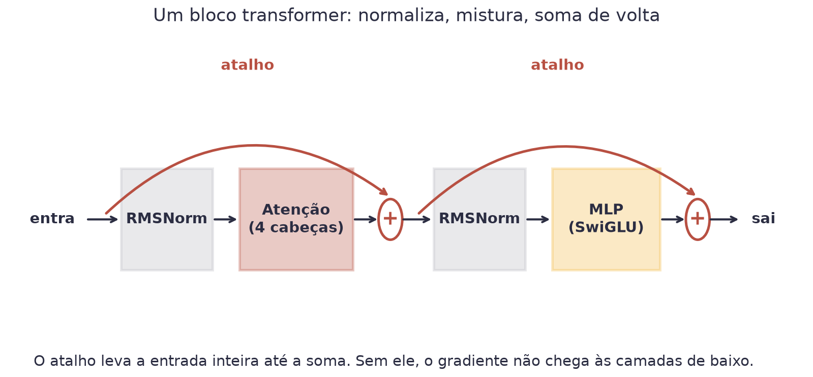
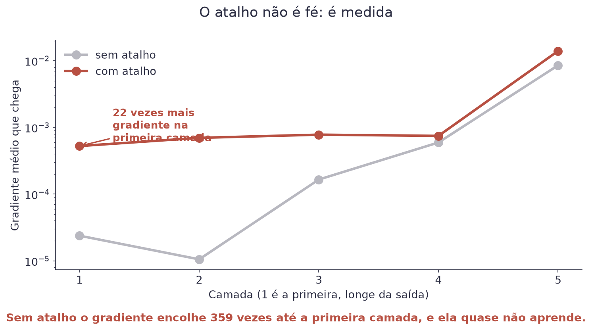
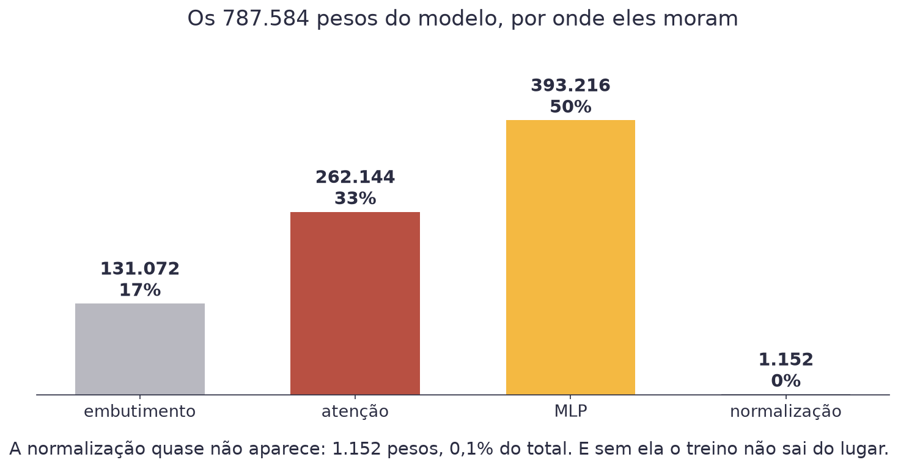
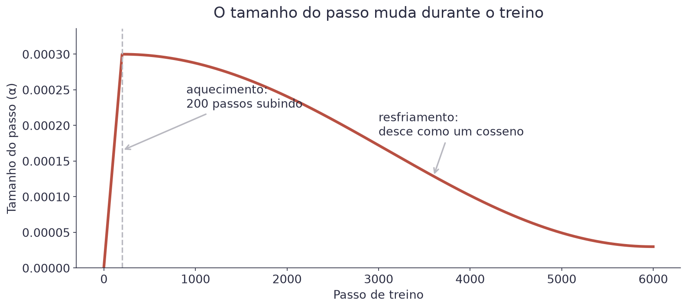
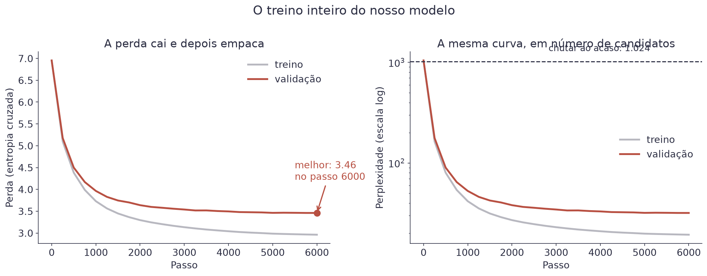
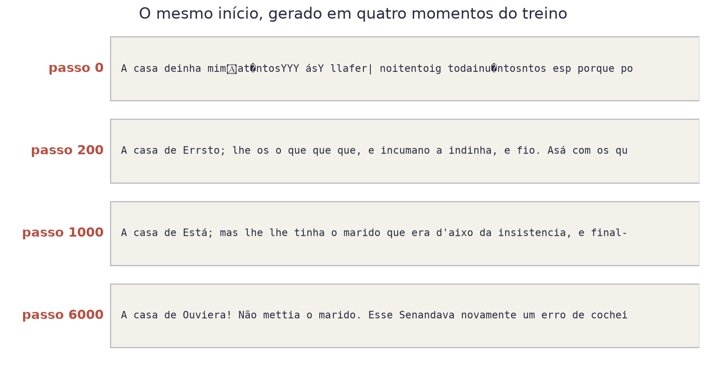

# Aula 11 — O Transformer e o Treino


**O que você leva desta aula**

Você vai montar o modelo inteiro (787.584 pesos), escrever o laço de
treino, e rodar. No fim, o seu computador vai ter escrito português com
sotaque de 1899, sem placa de vídeo nenhuma.


## Onde estamos

<figure><figcaption>As peças estão todas prontas. Falta montar e ligar.</figcaption></figure>

## Todas as peças já existem

Esta aula não tem quase nada de novo, e vale começar por aí:

| Peça | De onde veio |
|---|---|
| Tokenizador | Aula 9 |
| Atenção com máscara | Aula 10 |
| Camada densa com ativação | Aula 7 |
| Normalização | Aula 7 |
| Gradiente descendente | Aula 1 |
| Entropia cruzada e softmax | Aulas 3 e 8 |

O que falta é a montagem: em que ordem colocar as peças, e como treinar
sem que nada exploda.

## Comece por um modelo de mentira

Antes de escrever qualquer coisa difícil, escreva o modelo inteiro com um
buraco no meio. O bloco não faz nada: recebe e devolve.

```python
class BlocoDeMentira(nn.Module):
    def forward(self, x):
        return x                        # de propósito: não faz nada

class MiniLLM(nn.Module):
    def __init__(self):
        super().__init__()
        self.embutir = nn.Embedding(1024, 128)
        self.blocos = nn.ModuleList(BlocoDeMentira() for _ in range(4))
        self.cabeca = nn.Linear(128, 1024, bias=False)

    def forward(self, tokens):
        x = self.embutir(tokens)
        for bloco in self.blocos:
            x = bloco(x)
        return self.cabeca(x)
```

Isso **roda**. Você passa uma frase e recebe 1.024 pontuações por posição,
com o formato certo. Dá até para gerar texto, e o texto sai assim:

```
'Não sei se a senhora são homear\ufffd\th\nfR ta inviJ'
```

Lixo, e lixo com o formato correto. Três coisas ficaram estabelecidas de
graça: os pesos entram e saem pela mesma tabela, os blocos são
intercambiáveis, e o que sai da última camada tem um número por token do
vocabulário.

Daqui para a frente o trabalho é um só: **trocar o `return x` por algo que
valha a pena**. Todo o resto do arquivo já está no lugar, e a cada peça que
você encaixa dá para rodar de novo e ver a perda cair um pouco mais.


**Por que começar pelo esqueleto**

É a diferença entre montar um móvel com o manual aberto e montar peça por
peça torcendo para encaixar no fim. Com o esqueleto rodando, todo erro que
aparecer daqui em diante veio da peça que você acabou de escrever, e não
de mais nada. Isso corta o tempo de depuração pela metade.


## O bloco transformer

Um **transformer** é um bloco repetido várias vezes. Cada bloco tem duas
metades, e as duas seguem o mesmo desenho: normaliza, faz alguma coisa,
soma de volta.

<figure><figcaption>Um bloco. A primeira metade mistura posições, a segunda pensa sobre cada posição isolada.</figcaption></figure>

```python
def forward(self, x):
    x = x + self.atencao(self.norma1(x))
    return x + self.mlp(self.norma2(x))
```

Duas linhas. Repare no `x +` das duas: é o **atalho** (conexão residual).
A entrada inteira atravessa o bloco por fora, e o modelo soma ela ao
que saiu.

**Para que serve o atalho.** Sem ele, o gradiente da Aula 1 precisa
atravessar todas as camadas para chegar à primeira, e vai encolhendo pelo
caminho. Com ele, existe um caminho direto da saída até qualquer camada.

Isso não é para acreditar: é para medir. Monte uma rede de cinco camadas,
faça um passo para trás e imprima o gradiente médio que chega em cada uma:

<figure><figcaption>Escala logarítmica. Sem atalho, a primeira camada recebe migalhas.</figcaption></figure>

| Camada | Sem atalho | Com atalho |
|---|---|---|
| 1 (a primeira) | 0,00002 | **0,00053** |
| 2 | 0,00001 | 0,00070 |
| 3 | 0,00017 | 0,00078 |
| 4 | 0,00059 | 0,00075 |
| 5 (a última) | 0,00854 | 0,01401 |

Leia a coluna do meio de baixo para cima: o gradiente encolhe 359 vezes no
caminho até a primeira camada. Ela quase não aprende. Com o atalho, a
primeira camada recebe **22 vezes mais** gradiente, e as quatro primeiras
ficam na mesma ordem de grandeza.

Esse é o **gradiente que desaparece**, e foi ele que travou as redes
profundas por anos. A ideia do atalho, de 2015, é o que permitiu empilhar
dezenas de camadas.

Uma segunda leitura, mais intuitiva: cada bloco não reescreve o vetor da
palavra. Ele **acrescenta** alguma coisa ao que já estava lá.

## As duas metades do bloco

A **primeira metade é a atenção** da Aula 10: é onde as posições conversam
entre si. É a única parte do modelo em que uma palavra vê outra.

A **segunda metade é uma camada densa** da Aula 7, aplicada a cada posição
**separadamente**. Ela não olha para os vizinhos: pega o vetor que a
atenção montou e pensa sobre ele sozinho.

Essa divisão de trabalho é o transformer inteiro, e vale decorar assim:

> A atenção **junta** informação de outras posições. A camada densa
> **pensa** sobre essa mistura, uma posição de cada vez.

E a normalização antes de cada metade faz o de sempre, desde a Aula 7:
mantém os números num tamanho parecido, para o treino não desandar.


**O que os modelos de hoje trocaram (e por que você não precisa decorar)**

O desenho de 2017 usava LayerNorm e ReLU. Llama, Qwen e quase todo modelo
aberto de hoje, o nosso incluído, usam duas substituições:

- **RMSNorm** no lugar da LayerNorm: a mesma normalização da Aula 7, sem a
  subtração da média. Faz quase a mesma coisa e custa menos conta.
- **SwiGLU** no lugar da ReLU: além do caminho que carrega o conteúdo, um
  segundo caminho vira uma **porta**, que decide dimensão por dimensão
  quanto passa adiante. Custa uma tabela de pesos a mais e rende melhor.

São otimizações, não conceitos. Se você trocasse as duas pelas versões de
2017, o modelo desta aula ainda treinaria e ainda escreveria português. Ele
só ficaria um pouco pior e um pouco mais lento.


## O modelo inteiro

```python
class MiniLLM(nn.Module):
    def __init__(self):
        super().__init__()
        self.embutir = nn.Embedding(1024, 128)
        self.blocos = nn.ModuleList(Bloco() for _ in range(4))
        self.norma = nn.RMSNorm(128)
        self.cabeca = nn.Linear(128, 1024, bias=False)
        self.cabeca.weight = self.embutir.weight   # pesos amarrados
```

A última linha merece explicação. A tabela de entrada troca token por
vetor; a cabeça de saída faz o contrário, troca vetor por pontuação de
cada token. Usar a **mesma** tabela nos dois sentidos economiza 131.072
pesos e costuma melhorar o resultado, porque a tabela recebe gradiente
das duas pontas.

<figure><figcaption>Metade dos pesos está no MLP. A atenção é a peça famosa, mas não é a maior.</figcaption></figure>

Isso costuma surpreender. A atenção é o que dá nome ao artigo e o que
todo mundo explica, mas o modelo gasta mais pesos nas camadas densas que
vêm depois dela.

## A perda: entropia cruzada com 1.024 categorias

É a mesma perda da Aula 8, só que agora as categorias são os 1.024 tokens
do vocabulário, e a previsão acontece em cada uma das 128 posições da
janela.

$$\text{perda} = -\frac{1}{n}\sum_{i=1}^{n} \log P(\text{token certo}_i)$$

| Símbolo | Significado |
|---|---|
| `n` | quantas previsões o lote tem: 32 × 128 = 4.096 |
| `P(token certo)` | a probabilidade que o modelo deu ao token que de fato veio |
| `log` | o logaritmo, que castiga com força quem erra com confiança |

Antes de qualquer treino, o modelo chuta igual entre os 1.024 tokens.
Então a probabilidade do token certo é `1/1024`, e a perda tem que dar
`ln(1024) = 6,93`. O nosso deu 6,95 no passo 0, o que confirma que a
montagem está certa.


**Um teste que vale ouro**

Sempre confira a perda no passo 0 contra `ln(vocabulário)`. Se der muito
diferente, tem erro de montagem ou de inicialização, e é muito mais fácil
achar agora do que depois de duas horas de treino.


## Perplexidade: a perda em português

Perda de 3,46 não diz nada a ninguém. Tire a exponencial e ela vira um
número com significado:

$$\text{perplexidade} = e^{\text{perda}}$$

| Valor | Significa |
|---|---|
| perda 6,93 | perplexidade 1.024: o modelo não sabe nada |
| perda 3,46 | perplexidade 31,8: ele está escolhendo entre uns 32 candidatos |
| perda 0 | perplexidade 1: ele acerta sempre, o que só acontece se decorou |

Perplexidade é "entre quantos tokens o modelo está efetivamente na
dúvida". Sair de 1.024 para 31,8 quer dizer que o modelo eliminou 97% dos
candidatos antes de escolher.

## O laço de treino

```python
for passo in range(6000):
    entrada, alvo = sortear(dados_treino)
    _, perda = modelo(entrada, alvo)
    otimizador.zero_grad(set_to_none=True)
    perda.backward()
    torch.nn.utils.clip_grad_norm_(modelo.parameters(), 1.0)
    otimizador.step()
```

Seis linhas, e todas já apareceram no curso. Duas merecem comentário.

**AdamW** é o otimizador. Ele é o gradiente descendente da Aula 1 com duas
melhorias: guarda uma média dos gradientes recentes (o que suaviza o
caminho) e dá passos maiores nas direções em que o gradiente é
consistentemente pequeno.

**O corte de gradiente** (`clip_grad_norm_`) limita o tamanho do passo
quando um lote sai muito fora do normal. Sem ele, um único lote estranho
pode jogar os pesos para longe e estragar horas de treino.

## O tamanho do passo muda ao longo do treino

<figure><figcaption>Aquecimento e resfriamento. É o padrão em qualquer treino de modelo de linguagem.</figcaption></figure>

No começo os pesos são aleatórios, e passo grande em direção errada só faz
estrago: por isso o **aquecimento**, com a taxa subindo do zero nos
primeiros 200 passos. No fim, o modelo está perto de um bom lugar e passo
grande faz ele passar do ponto: por isso o **resfriamento**, com a taxa
descendo até quase zero.

## O treino de verdade

<figure><figcaption>6.000 passos, 40 minutos de processador. A queda grande acontece nos primeiros 1.000.</figcaption></figure>

Repare no formato: a perda despenca no começo e depois vai ficando cada
vez mais difícil melhorar. Sair de 6,95 para 4,0 custou uns poucos
minutos. Sair de 4,0 para 3,46 custou o resto das quatro dezenas.

Essa curva explica por que treinar modelos grandes é caro. Cada ponto a
menos custa mais que o anterior, e não existe atalho.

E veja o que sai do modelo em cada momento:

<figure><figcaption>O mesmo início, gerado em quatro momentos. Nada mudou além do valor dos 787.584 pesos.</figcaption></figure>

No passo 0 é ruído. Em 200 passos já existem palavras curtas e vírgulas em
lugares plausíveis. Em 1.000 aparecem frases inteiras erradas mas
gramaticais. No fim, ele escreve com a grafia de 1899, porque foi isso que
leu.


**Erro do dia**

Julgar o modelo pela perda de treino. No nosso, ela terminou em 2,96
enquanto a de validação parou em 3,46. Essa diferença é o modelo decorando
trechos do corpus. Enquanto as duas caem juntas, tudo bem. Quando a de
validação começa a subir, pare o treino: o que vem depois é decoreba.


## O que muda quando o modelo é grande

O nosso tem 787.584 pesos e leu 3,7 milhões de caracteres. Um modelo
comercial tem centenas de bilhões de pesos e leu trilhões de tokens. A
arquitetura, essa, é a mesma que você acabou de montar.

| Peça | O nosso | Um comercial |
|---|---|---|
| Camadas | 4 | 60 a 120 |
| Dimensão | 128 | 4.000 a 16.000 |
| Cabeças | 4 | 32 a 128 |
| Janela | 128 tokens | centenas de milhares |
| Treino | 40 minutos, um processador | meses, milhares de placas |

Nada nessa tabela é uma ideia nova. É a mesma ideia, com mais dinheiro.

## Materiais

- **Notebook desta aula, no Google Colab:** [](https://colab.research.google.com/github/klein-natan/nanodegree-AI-Atitus/blob/main/notebooks/aula-11-transformer-e-treino.ipynb)
- Slides desta aula: entregues em sala.
- Modelo treinado: [`mini_llm.pt`](https://github.com/klein-natan/nanodegree-AI-Atitus/blob/main/data/mini_llm.pt)

## Para ir além

- [nanoGPT, de Andrej Karpathy](https://github.com/karpathy/nanoGPT): o repositório que inspirou o modelo desta aula, com 300 linhas de PyTorch.
- [Let's build GPT, from scratch](https://www.youtube.com/watch?v=kCc8FmEb1nY): duas horas de vídeo montando a mesma coisa, linha por linha.
- [Transformers, the tech behind LLMs (3Blue1Brown)](https://www.youtube.com/watch?v=wjZofJX0v4M): o modelo inteiro, do token à previsão, em animação. Em inglês, com legendas.
- [Build a Large Language Model (From Scratch)](https://www.manning.com/books/build-a-large-language-model-from-scratch): o livro que inspirou a ordem desta aula. Constrói um GPT em PyTorch, peça por peça, em inglês.
- [Glossário](../glossario.md): para revisar qualquer termo novo desta aula.
