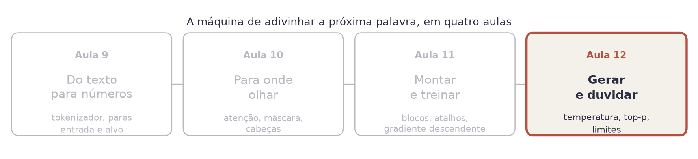
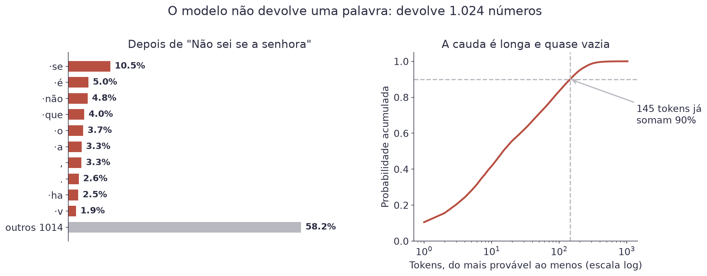
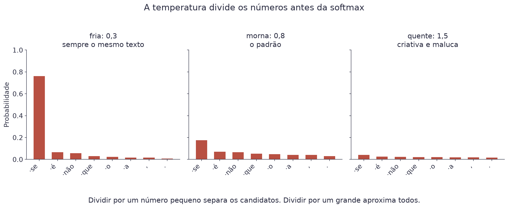
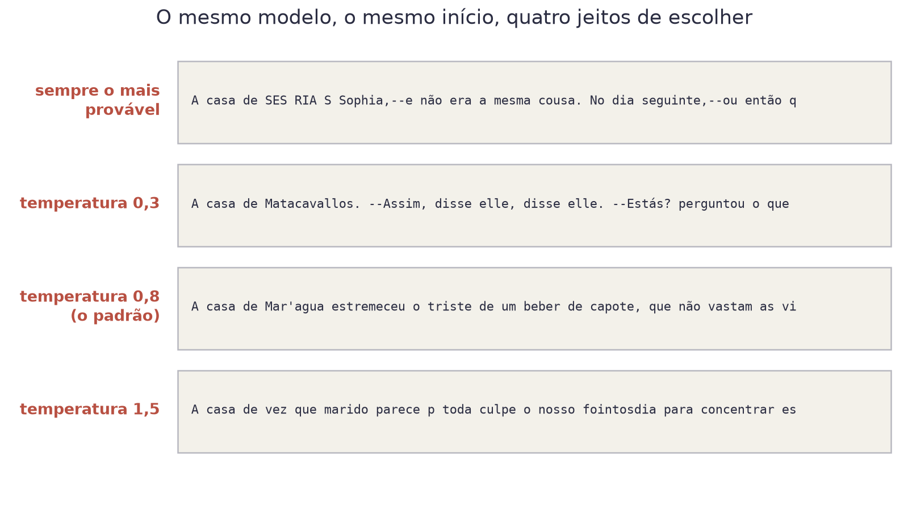
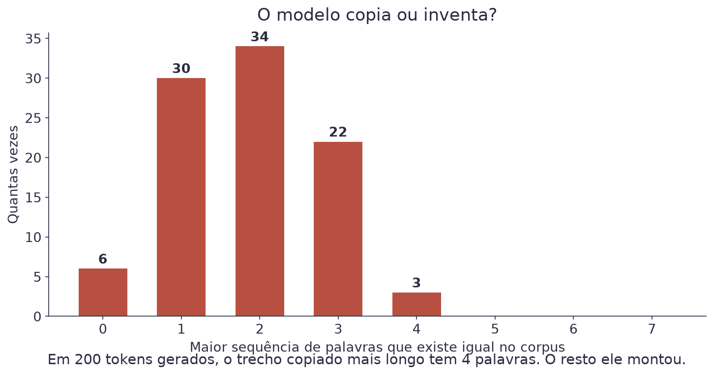
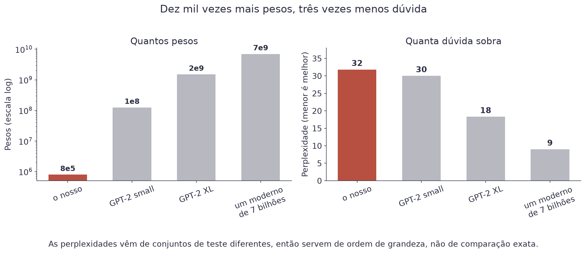

# Aula 12 — Geração e Limites


**O que você leva desta aula**

Você vai entender o que acontece entre a saída do modelo e a palavra que
aparece na tela, saber o que a temperatura faz de verdade, e conseguir
explicar por que um modelo de linguagem inventa fatos.


## Onde estamos

<figure><figcaption>O modelo está treinado. Falta transformar as probabilidades dele em texto, e saber do que ele não é capaz.</figcaption></figure>

## O modelo não devolve uma palavra

Este é o mal-entendido mais comum sobre modelos de linguagem, e vale
desfazer com um gráfico. Dê ao modelo treinado na Aula 11 o começo "Não
sei se a senhora" e olhe o que ele produz:

<figure><figcaption>Uma passada do modelo devolve 1.024 números, um por token do vocabulário.</figcaption></figure>

Nenhuma continuação chega a 11%. As dez melhores juntas dão 42%, e o resto
da probabilidade está espalhado por mais de mil tokens.

Escolher **qual** desses 1.024 vai para a tela é um problema separado, que
nada tem a ver com o treino. Ele tem nome: **amostragem** (*sampling*), e é
o assunto da primeira metade desta aula.

## Duas escolhas ruins

**Sempre o mais provável.** Chama-se decodificação gulosa (*greedy*). É
determinística e parece segura, e o resultado é ruim: o texto entra em
laço, repetindo a mesma frase. Um modelo que só escolhe o topo acaba num
lugar de onde o topo aponta de volta para si.

**Sortear direto da distribuição.** O oposto: cada token tem exatamente a
chance que o modelo deu. O problema está na cauda. Nesta posição, os
tokens fora dos 40 melhores somam 33% da probabilidade, espalhados por
984 candidatos. Um a um eles são improváveis, mas juntos dão uma chance em
três de o modelo escolher algo que ele mesmo considera ruim.

A saída é ficar no meio, e existem três controles para isso.

## Controle 1: a temperatura

Antes da softmax, divida todos os números por `T`.

$$P_j = \frac{e^{z_j / T}}{\sum_{k} e^{z_k / T}}$$

| Símbolo | Significado |
|---|---|
| `zⱼ` | o número cru (o *logit*) que o modelo deu ao token `j` |
| `T` | a temperatura, um número positivo que você escolhe |
| `Pⱼ` | a probabilidade final desse token |

Exemplo com três logits: 4, 2 e 0.

| Temperatura | Os logits viram | As probabilidades ficam |
|---|---|---|
| `T = 0,5` | 8, 4, 0 | 98%, 2%, 0% |
| `T = 1` | 4, 2, 0 | 87%, 12%, 2% |
| `T = 2` | 2, 1, 0 | 67%, 24%, 9% |

A última linha é a mesma conta das Aulas 8 e 10, com os mesmos três
números. Repare no que a temperatura fez: ela não mudou a ordem dos
candidatos, só a distância entre eles.

<figure><figcaption>A mesma saída do modelo, com três temperaturas. Nada no modelo mudou.</figcaption></figure>

Guarde a leitura em português:

| Temperatura | O que acontece |
|---|---|
| perto de 0 | vira a escolha gulosa: sempre o mesmo texto |
| 0,7 a 0,9 | o padrão da maioria das ferramentas |
| acima de 1,2 | o modelo passa a considerar tokens que ele mesmo acha improváveis |

## Controles 2 e 3: cortar a cauda

A temperatura reescala tudo, inclusive o lixo. Os outros dois controles
simplesmente eliminam candidatos antes do sorteio.

**Top-k**: fique com os `k` mais prováveis e zere o resto. Com `k = 40`,
os outros 984 tokens deixam de existir, e com eles vai embora aquele um
terço de risco. Simples, e sempre corta o mesmo
tanto, mesmo quando o modelo está muito seguro.

**Top-p** (ou núcleo, *nucleus*): pegue os mais prováveis até que a soma
deles passe de `p`. Com `p = 0,9`, no exemplo do começo desta aula, isso
daria 145 tokens; numa posição onde o modelo está certo do que vem, daria
dois ou três. É a versão que se adapta.

```python
corte = torch.topk(logits, 40)[0][:, -1:]
logits = logits.masked_fill(logits < corte, float("-inf"))
```

## Os quatro textos

Mesmo modelo, mesmo início, quatro jeitos de escolher:

<figure><figcaption>Nenhum peso mudou entre as quatro linhas. Só a regra de escolha.</figcaption></figure>

Leia com atenção. Na temperatura 0,3 aparece "disse elle, disse elle": é a
repetição chegando. Na 1,5 aparecem palavras que não existem. A 0,8 é a que
lê melhor, e é por isso que ela é o padrão em quase toda ferramenta.

## Autorregressão: o erro vira entrada

Uma palavra sobre o mecanismo. Gerar texto é repetir o mesmo passo:

1. Passe o texto atual pelo modelo.
2. Pegue os 1.024 números da última posição.
3. Aplique temperatura e corte.
4. Sorteie um token.
5. Cole ele no fim do texto e volte ao passo 1.

Isso se chama **geração autorregressiva**, e tem uma consequência que
explica muito. O token sorteado no passo 4 vira entrada do passo 1
seguinte. Se ele foi ruim, o modelo não tem como voltar atrás: ele agora
precisa continuar coerentemente a partir do erro.

É por isso que temperatura alta não produz "criatividade". Ela produz um
erro que contamina tudo o que vem depois.


**Erro do dia**

Subir a temperatura achando que isso deixa o modelo mais criativo. O que
sobe é a chance de ele escolher um token que ele mesmo considera
improvável, e a partir dali o texto tem que se justificar sozinho. Se você
quer outra resposta, mude o começo, não a temperatura.


## Ele copia ou inventa?

É a pergunta que a turma sempre faz, e dá para medir. Pegue 200 tokens
gerados pelo modelo e procure, para cada posição, o maior trecho que
aparece **literalmente** no corpus de Machado:

<figure><figcaption>O trecho copiado mais longo tem 4 palavras. Tudo o mais o modelo montou.</figcaption></figure>

A média é 1,85 palavras. O modelo não guarda o texto: ele guarda uma
estatística sobre o texto, em 787.584 números. Reconstruir uma frase
inteira de Machado a partir disso é impossível, e produzir uma frase nova
que soa como Machado é exatamente o que ele faz.

Modelos grandes, treinados em textos que aparecem muitas vezes na
internet, conseguem reproduzir trechos longos. É um problema real de
direito autoral, e a causa é a repetição no corpus, não a arquitetura.

## Por que o modelo alucina

Agora a parte que importa fora da sala de aula. Nosso modelo escreve
frases confiantes sobre coisas que nunca existiram, e não há nada de
errado com ele. Ele está fazendo exatamente o que o treino pediu.

| O que ele tem | O que ele não tem |
|---|---|
| Uma estimativa de qual token é provável | Qualquer noção de verdadeiro e falso |
| 787.584 pesos ajustados por gradiente | Um lugar para consultar um fato |
| Uma janela de 128 tokens | Memória do que disse antes disso |
| A estatística do corpus | Uma marcação do que veio de onde |

"Alucinação" é um nome ruim, porque sugere defeito. Uma frase falsa e
fluente e uma frase verdadeira e fluente têm exatamente a mesma natureza
para o modelo: as duas são sequências prováveis. Ele não tem como
distinguir, porque nunca teve.

## O modelo é o corpus

Repare no que o nosso escreve: "elle", "cousa", "mettia", "pharmacia". Ele
escreve a grafia de 1899 porque leu 3,7 milhões de caracteres de 1899, e
nada mais.

Essa é a lição que vale para qualquer modelo de linguagem, e para qualquer
tamanho. Um modelo treinado em fóruns escreve como fórum. Um modelo
treinado em texto majoritariamente em inglês responde melhor em inglês. Um
modelo treinado em textos que carregam um preconceito reproduz esse
preconceito, com a mesma fluência com que reproduz a gramática.

Não existe modelo neutro. Existe corpus, e o modelo é o que ele diz.

## O que a escala compra

<figure><figcaption>Dez mil vezes mais pesos compram cerca de três vezes menos dúvida. Não é pouco, e é caro.</figcaption></figure>

As perplexidades vêm de conjuntos de teste diferentes, então valem como
ordem de grandeza. O que a figura mostra é o formato da coisa: cada corte
na dúvida custa ordens de grandeza mais treino que o anterior.

E o que se ganha com isso não é só "menos dúvida". Com escala aparecem
comportamentos que o modelo pequeno não tem: seguir uma instrução, manter
o assunto por páginas, fazer uma conta de várias etapas.

## O que falta para virar um assistente

Nosso modelo continua texto. Ele não responde perguntas, e isso não é
questão de tamanho: é questão de treino. Entre o modelo que você montou e
um assistente existem duas etapas a mais:

| Etapa | O que faz |
|---|---|
| Pré-treino | o que fizemos: prever o próximo token, em muito texto |
| Ajuste por instrução | treinar em pares de pergunta e resposta boa |
| Ajuste por preferência | treinar com pessoas comparando duas respostas |

A segunda etapa é o que ensina o formato "alguém perguntou, agora
responda". A terceira é o que ensina qual resposta as pessoas preferem. As
duas usam o mesmo gradiente descendente da Aula 1, sobre os mesmos pesos.

## A novidade: gastar tempo em vez de peso

Até 2023, melhorar um modelo queria dizer uma coisa só: mais pesos e mais
texto de treino. De 2024 para cá apareceu uma segunda alavanca, e ela não
mexe em nenhum peso.

A ideia é simples ao ponto de parecer trapaça: **deixe o modelo escrever
mais antes de responder**. Em vez de exigir a resposta na primeira linha,
peça que ele escreva o raciocínio, e só então conclua. Cada token que ele
escreve entra de volta como entrada do próximo, então pensar em voz alta é
literalmente dar a si mesmo mais contexto para trabalhar.

Três formas disso, da mais simples para a mais elaborada:

| Truque | O que se faz |
|---|---|
| Escrever o passo a passo | pedir o raciocínio antes da resposta |
| Votação | gerar a mesma resposta cinco vezes e ficar com a mais frequente |
| Revisão | gerar, criticar a própria resposta, e gerar de novo |

Repare que os três funcionam **com o modelo já pronto**, sem treinar nada.
O que eles gastam é tempo de máquina na hora de responder. Daí o nome:
*inference-time scaling*, ou escalar no momento de responder.

É por isso que os modelos de raciocínio de hoje demoram e mostram um
"pensando" antes de falar. Não há mágica nova ali dentro: é o mesmo
transformer desta aula, gerando um token de cada vez, só que gerando muito
mais antes de mostrar o resultado.


**Por que isso importa para você**

O modelo que você usa no dia a dia não muda. O seu jeito de pedir muda.
Pedir "explique o seu raciocínio antes de responder" costuma valer mais
que qualquer ajuste de temperatura, e é de graça.


## Explique sem olhar

O teste mais honesto de que você entendeu é tentar explicar sem ler.
Feche esta página e responda em voz alta, como se explicasse para um
colega. Onde travar, é ali que falta entender: volte à seção.

1. O que a temperatura muda, e o que ela não muda?
2. Por que a escolha gulosa entra em repetição?
3. Por que "alucinação" é um nome ruim para o que o modelo faz?

## Cola da aula

| Conceito | O que significa |
|---|---|
| Logit | O número cru que o modelo dá a um token, antes da softmax |
| Amostragem | A regra para escolher um token entre os 1.024 |
| Gulosa | Escolher sempre o mais provável: entra em repetição |
| Temperatura | Divide os logits: baixa concentra, alta espalha |
| Top-k | Fica só com os k mais prováveis |
| Top-p | Fica com os mais prováveis até somarem p |
| Autorregressiva | Cada token gerado vira entrada do passo seguinte |
| Alucinação | Frase provável e falsa: o modelo não distingue as duas |
| Ajuste por instrução | O treino extra que transforma um continuador em assistente |

## Materiais

- **Notebook desta aula, no Google Colab:** [](https://colab.research.google.com/github/klein-natan/nanodegree-AI-Atitus/blob/main/notebooks/aula-12-geracao-e-limites.ipynb)
- Slides desta aula: entregues em sala.
- Modelo treinado: [`mini_llm.pt`](https://github.com/klein-natan/nanodegree-AI-Atitus/blob/main/data/mini_llm.pt)

## Para ir além

- [The Curious Case of Neural Text Degeneration](https://arxiv.org/abs/1904.09751): o artigo que apresentou o top-p, com exemplos de texto degenerado que valem mais que a matemática.
- [Extracting Training Data from Large Language Models](https://arxiv.org/abs/2012.07805): quanto um modelo grande consegue reproduzir do que leu, medido.
- [Deep Dive into LLMs like ChatGPT (Andrej Karpathy)](https://www.youtube.com/watch?v=7xTGNNLPyMI): três horas sobre o que existe depois do pré-treino, incluindo as etapas que este curso só menciona. Em inglês.
- [Build a Large Language Model (From Scratch)](https://www.manning.com/books/build-a-large-language-model-from-scratch): o livro que inspirou a ordem desta aula. Constrói um GPT em PyTorch, peça por peça, em inglês.
- [Build a Reasoning Model (From Scratch)](https://www.manning.com/books/build-a-reasoning-model-from-scratch): de onde veio a seção sobre gastar tempo em vez de peso. Em inglês.
- [Glossário](../glossario.md): para revisar qualquer termo novo desta aula.
