# Aula 1 — Regressão Linear Simples


**O que você leva desta aula**

Você vai aprender a desenhar uma reta que prevê um preço a partir de uma
distância, a medir o quanto essa reta erra, e a usar o gradiente
descendente, a técnica que todo modelo de IA usa para aprender, para
melhorar essa reta sozinho, sem chute.


## Para que serve

Você chama um carro por aplicativo. Antes de aceitar a corrida, o app já
mostra o preço. Como ele sabe isso antes mesmo de você sair de casa?

Ele não sabe o futuro. Ele olha para o passado: milhares de corridas
anteriores, cada uma com sua distância e seu preço final. Nesses dados
existe um padrão. Corridas mais longas custam mais. O aplicativo usa esse
padrão para prever o preço da sua corrida antes de ela acontecer.

Regressão linear é a ferramenta mais simples para encontrar esse padrão.
Ela desenha uma reta no meio dos seus dados e usa essa reta para prever.
Esta aula usa exatamente esse exemplo, o preço de uma corrida, para
ensinar a matemática por trás de qualquer modelo de previsão.

Veja como fica quando você coloca a distância e o preço de 200 corridas
num gráfico:

<figure>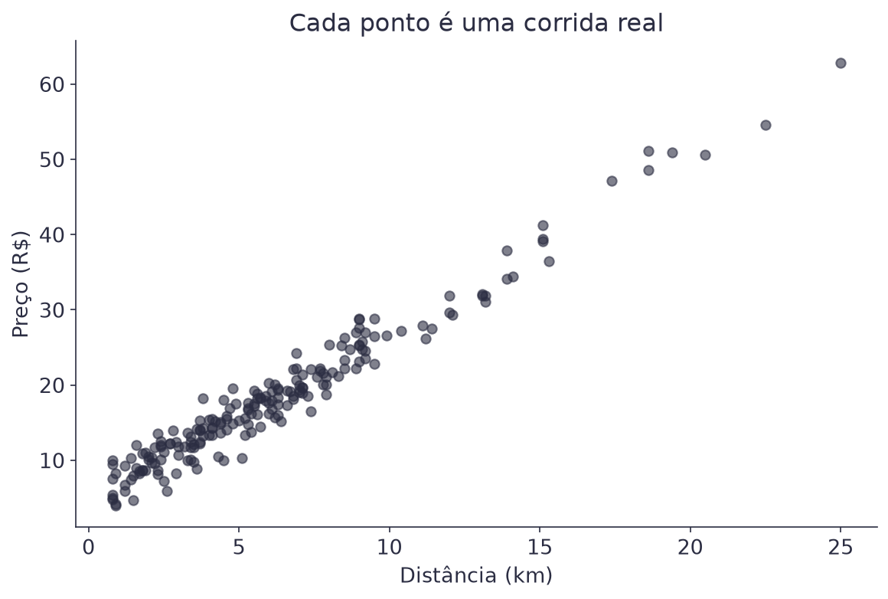<figcaption>Cada ponto é uma corrida real.</figcaption></figure>

Os pontos não formam uma reta perfeita. O trânsito, o horário e outros
fatores empurram cada corrida um pouco para cima ou para baixo. Mas dá
para ver uma tendência clara: quanto maior a distância, maior o preço. É
essa tendência que a regressão linear captura.

## A reta que prevê o preço

Uma reta de regressão é uma regra simples: você entra com a distância, ela
devolve o preço previsto.

O preço previsto é a taxa fixa (o valor cobrado mesmo numa corrida de 0
km) mais o preço por quilômetro, multiplicado pela distância.

$$\text{preço} = w_0 + w_1 \cdot \text{distância}$$

| Símbolo | Significado |
|---|---|
| `preço` | o preço previsto pela reta, em reais |
| `distância` | a distância da corrida, em km |
| `w₀` | a taxa fixa: o preço previsto para uma corrida de 0 km |
| `w₁` | o preço por km: quanto o preço sobe para cada km a mais |

Exemplo: se `w₀ = 5` e `w₁ = 2,20`, uma corrida de 8 km custa `5 + 2,20 ×
8 = 22,60` reais.

Repare que `w₁` é o único número que decide o quanto o preço reage à
distância. Se `w₁` dobrasse, cada km rodado custaria o dobro. A reta
ficaria bem mais inclinada, e corridas longas ficariam
desproporcionalmente mais caras.

`w₀` e `w₁` (lê-se "peso zero" e "peso um") se chamam **coeficientes** ou
**pesos** do modelo. Encontrar a melhor reta é, na prática, encontrar os
melhores valores para esses dois números. O nome "peso" (do inglês
*weight*) é o mesmo usado em modelos bem maiores: cada conexão de uma
rede neural tem um peso, e a ideia continua sendo esta.

## O erro de cada previsão

Nenhuma reta acerta todas as 200 corridas. Os pontos não estão exatamente
alinhados. A diferença entre o preço real de uma corrida e o preço que a
reta previu para ela se chama **resíduo** (também chamado de *erro*).

$$\text{resíduo} = \text{preço real} - \text{preço previsto}$$

| Símbolo | Significado |
|---|---|
| `preço real` | o preço que a corrida realmente teve |
| `preço previsto` | o preço que a reta calculou para essa mesma corrida |

Exemplo: uma corrida de 8 km custou R$ 25,00, e a reta previu R$ 22,60.
O resíduo dessa corrida é 25,00 − 22,60 = R$ 2,40.

A mesma conta, escrita com símbolos:

$$arepsilon_i = y_i - \hat{y}_i$$

| Símbolo | Significado |
|---|---|
| `i` | o número da corrida: 1 para a primeira, 2 para a segunda... |
| `εᵢ` | o resíduo da corrida `i` (lê-se "épsilon i") |
| `yᵢ` | o preço real da corrida `i` |
| `ŷᵢ` | o preço previsto para a corrida `i` (lê-se "y chapéu") |

No exemplo acima, `y₁ = 25,00`, `ŷ₁ = 22,60` e `ε₁ = 2,40`. Esses três
símbolos voltam em todas as fórmulas de erro desta página.

Um resíduo positivo significa que a reta previu um preço menor que o
real. Um resíduo negativo significa que ela previu um preço maior.
Visualmente, o resíduo é a distância vertical entre o ponto e a reta:

<figure>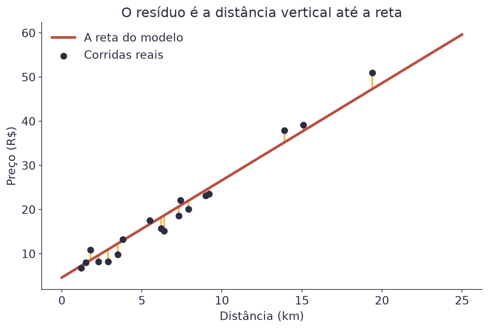<figcaption>O resíduo é a distância vertical até a reta. Quanto mais perto de zero, melhor a previsão daquela corrida.</figcaption></figure>

Uma reta boa não é a que acerta uma corrida perfeitamente. É a que erra
pouco, na média, em todas as corridas ao mesmo tempo.

## Encontrando a melhor reta: o erro quadrático médio

Para comparar retas diferentes, você precisa de um único número que
resuma o quanto uma reta erra. O mais usado é o **erro quadrático médio**
(*mean squared error*, ou MSE): a média dos resíduos, cada um elevado ao
quadrado.

$$\text{MSE} = \frac{1}{n}\sum_{i=1}^{n}(y_i - \hat{y}_i)^2$$

| Símbolo | Significado |
|---|---|
| `n` | o número de corridas |
| `yᵢ` | o preço real da corrida `i` |
| `ŷᵢ` | o preço que a reta previu para a corrida `i` (lê-se "y chapéu") |

Por que elevar ao quadrado, e não só somar os erros? Por dois motivos.
Primeiro, um resíduo pode ser negativo (a reta previu preço maior que o
real) ou positivo (previu menor). Se você só somasse, um erro positivo
cancelaria um negativo, e a soma poderia dar zero mesmo com a reta
errando bastante. Elevar ao quadrado remove esse problema, porque todo
número ao quadrado é positivo. Segundo, o quadrado penaliza mais os erros
grandes: errar R$ 2 em uma corrida conta 4; errar R$ 10 conta 100. Vinte
e cinco vezes mais, não só cinco.

Exemplo com 3 corridas, cujos resíduos foram R$ 1, R$ -2 e R$ 3: elevando
cada um ao quadrado, você tem 1, 4 e 9. A média é (1+4+9)/3 = 4,67. O MSE
dessas três corridas é 4,67, em reais ao quadrado. Uma unidade estranha,
que é justamente o motivo de existirem as outras métricas desta página.

Quanto menor o MSE, melhor a reta. Veja três retas candidatas para os
mesmos dados, cada uma com seu MSE:

<figure>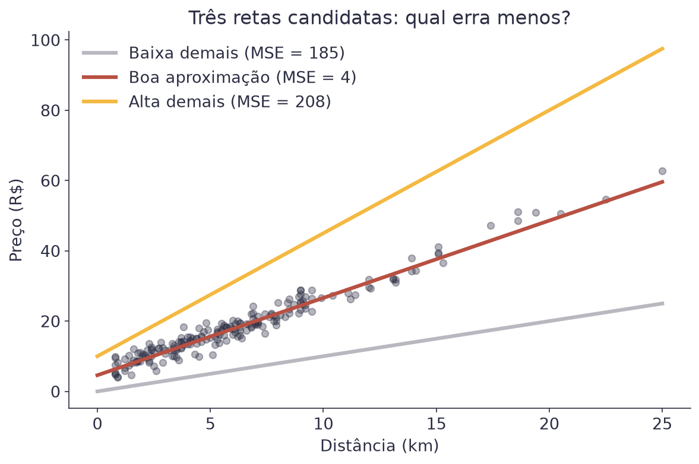<figcaption>A reta do meio tem o menor MSE. É a que melhor acompanha os pontos.</figcaption></figure>

## Existe um atalho: mínimos quadrados

Para uma reta simples como esta, existe uma fórmula que calcula os
melhores `w₀` e `w₁` direto, sem precisar tentar valor por valor. Ela se
chama **mínimos quadrados** (*ordinary least squares*).

$$w_1 = \frac{\sum_{i=1}^{n}(x_i - \bar{x})(y_i - \bar{y})}{\sum_{i=1}^{n}(x_i - \bar{x})^2} \qquad w_0 = \bar{y} - w_1 \bar{x}$$

| Símbolo | Significado |
|---|---|
| `xᵢ`, `yᵢ` | a distância e o preço da corrida `i` |
| `x̄` | a média de todas as distâncias |
| `ȳ` | a média de todos os preços |

Este guia não deduz de onde essa fórmula vem. O importante aqui é saber
que ela existe e o que ela calcula, não como alguém a inventou.

Exemplo com 3 corridas de brinquedo, com distâncias 1, 2 e 3 km e preços
R$ 6, R$ 9 e R$ 15: a distância média é `x̄ = 2` e o preço médio é
`ȳ = 10`. Aplicando a fórmula, `w₁ = 4,5` e `w₀ = 1`. A melhor reta para
este mini-exemplo é `preço = 1 + 4,5 × distância`.


Repare que os resíduos dessa reta (0,50, -1,00 e 0,50) somam zero. Isso
não é coincidência: a reta de mínimos quadrados sempre produz resíduos
que somam exatamente zero. É uma boa forma de conferir uma conta feita à
mão.


Se essa fórmula resolve o problema direto, por que aprender outro jeito
de chegar à mesma resposta? Porque ela é a exceção, não a regra. A
próxima seção mostra o método que funciona quando ela não existe, que é
quase sempre.

## Gradiente descendente: descendo a serra na neblina

Imagine que você está numa serra, de noite, com neblina fechada. Você não
enxerga o vale lá embaixo, mas consegue sentir com os pés se o chão desce
para a esquerda ou para a direita. A estratégia mais simples para chegar
ao fundo do vale é: sinta a inclinação do chão onde você está, dê um
passo na direção que desce, e repita.

O **gradiente descendente** faz exatamente isso, mas em vez de um vale de
terra, o "terreno" é o MSE. Em vez de posição geográfica, você está
"andando" sobre os valores possíveis de `w₀` e `w₁`. A inclinação do
terreno em cada ponto tem um nome técnico: **gradiente**. Ele aponta para
onde o erro cresce mais rápido, e por isso você anda na direção
contrária a ele.

### Por que não usar sempre o atalho

A fórmula dos mínimos quadrados dá a resposta exata de primeira, sem
passo nenhum. Parece sempre melhor que descer a serra tateando no
escuro. E é, para uma reta com dois pesos.

O problema é que ela não escala. Aquela fórmula existe porque alguém
conseguiu resolver a conta no papel, e isso só dá certo em modelos
pequenos. Uma rede neural tem milhões de pesos amarrados uns nos outros,
e ninguém nunca resolveu essa conta no papel. Para ela não existe fórmula
fechada, e provavelmente nunca vai existir.

O gradiente descendente não precisa resolver conta nenhuma. Ele precisa
saber uma coisa só: de onde estou, para que lado o erro diminui? Essa
pergunta tem resposta em qualquer modelo, de qualquer tamanho.

É por isso que esta seção é a mais importante da aula. O mesmo método que
ajusta a reta das corridas treina a rede que reconhece imagens na Aula 8
e o modelo de linguagem que você constrói na Aula 11. Muda o tamanho do
modelo. A ideia é esta.

### O terreno existe, e dá para desenhá-lo

Essa serra não é só uma figura de linguagem. Para enxergá-la, congele
`w₀` no valor que os mínimos quadrados dão (4,63) e mexa só em `w₁`. Cada
valor de `w₁` dá uma reta diferente, e cada reta tem o seu MSE. Marque
`w₁` no eixo horizontal e o MSE no eixo vertical, e o terreno aparece:

<figure>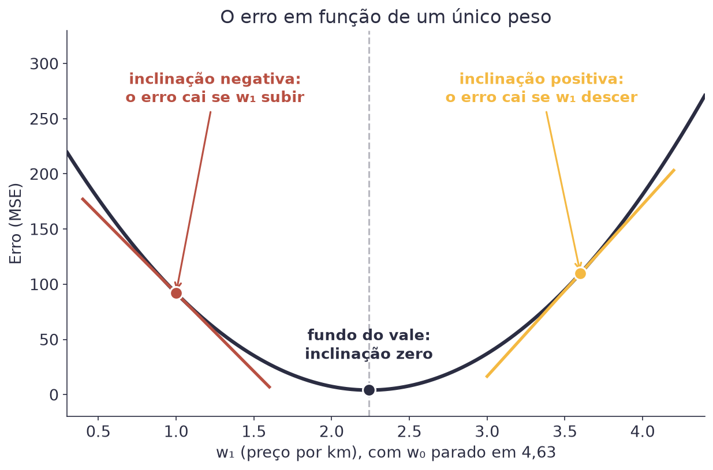<figcaption>Cada ponto desta curva é uma reta diferente, com o erro que ela comete. O fundo do U é o melhor preço por km.</figcaption></figure>

Repare em três coisas. A curva tem um fundo, e é ali que mora o melhor
`w₁`. À esquerda do fundo ela desce, à direita ela sobe. E a inclinação
do chão em cada ponto já diz para que lado andar: onde a curva desce,
aumentar `w₁` diminui o erro.

### A inclinação tem nome: derivada

Você está parado num ponto da curva e precisa decidir uma coisa só: para
que lado andar. A **derivada** responde exatamente isso. Ela olha o peso
onde você está e diz o que acontece com o erro se você aumentar esse peso
um tiquinho.

Pense numa placa de estrada avisando "10% de inclinação": a cada 100
metros andados para a frente, a estrada sobe 10 metros. Aqui, "andar para
a frente" é aumentar o peso, e "subir" é o erro aumentar.

A conta é a mesma da placa. Ande um tiquinho para a frente e veja o
quanto o erro subiu.

$$\text{inclinação} \approx \frac{\text{MSE}(w_1 + h) - \text{MSE}(w_1)}{h}$$

| Símbolo | Significado |
|---|---|
| `h` | o tiquinho andado: um avanço pequeno no valor de `w₁` |
| `MSE(w₁)` | o erro com o `w₁` de agora |
| `MSE(w₁ + h)` | o erro depois de andar esse tiquinho |
| `≈` | "quase igual": a conta fica exata quando `h` encolhe até quase zero |

Exemplo, partindo de `w₁ = 3,20` com um avanço de `h = 0,05`: o erro sai
de 56,75 para 62,38. A subida foi 5,63, e 5,63 ÷ 0,05 = 112,7. A
inclinação naquele ponto é 112,7. Ela é positiva, então aumentar `w₁`
aumenta o erro, e o caminho para baixo é o contrário.

**Como ler o número que sai.** Ele carrega duas informações ao mesmo
tempo, e o modelo usa as duas:

| O que a derivada diz | O que o modelo faz com isso |
|---|---|
| **Sinal positivo**: aumentar o peso aumenta o erro | anda para o outro lado, diminuindo o peso |
| **Sinal negativo**: aumentar o peso diminui o erro | anda para a frente, aumentando o peso |
| **Número grande**: ladeira íngreme, o erro muda rápido ali | dá um passo maior |
| **Número perto de zero**: chão plano, o erro quase não muda | dá um passo curto: o fundo está perto |

É por isso que a derivada é a peça que faltava. Sem ela, você saberia o
erro do lugar onde está e mais nada, e teria que testar valores no
escuro, um por um. Com ela, você sabe para onde ir antes de dar o passo.

A animação mostra o que acontece quando o avanço encolhe. A reta amarela
liga dois pontos da curva, e tem nome: **secante**. Quanto menor o
avanço, mais ela cola na reta tracejada, aquela que toca a curva em um
ponto só: a **tangente**. A derivada é a inclinação dessa tangente.

<figure>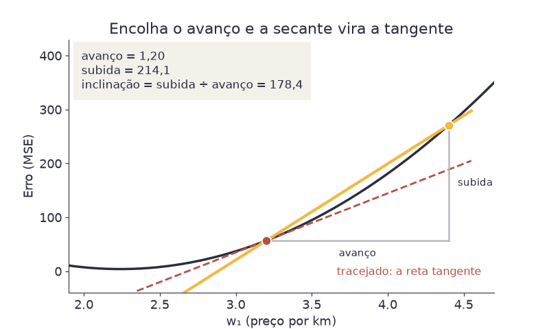<figcaption>Encolha o avanço e a secante vira a tangente. A inclinação dela é a derivada.</figcaption></figure>

Ninguém precisa calcular derivada à mão neste curso. Quem faz essa conta
é o computador. O que você precisa levar é o significado do número: para
que lado o erro cresce, e o quão rápido.

### O gradiente: uma inclinação para cada peso

A curva de antes tinha um peso só, porque `w₀` ficou congelado. No treino
de verdade os dois pesos se mexem, e aí não existe uma inclinação só.
Existe uma para cada peso: o quanto o erro muda se você mexer só em `w₀`,
e o quanto ele muda se você mexer só em `w₁`. Essa lista de inclinações é
o **gradiente**.

$$\nabla \text{MSE} = \left( \frac{\partial \text{MSE}}{\partial w_0} \; , \; \frac{\partial \text{MSE}}{\partial w_1} \right)$$

| Símbolo | Significado |
|---|---|
| `∇` | nabla: o símbolo do gradiente, a lista de todas as inclinações |
| `∂MSE/∂w₀` | a inclinação do erro quando só `w₀` se mexe |
| `∂MSE/∂w₁` | a inclinação do erro quando só `w₁` se mexe |

O símbolo `∂` é a derivada quando existe mais de um peso. Ele quer dizer:
mexa só neste peso aqui e segure os outros parados. A conta continua sendo
a mesma de antes, subida dividida por avanço, feita uma vez por peso.

Volte para a serra. Andar só para o norte tem uma inclinação, andar só
para o leste tem outra, e o gradiente é esse par. Ele aponta para onde o
erro cresce mais rápido, e é por isso que o modelo anda no sentido
contrário.

Exemplo com duas corridas de brinquedo (2 km por R$ 9 e 5 km por R$ 15) e
o chute `w₀ = 0`, `w₁ = 2`. As previsões são R$ 4 e R$ 10, então os dois
resíduos valem R$ 5. O gradiente nesse ponto é `(−10 ; −35)`. Os dois
números são negativos, o que significa que subir os dois pesos reduz o
erro.

### A regra de atualização

$$w_{t+1} = w_t - \alpha \cdot \frac{\partial \text{MSE}}{\partial w}$$

| Símbolo | Significado |
|---|---|
| `t` | o número do passo: `t = 0` é o chute inicial |
| `wₜ` | o valor do peso no passo `t` |
| `wₜ₊₁` | o valor que esse peso passa a ter no passo seguinte |
| `α` | a taxa de aprendizado (*learning rate*): o tamanho do passo |
| `∂MSE/∂w` | a inclinação do erro naquele ponto, para aquele peso |

O sinal de menos é o coração da fórmula. Se a inclinação é positiva, o
erro cresce para a frente, então o peso anda para trás. Se é negativa, o
peso anda para a frente.

O `t` é só um contador de passos. A fórmula é uma receita para repetir:
você calcula o peso do passo seguinte a partir do peso de agora, e usa
esse resultado como ponto de partida da próxima volta. Cada peso tem a sua
própria linha, com a sua própria inclinação.

Veja dois passos calculados à mão, com as mesmas duas corridas de
brinquedo, taxa de aprendizado `α = 0,01`, e o chute inicial `w₀ = 0`,
`w₁ = 2`:

| Passo | `w₀` | `w₁` | MSE |
|---|---|---|---|
| `t = 0` (chute inicial) | 0,00 | 2,00 | 25,00 |
| `t = 1` | 0,10 | 2,35 | 13,78 |
| `t = 2` | 0,17 | 2,59 | 8,43 |

A cada passo, o MSE cai. A reta está melhorando sozinha, sem que ninguém
diga qual deveria ser o próximo chute. Rodando esse mesmo processo
dezenas de vezes, ele se aproxima cada vez mais da resposta que a fórmula
de mínimos quadrados dá direto.

Na curva do erro, esse processo vira uma bolinha escorregando para o
fundo. Repare que os passos encolhem sozinhos: perto do fundo o chão fica
plano, a inclinação diminui, e o passo diminui junto.

<figure>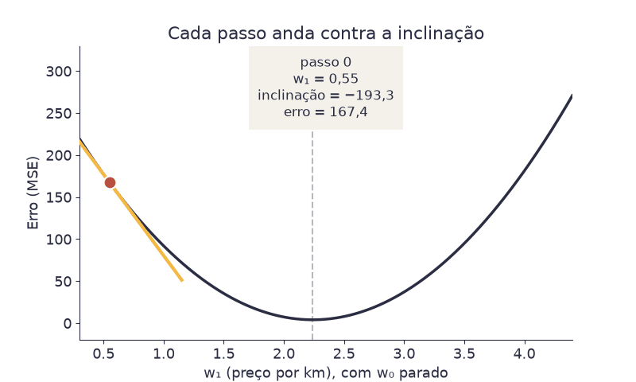<figcaption>Cada passo anda contra a inclinação. Perto do fundo, os passos ficam curtos.</figcaption></figure>

### O algoritmo, do começo ao fim

Junte as peças e o gradiente descendente inteiro cabe em cinco passos:

1. **Chute qualquer valor** para `w₀` e `w₁`. Zero serve. O chute não
   precisa ser bom, e quase nunca é.
2. **Calcule o erro** (o MSE) com os pesos que você tem agora.
3. **Calcule a inclinação** do erro para cada peso. É a conta da seção
   anterior, feita uma vez por peso.
4. **Ande contra a inclinação**: aplique a regra de atualização, uma vez
   para cada peso.
5. **Volte ao passo 2** e repita.

Quando parar? Quando o erro parar de cair de forma perceptível. Perto do
fundo a inclinação chega perto de zero, os passos encolhem sozinhos, e
mais uma volta quase não muda nada. Na prática você também define um
número máximo de voltas, para o programa não rodar para sempre.

Repare no que o algoritmo **não** faz. Ele nunca testa todos os valores
possíveis de `w₀` e `w₁`. Ele nunca precisa enxergar o terreno inteiro.
Ele olha só para o chão embaixo dos próprios pés, e essa modéstia é o que
faz o método funcionar tanto num modelo de dois pesos quanto num de
bilhões.

### Com os dois pesos ao mesmo tempo

Congelar `w₀` foi só para caber num desenho. No treino de verdade os dois
pesos mudam juntos, e o terreno deixa de ser uma curva. Com dois pesos
ele vira uma superfície, uma bacia de verdade:

<figure>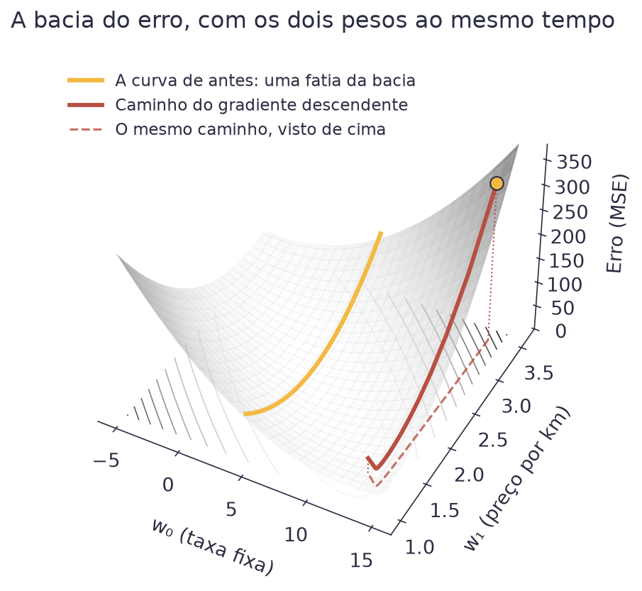<figcaption>A curva de antes é uma fatia desta bacia. O gradiente descendente escorrega pela parede até o fundo.</figcaption></figure>

A regra de atualização não muda quando os dois pesos andam juntos. Você a
aplica duas vezes por passo, uma para cada peso, cada uma com a sua
inclinação.

Essa mesma bacia, vista de cima, vira um mapa. Cada tom de cinza é um
valor de MSE, e a linha vermelha é o caminho que o gradiente descendente
percorre, passo a passo, até chegar perto do fundo, a região mais clara,
onde o erro é menor.

<figure>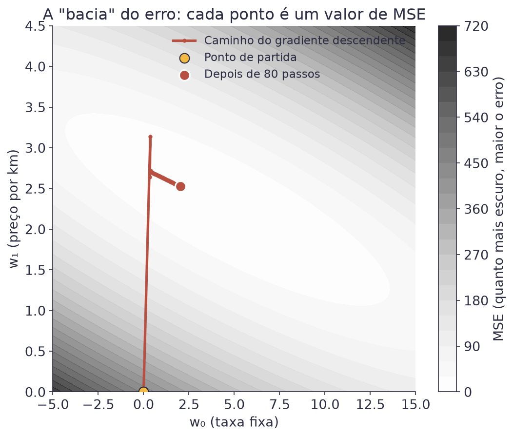<figcaption>Cada ponto do mapa é uma reta diferente. O gradiente descendente caminha até a região de menor erro.</figcaption></figure>

### A taxa de aprendizado

O tamanho do passo, `α`, decide se o gradiente descendente funciona bem,
devagar, ou nem funciona:

<figure>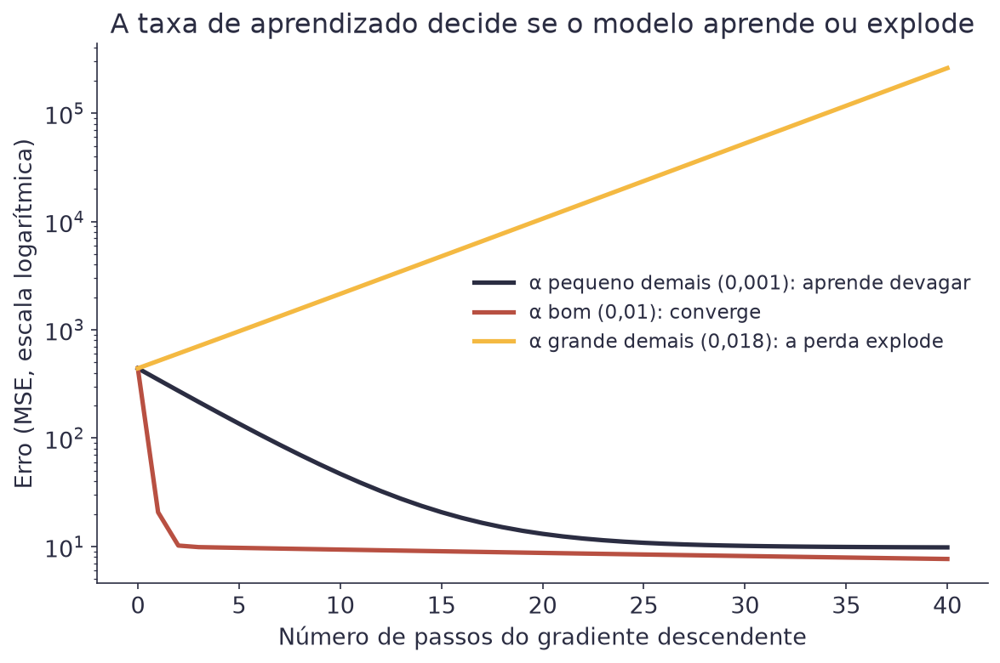<figcaption>Taxa pequena demais: aprende, mas devagar. Taxa boa: converge rápido. Taxa grande demais: o erro explode.</figcaption></figure>

- **Taxa pequena demais.** Cada passo é curto. O modelo até melhora, mas
  leva muito mais tempo, e muito mais passos, para chegar perto da
  melhor reta.
- **Taxa boa.** Os passos são grandes o suficiente para andar rápido, mas
  pequenos o suficiente para não passar do ponto certo.
- **Taxa grande demais.** Cada passo é tão largo que ultrapassa o fundo
  da bacia e cai do outro lado, cada vez mais alto. O erro, em vez de
  cair, cresce sem parar.


**Erro do dia**

É comum, na primeira vez que se usa gradiente descendente, escolher uma
taxa de aprendizado grande demais para "o modelo aprender mais rápido",
e ver o erro, em vez de diminuir, virar um número gigante ou `nan` ("não
é um número", o jeito do Python de dizer que a conta explodiu). Se isso
acontecer, a correção quase sempre é a mesma: diminua a taxa de
aprendizado, muitas vezes por um fator de 10, e rode de novo.


## Métricas de regressão

Depois de treinar um modelo, você precisa de números que digam, em
linguagem simples, o quanto ele erra. Cada métrica conta uma parte da
história. Vamos calcular as quatro para o mesmo mini-exemplo de antes (as
3 corridas de brinquedo, com resíduos 0,50, -1,00 e 0,50).

### MAE: o erro médio, em reais

O **erro absoluto médio** (*mean absolute error*) é a média do tamanho
dos erros, ignorando se cada um é para cima ou para baixo.

$$\text{MAE} = \frac{1}{n}\sum_{i=1}^{n}|y_i - \hat{y}_i|$$

| Símbolo | Significado |
|---|---|
| barras verticais | valor absoluto: transforma um número negativo em positivo |
| `n`, `yᵢ`, `ŷᵢ` | os mesmos símbolos do MSE (número de corridas, preço real, preço previsto) |

As barras verticais em torno de `yᵢ - ŷᵢ` deixam um número já positivo
como está, e transformam um número negativo em positivo.

No mini-exemplo: (0,50 + 1,00 + 0,50)/3 = 0,67. Em média, a reta erra
R$ 0,67 por corrida, na mesma unidade do preço, fácil de explicar para
qualquer pessoa.

### MSE e RMSE: penalizando os erros grandes

Você já viu o MSE (a média dos erros ao quadrado). No mini-exemplo:
(0,25 + 1,00 + 0,25)/3 = 0,50. O problema do MSE é a unidade: "reais ao
quadrado" não significa nada no mundo real.

A **raiz do erro quadrático médio** (*root mean squared error*, RMSE)
resolve isso. É só a raiz quadrada do MSE, o que devolve a métrica para
a unidade original.

$$\text{RMSE} = \sqrt{\text{MSE}}$$

| Símbolo | Significado |
|---|---|
| raiz quadrada | devolve o MSE para a unidade original (reais) |

No mini-exemplo: a raiz quadrada de 0,50 é 0,71. O RMSE fica bem perto do
MAE neste caso. Isso muda quando existe um erro muito fora do padrão.

### MAPE: o erro em porcentagem

Nas 200 corridas, o MAE do modelo dá R$ 1,61. Agora responda: isso é
muito?

Depende da corrida. Errar R$ 1,61 numa corrida de R$ 8 é errar um quinto
do preço, e o cliente percebe na hora. Errar os mesmos R$ 1,61 numa
corrida de R$ 50 é errar pouco mais de 3%, e ninguém reclama. O mesmo
erro em reais não vale a mesma coisa nas duas.

O **erro percentual absoluto médio** (*mean absolute percentage error*,
MAPE) resolve isso com uma ideia só: antes de tirar a média, transforme o
erro de cada corrida em porcentagem do preço daquela corrida.

Faça isso corrida por corrida, no mini-exemplo de três:

| Corrida | Preço real | Previsto | Resíduo | Em % do preço real |
|---|---|---|---|---|
| 1 | R$ 6,00 | R$ 5,50 | +R$ 0,50 | 0,50 ÷ 6,00 = 8,3% |
| 2 | R$ 9,00 | R$ 10,00 | −R$ 1,00 | 1,00 ÷ 9,00 = 11,1% |
| 3 | R$ 15,00 | R$ 14,50 | +R$ 0,50 | 0,50 ÷ 15,00 = 3,3% |

A última coluna joga fora o sinal: errar R$ 1 para cima ou para baixo
conta igual. A média dessas três porcentagens é
(8,3 + 11,1 + 3,3) ÷ 3 = **7,6%**. Esse é o MAPE.

A fórmula diz isso mesmo, em símbolos:

$$\text{MAPE} = \frac{100}{n}\sum_{i=1}^{n}\left|\frac{y_i - \hat{y}_i}{y_i}\right|$$

| Símbolo | Significado |
|---|---|
| `yᵢ - ŷᵢ` | o resíduo da corrida `i`: quanto o modelo errou, em reais |
| dividido por `yᵢ` | o resíduo vira uma fração do preço daquela corrida |
| as barras verticais | valor absoluto: jogam fora o sinal do resíduo |
| `100` | transforma a fração em porcentagem |
| `n` | o número de corridas |

Leia a fórmula de dentro para fora e ela vira a tabela: pegue o resíduo,
divida pelo preço real, tire o sinal, some em todas as corridas, divida
pelo número de corridas e multiplique por 100.

Nas 200 corridas, o MAPE do modelo dá **11,2%**. Repare que ele conta uma
história bem diferente do `R²` de 0,96 da próxima seção. As duas estão
certas: elas respondem perguntas diferentes.


**O cuidado com o MAPE**

Ele divide pelo valor real, então explode quando esse valor chega perto de
zero, e nem existe quando ele é zero. Numa série que passa por zero, ou em
dados que podem ser negativos, use MAE.


### R²: quanto da bagunça a reta explica

O **R²** (lê-se "r ao quadrado", também chamado de coeficiente de
determinação) responde a uma pergunta diferente: de toda a variação que
existe nos preços, quanto a reta consegue explicar?

$$R^2 = 1 - \frac{\sum_{i=1}^{n}(y_i - \hat{y}_i)^2}{\sum_{i=1}^{n}(y_i - \bar{y})^2}$$

| Símbolo | Significado |
|---|---|
| `ȳ` | o preço médio, sem usar a reta |
| numerador | soma dos erros da reta ao quadrado |
| denominador | soma dos desvios em torno de `ȳ` |

O numerador é a soma dos erros da reta ao quadrado: o tanto que a reta
erra. O denominador é a soma dos desvios em torno da média `ȳ`, sem usar
a reta: o tanto que os preços variam sozinhos.

`R²` varia de 0 a 1 (às vezes pode ficar negativo, para uma reta muito
ruim). Perto de 1 significa que a reta explica quase toda a variação.
Perto de 0 significa que ela não ajuda muito mais do que simplesmente
chutar a média para todo mundo.

No mini-exemplo, a soma dos erros ao quadrado é 0,25 + 1,00 + 0,25 = 1,5,
e a soma dos desvios em torno da média (10) é
(6-10)² + (9-10)² + (15-10)² = 16 + 1 + 25 = 42. Então
`R² = 1 - 1,5/42 = 0,96`. Essa reta explica 96% da variação dos preços
nesse mini-exemplo, um ajuste muito bom.

### Quando uma métrica engana

MAE e RMSE quase sempre andam juntos, até aparecer uma corrida fora do
padrão. Uma única corrida com um preço muito estranho (uma tarifa
dinâmica disparada, por exemplo) pesa pouco no MAE, mas pesa muito no
RMSE, porque a conta eleva esse erro ao quadrado antes de somá-lo à
média.

<figure>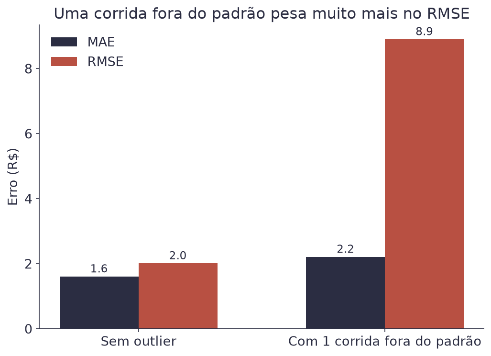<figcaption>Uma única corrida fora do padrão quase não muda o MAE, mas quase quadruplica o RMSE.</figcaption></figure>

Por isso, quando o RMSE de um modelo está bem mais alto que o MAE, isso é
um sinal de que existem alguns erros grandes escondidos na média. Vale a
pena investigar quais corridas eles são.

O MAPE engana de outro jeito, e este é mais sutil. Separe as 200 corridas
por distância e olhe as duas métricas lado a lado:

| Faixa | Corridas | Preço médio | MAE | MAPE |
|---|---|---|---|---|
| até 5 km | 89 | R$ 11,32 | R$ 1,54 | 15,8% |
| 5 a 10 km | 86 | R$ 20,37 | R$ 1,55 | 8,2% |
| 10 a 15 km | 14 | R$ 30,92 | R$ 2,01 | 6,6% |
| acima de 15 km | 11 | R$ 47,45 | R$ 2,08 | 4,4% |

Leia a coluna do MAE: o modelo erra quase o mesmo em toda faixa, entre
R$ 1,54 e R$ 2,08. Agora leia a do MAPE: ele vai de 15,8% a 4,4%, quase
quatro vezes.

Nenhuma das duas está mentindo. O modelo erra o mesmo tanto em reais, e
esse mesmo tanto é uma fatia bem maior de uma corrida barata. Se o seu
problema é comprar combustível, o MAE responde. Se é a percepção do
cliente sobre o preço estar certo, o MAPE responde.

## O intervalo de predição

Até aqui o modelo devolve um número: uma corrida de 8 km custa R$ 22,55. E
aí vem a pergunta honesta: a sua corrida de 8 km vai custar isso?

Não. Vai custar em volta disso. Olhe de novo a nuvem de pontos: para 8 km
existem corridas de R$ 19 e de R$ 26, todas de verdade. **A reta acerta a
média das corridas de 8 km, e nenhuma corrida sozinha é a média.**

Um número único esconde isso. Uma faixa mostra.

### Quanto uma corrida se afasta da reta

Comece medindo o tamanho típico de um resíduo. Esse número se chama **erro
padrão residual** e costuma aparecer como `s`:

$$s = \sqrt{\frac{1}{n-2}\sum_{i=1}^{n}(y_i - \hat{y}_i)^2}$$

| Símbolo | Significado |
|---|---|
| a soma | os resíduos ao quadrado, os mesmos do MSE |
| `n - 2` | em vez de `n`: dois números (`w₀` e `w₁`) já foram gastos para ajustar a reta |
| `s` | o resíduo típico, em reais |

Nas 200 corridas, `s = R$ 2,02`. É quase o RMSE (R$ 2,01), e a diferença é
só esse `n - 2` no lugar do `n`.

### A regra prática: dois desvios para cada lado

Os resíduos se espalham em torno da reta, e a maioria fica a menos de dois
`s` de distância. Daí a regra:

$$\text{faixa} = \hat{y} \pm 2s$$

| Símbolo | Significado |
|---|---|
| `ŷ` | o preço que a reta previu para aquela distância |
| `2s` | R$ 4,04 nestes dados: a margem para cada lado |

Exemplo, para a corrida de 8 km: `22,55 ± 4,04`, ou seja, **de R$ 18,51 a
R$ 26,59**. Essa frase é muito mais útil que "vai custar R$ 22,55", porque
ela é verdadeira.

### Ela funciona? Dá para conferir

Uma faixa que promete 95% e entrega 60% não serve para nada. Conte:

<figure>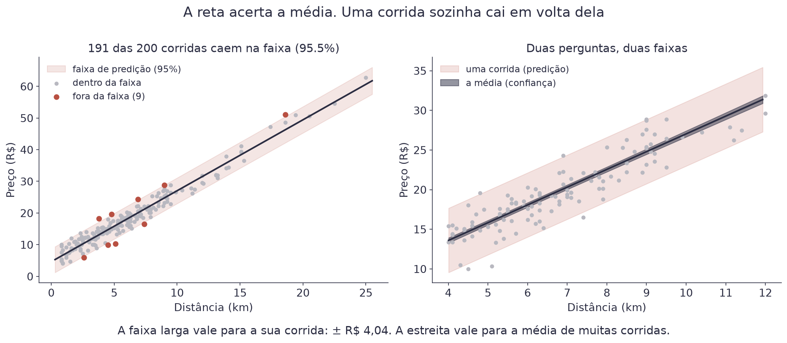<figcaption>191 das 200 corridas caem dentro da faixa, ou 95,5%. Era o prometido.</figcaption></figure>

Nove corridas ficaram de fora, de 200. São 4,5%, e a faixa prometia deixar
5% de fora. Isso é o que se espera de uma faixa honesta, e é assim que se
confere qualquer intervalo: conte quantos ficaram dentro.

### As duas faixas do painel da direita

O painel da direita mostra duas faixas, e a diferença entre elas é o ponto
mais confundido do assunto inteiro.

| Pergunta | Faixa | Largura em 8 km |
|---|---|---|
| Quanto custa **a sua** corrida de 8 km? | intervalo de **predição** | ± R$ 4,00 |
| Quanto custa **em média** uma corrida de 8 km? | intervalo de **confiança** | ± R$ 0,31 |

A segunda faixa é treze vezes mais estreita, e a razão é direta. Com 200
corridas, a reta já conhece bem a média: a dúvida sobre ela é pequena, e
encolhe conforme você coleta mais dados. Mas a variação entre corridas
individuais (trânsito, horário, tarifa) **não encolhe nunca**, por mais
dados que você junte. Ela é do mundo, não do modelo.


**Erro do dia**

Entregar a faixa estreita quando a pergunta pedia a larga. É fácil de
fazer, e o resultado é um sistema que promete R$ 22,55 ± R$ 0,31 e erra
quase toda corrida. Antes de escolher a faixa, pergunte: estou falando de
**uma** corrida ou da **média** de muitas?


### A fórmula completa, para constar

A regra do `± 2s` é uma simplificação boa, e vale a pena saber de onde ela
vem. A fórmula exata do intervalo de predição é:

$$\hat{y}_0 \pm t \cdot s \sqrt{1 + \frac{1}{n} + \frac{(x_0 - \bar{x})^2}{\sum_{i=1}^{n}(x_i - \bar{x})^2}}$$

| Símbolo | Significado |
|---|---|
| `x₀` | a distância da corrida que você quer prever |
| `t` | um número de tabela, perto de 2 quando há muitos dados |
| a raiz | quase 1 aqui, e cresce quando `x₀` foge da média das distâncias |

Ninguém calcula isso à mão, e você não precisa decorar. Repare só no que
ela diz: com `n = 200`, `t` vale 1,97 e a raiz vale 1,003, então o
resultado é `± R$ 4,00`. A regra prática deu `± R$ 4,04`. Quatro centavos
de diferença.

E repare no último termo: a faixa **abre** quando você prevê longe da
média das distâncias. Prever uma corrida de 60 km com dados que vão até
25 km é possível, e a fórmula avisa que a incerteza cresce. Fora da faixa
dos dados, ela deixa de avisar direito: ali não há informação nenhuma.

## Explique sem olhar

O teste mais honesto de que você entendeu é tentar explicar sem ler.
Feche esta página e responda em voz alta, como se explicasse para um
colega. Onde travar, é ali que falta entender: volte à seção.

1. Por que elevar o erro ao quadrado, em vez de só somar os erros?
2. O sinal da inclinação diz o quê sobre para que lado mexer o peso?
3. Por que não usar a fórmula dos mínimos quadrados para tudo, já que ela dá a resposta exata de primeira?
4. Se o RMSE está bem acima do MAE, o que isso revela sobre os erros?
5. Por que o MAE quase não muda entre corridas curtas e longas, e o MAPE muda quatro vezes?
6. Por que a faixa da média encolhe com mais dados, e a faixa de uma corrida não?

## Cola da aula

| Conceito | O que significa |
|---|---|
| `w₀`, `w₁` | taxa fixa e preço por km |
| Resíduo (`εᵢ`) | preço real menos preço previsto, corrida por corrida |
| MSE | média dos resíduos ao quadrado |
| Mínimos quadrados | fórmula que calcula a melhor reta direto, sem tentativa e erro |
| Inclinação (derivada) | o quanto o erro muda quando você mexe um tiquinho no peso |
| Gradiente | a lista das inclinações, uma por peso do modelo |
| Gradiente descendente | ajusta os coeficientes aos poucos, na direção que reduz o erro |
| Taxa de aprendizado (`α`) | tamanho do passo do gradiente descendente |
| MAE | erro médio, na mesma unidade do preço |
| RMSE | como o MAE, mas penaliza mais os erros grandes |
| R² | fração da variação dos preços que a reta explica (0 a 1) |
| MAPE | erro médio em porcentagem do preço real |
| `s` (resíduo típico) | o tamanho médio de um resíduo, em reais |
| Intervalo de predição | a faixa onde cai **uma** corrida: `ŷ ± 2s` |
| Intervalo de confiança | a faixa onde cai a **média**, bem mais estreita |

## Materiais

- **Notebook desta aula, no Google Colab:** 
- Slides desta aula: entregues em sala.
- Dataset: [`corridas_app.csv`](https://github.com/klein-natan/nanodegree-AI-Atitus/blob/main/data/corridas_app.csv)

Se ainda não sabe como abrir o notebook, veja
[Antes de começar](../antes-de-comecar.md) primeiro.

## Para ir além

- [Documentação da `LinearRegression` no scikit-learn](https://scikit-learn.org/stable/modules/generated/sklearn.linear_model.LinearRegression.html): a classe que você vai usar no notebook desta aula.
- [Gradient descent, how neural networks learn (3Blue1Brown)](https://www.youtube.com/watch?v=IHZwWFHWa-w): a serra na neblina, animada. Em inglês, com legendas em português.
- [Regressão linear, visualmente (MLU-Explain)](https://mlu-explain.github.io/linear-regression/): arraste os pontos e veja a reta e o erro mudarem na hora.
- [Machine Learning Crash Course (Google)](https://developers.google.com/machine-learning/crash-course?hl=pt-br): curso gratuito em português, com o mesmo caminho desta aula e exercícios interativos.
- [Glossário](../glossario.md): para revisar qualquer termo novo desta aula.
