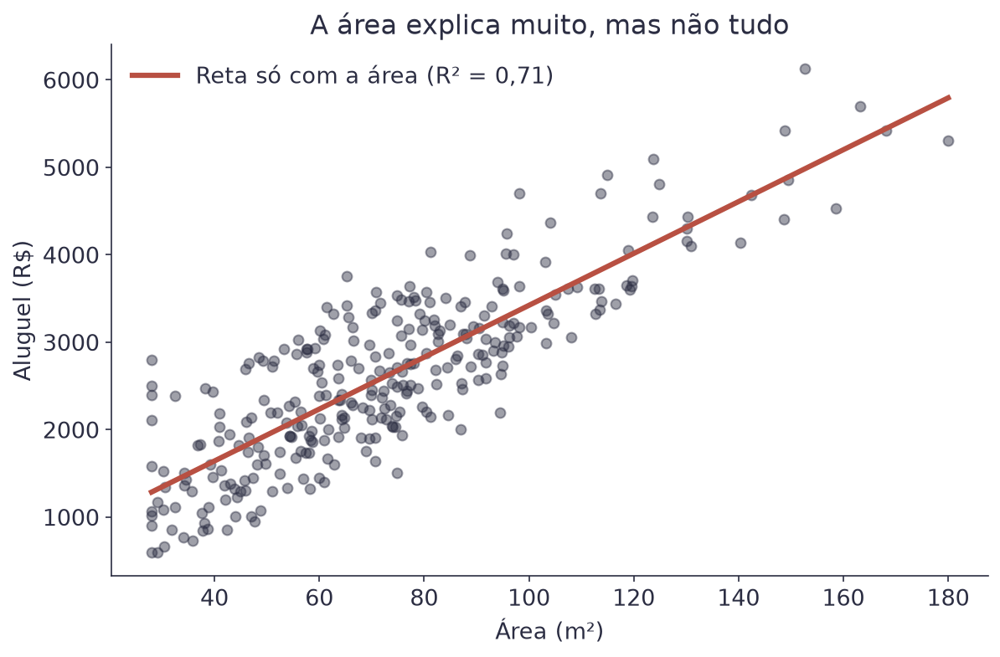
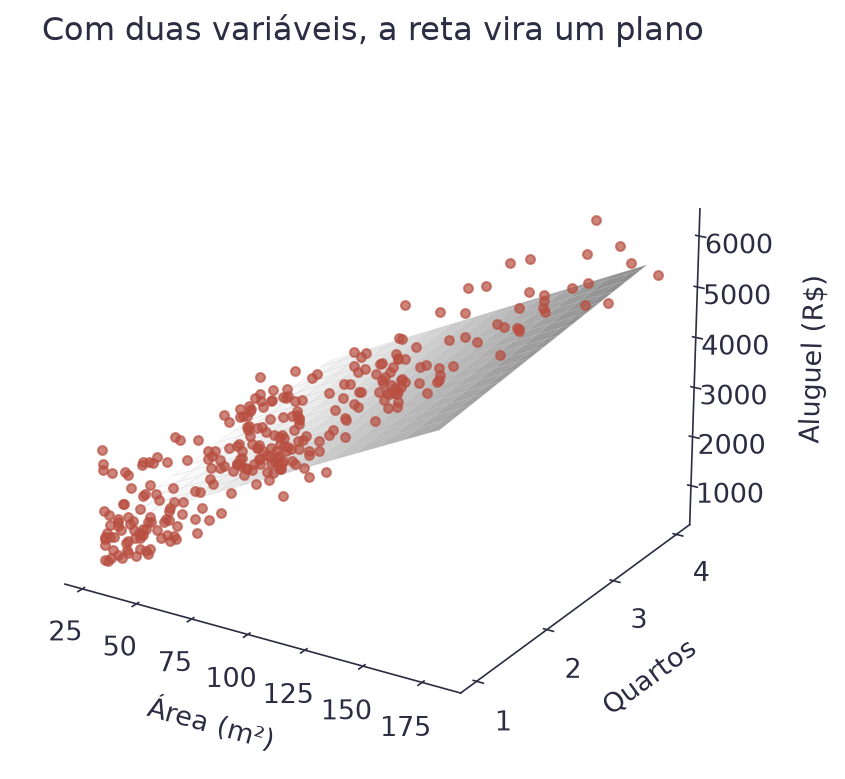
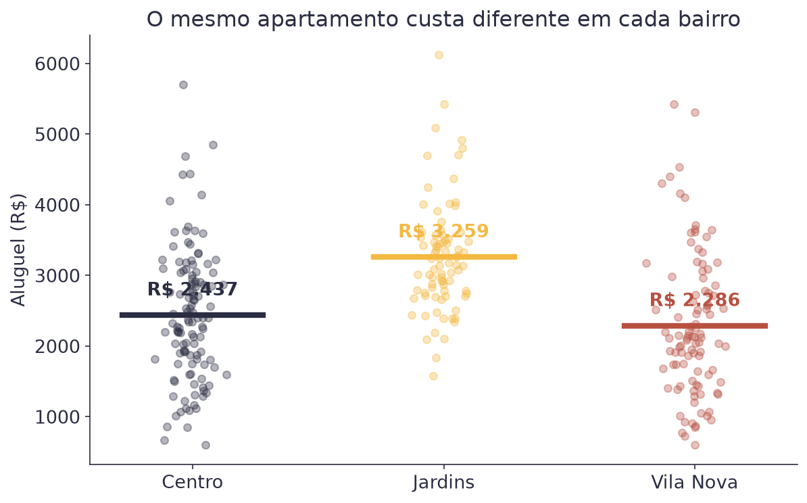
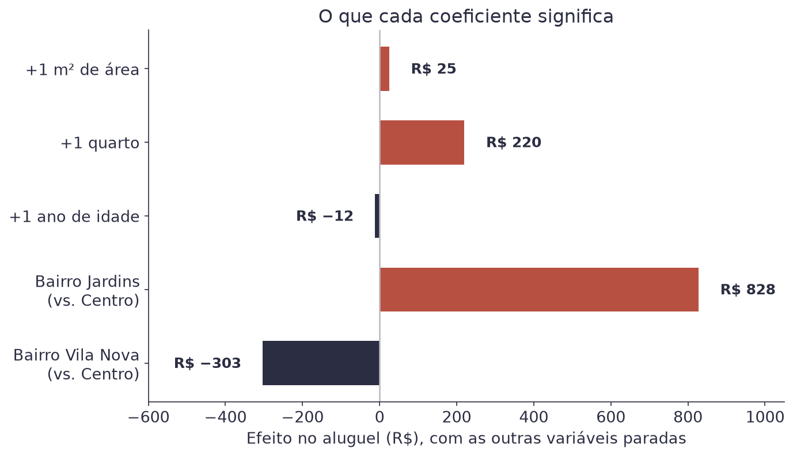
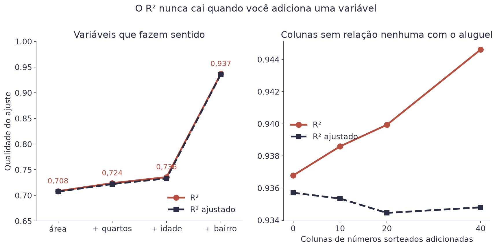
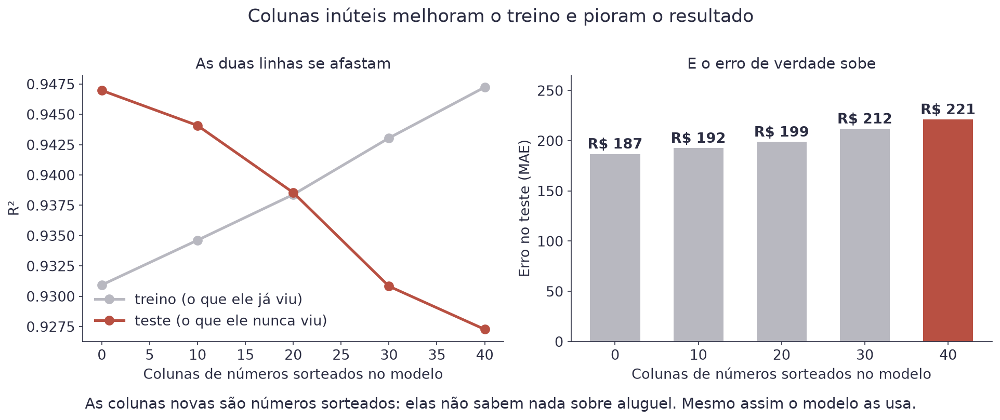
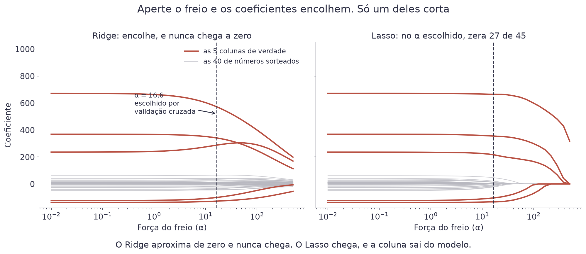
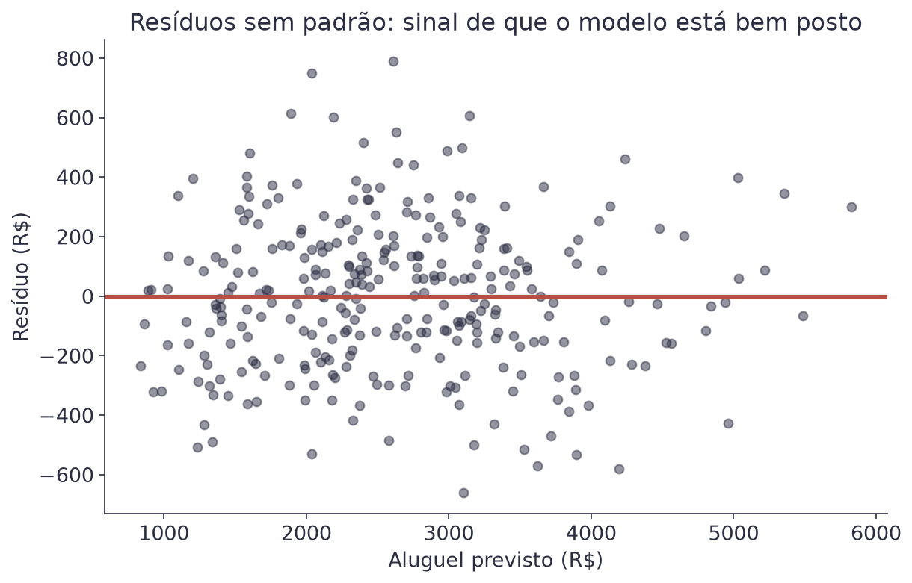

# Aula 2 — Regressão Múltipla


**O que você leva desta aula**

Você vai aprender a prever um número usando várias informações ao mesmo
tempo, a incluir no modelo uma coluna que não é número (o bairro), e a ler
cada coeficiente em português, sabendo o que ele mede e o que ele não
mede.


## Para que serve

Você quer alugar um apartamento e abre um site de imóveis. Dois anúncios
têm exatamente 70 m². Um pede R$ 2.400 e o outro pede R$ 3.500. A área é a
mesma, então o preço não vem só dela.

Vem também do número de quartos, da idade do prédio e, principalmente, do
bairro. Na Aula 1 a reta usava uma informação só. Aqui você aprende a usar
todas as informações ao mesmo tempo, que é como qualquer modelo de verdade
funciona.

O dataset desta aula tem 300 apartamentos, com quatro informações sobre
cada um: área, quartos, idade e bairro.

## Uma variável não basta

Comece pelo que você já sabe fazer: uma reta com a área.

<figure><figcaption>A área sozinha explica 71% da variação dos aluguéis. Sobram 29%.</figcaption></figure>

A reta acompanha a tendência, e o `R²` dá 0,71. Não é ruim. Mas repare na
espessura da nuvem: para uma mesma área existem aluguéis bem diferentes. É
essa faixa vertical que as outras informações vão explicar.

## A fórmula com várias variáveis

O modelo continua sendo uma soma. Cada informação entra multiplicada pelo
seu próprio peso.

$$\hat{y} = w_0 + w_1 x_1 + w_2 x_2 + \dots + w_p x_p$$

| Símbolo | Significado |
|---|---|
| `ŷ` | o aluguel previsto, em reais |
| `p` | quantas informações (variáveis) o modelo usa |
| `x₁, x₂...` | as informações do apartamento: área, quartos, idade |
| `w₁, w₂...` | o peso de cada informação |
| `w₀` | o valor base, quando todas as informações valem zero |

Escrever `x₁ + x₂ + ...` cansa quando o modelo tem muitas variáveis. A
forma compacta usa o mesmo somatório da Aula 1:

$$\hat{y} = w_0 + \sum_{j=1}^{p} w_j x_j$$

| Símbolo | Significado |
|---|---|
| `j` | o número da variável: 1 para a área, 2 para os quartos... |
| `Σ` | "some para todas as variáveis, de `j = 1` até `j = p`" |

Exemplo com três variáveis, usando os pesos que o modelo desta aula
encontrou. Para um apartamento de 70 m², com 2 quartos e 10 anos, no
Centro: `442 + 25,10 × 70 + 220,10 × 2 + (−11,60) × 10 = 2.521` reais.

## Nada muda no treino

Esta é a boa notícia. A função de perda continua sendo o MSE, e o
gradiente descendente continua fazendo o mesmo. A única diferença é o
tamanho do gradiente: em vez de duas inclinações, agora ele tem uma para
cada peso.

$$\nabla \text{MSE} = \left( \frac{\partial \text{MSE}}{\partial w_0} , \frac{\partial \text{MSE}}{\partial w_1} , \dots , \frac{\partial \text{MSE}}{\partial w_p} \right)$$

| Símbolo | Significado |
|---|---|
| `∂MSE/∂wⱼ` | a inclinação do erro quando só o peso `wⱼ` se mexe |
| `p` | o número de variáveis do modelo |

A regra de atualização também é a mesma, aplicada a cada peso, passo a
passo:

$$w_{t+1} = w_t - \alpha \cdot \frac{\partial \text{MSE}}{\partial w}$$

| Símbolo | Significado |
|---|---|
| `t` | o número do passo |
| `α` | a taxa de aprendizado, o tamanho do passo |

Com duas variáveis, a reta vira um plano. Com três ou mais ninguém
consegue desenhar, mas a conta é idêntica.

<figure><figcaption>Área e quartos no chão, aluguel na altura. O modelo agora é um plano.</figcaption></figure>

## O bairro não é um número

Área, quartos e idade são números. O bairro é um nome: Centro, Jardins ou
Vila Nova. E ele importa muito.

<figure><figcaption>O aluguel médio muda quase R$ 1.000 entre Jardins e Vila Nova.</figcaption></figure>

A tentação é numerar: Centro = 1, Jardins = 2, Vila Nova = 3. Não faça
isso. O modelo trataria esses números como quantidade, e passaria a
acreditar em duas bobagens. Que Vila Nova é "três vezes" o Centro. E que a
distância entre Centro e Jardins é a mesma que entre Jardins e Vila Nova.

O jeito certo é criar uma coluna nova para cada bairro, com 0 ou 1. Essas
colunas se chamam **variáveis indicadoras** (*dummy variables*).

| Bairro do anúncio | `bairro_Jardins` | `bairro_Vila Nova` |
|---|---|---|
| Centro | 0 | 0 |
| Jardins | 1 | 0 |
| Vila Nova | 0 | 1 |

Repare que existem três bairros e só duas colunas. O Centro é a
**categoria de referência**: ele aparece quando as duas colunas valem
zero. Sempre sobra uma categoria de fora, e é isso que você quer. Se
criasse as três colunas, uma delas seria adivinhável a partir das outras
duas, e o modelo ficaria com infinitas soluções equivalentes.

Com as duas colunas novas, o modelo fica assim:

$$\hat{y} = w_0 + w_1 \text{área} + w_2 \text{quartos} + w_3 \text{idade} + w_4 \text{jardins} + w_5 \text{vila}$$

| Símbolo | Significado |
|---|---|
| `jardins` | vale 1 se o apartamento é no Jardins, 0 se não é |
| `vila` | vale 1 se o apartamento é na Vila Nova, 0 se não é |
| `w₄, w₅` | quanto cada bairro soma ou tira, em relação ao Centro |

Exemplo: o mesmo apartamento de 70 m², 2 quartos e 10 anos custa R$ 2.521
no Centro. No Jardins, a coluna `jardins` passa a valer 1, e o aluguel
previsto sobe para `2.521 + 828 = 3.349` reais.

## Lendo os coeficientes

Cada coeficiente responde a uma pergunta muito específica: quanto muda o
aluguel se esta variável subir uma unidade **e todas as outras ficarem
paradas**?

<figure><figcaption>Cada barra é o efeito de uma unidade a mais daquela variável.</figcaption></figure>

Traduzindo o gráfico para frases:

| Coeficiente | Valor | Lê-se assim |
|---|---|---|
| área | +25,10 | cada m² a mais soma R$ 25,10 no aluguel |
| quartos | +220,10 | um quarto a mais soma R$ 220,10, na mesma área |
| idade | −11,60 | cada ano de prédio tira R$ 11,60 |
| Jardins | +827,60 | o mesmo apartamento no Jardins custa R$ 827,60 a mais que no Centro |
| Vila Nova | −303,20 | e na Vila Nova custa R$ 303,20 a menos que no Centro |

O `w₀` de 442 reais é o valor base: o que o modelo prevê para um
apartamento de 0 m², 0 quartos, novo, no Centro. Esse apartamento não
existe. Isso é normal, e não invalida o modelo. O papel de `w₀` é ajustar
a altura de todo o resto.


**Erro do dia**

Olhar para o gráfico acima e concluir que "o bairro é a variável mais
importante, porque a barra é maior". As barras estão em unidades
diferentes. Uma delas é o efeito de **um metro quadrado**, a outra é o
efeito de **mudar de bairro**. Vinte metros quadrados a mais valem
R$ 502, quase tanto quanto trocar o Centro pelo Jardins. Coeficiente
grande não significa variável importante: significa que a unidade daquela
variável é pequena.


## Por que um coeficiente muda quando outro entra

Este é o ponto mais difícil da aula, e vale a pena ir devagar.

Sozinha, a área tem coeficiente 29,70. No modelo completo, ela cai para
25,10. A área não mudou. A pergunta é que mudou.

Quando a área é a única variável, ela leva o crédito por tudo que anda
junto com ela. Apartamentos maiores costumam ter mais quartos: neste
dataset, a correlação entre área e quartos é de 0,82. Sem a coluna de
quartos no modelo, o efeito dos quartos se esconde dentro do coeficiente
da área.

Quando os quartos entram, cada um fica com a sua parte. Por isso o
coeficiente da área diminui. Ele passou a significar "o efeito de mais um
metro quadrado, **no mesmo número de quartos**".

O mesmo raciocínio explica um número estranho deste dataset. A Vila Nova
tem a maior área média (76,5 m²) e o menor aluguel médio (R$ 2.286). Isso
não é contradição. O coeficiente da Vila Nova compara apartamentos de
mesma área, e aí o bairro sai devendo.

## Quanto mais variáveis, melhor?

Existe uma armadilha aqui. Toda variável nova, por pior que seja, faz o
`R²` subir ou ficar igual. Ele nunca cai.

<figure><figcaption>À direita, colunas de números sorteados. O R² sobe mesmo assim; o R² ajustado não cai nessa.</figcaption></figure>

A defesa contra isso é o **R² ajustado**, que desconta do `R²` o preço de
cada variável nova.

$$R^2_{\text{aj}} = 1 - (1 - R^2) \cdot \frac{n - 1}{n - p - 1}$$

| Símbolo | Significado |
|---|---|
| `n` | quantos apartamentos existem na tabela |
| `p` | quantas variáveis o modelo usa |
| `R²` | o R² comum, aquele da Aula 1 |

Exemplo com o modelo completo: `n = 300`, `p = 5` e `R² = 0,937`. A conta
dá `R²` ajustado de 0,936. A diferença é pequena porque as cinco variáveis
são boas. Encha o modelo de colunas sorteadas e a diferença cresce.

A regra prática: se você adicionou uma variável e o `R²` ajustado caiu,
essa variável não estava pagando o próprio custo.

## Separe treino e teste

A seção anterior mostrou o `R²` ajustado como diagnóstico. Ele ajuda, e não
resolve. O jeito direto de saber se um modelo presta é guardar dados que
ele nunca viu.

```python
from sklearn.model_selection import train_test_split

treino_x, teste_x, treino_y, teste_y = train_test_split(
    tabela, dados["aluguel"], test_size=0.3, random_state=42)
```

Você treina com 70% dos apartamentos e mede com os outros 30%. A regra é
simples e não tem exceção: **o modelo nunca pode ver os dados de teste
durante o treino**. Se ele vir, a medida deixa de valer.

Com essa separação, dá para enxergar o problema que o `R²` ajustado só
apontava de longe. Comece com as 5 colunas boas e vá enchendo o modelo de
colunas de números sorteados:

<figure><figcaption>As colunas novas são números sorteados. Elas não sabem nada sobre aluguel, e mesmo assim o modelo as usa.</figcaption></figure>

| Colunas sorteadas | `R²` no treino | `R²` no teste | Erro no teste |
|---|---|---|---|
| nenhuma | 0,931 | 0,947 | R$ 187 |
| 10 | 0,935 | 0,944 | R$ 192 |
| 20 | 0,938 | 0,939 | R$ 199 |
| 40 | 0,947 | **0,927** | **R$ 221** |

Leia as duas colunas do meio na horizontal. O `R²` de treino **sobe** de
0,931 para 0,947, e o de teste **desce** de 0,947 para 0,927. O modelo
está ficando melhor no que já viu e pior no que importa.

Isso tem nome: **sobreajuste** (*overfitting*). O modelo decorou o ruído
das 210 linhas de treino em vez de aprender a regra.

## Regularização: um freio nos coeficientes

Por que o modelo usa colunas que não sabem nada? Porque nada o impede. O
gradiente descendente só tem uma ordem: minimize o erro no treino. Se dar
um coeficiente de 40 reais a uma coluna sorteada tira um centavo do erro,
ele dá.

A **regularização** muda a ordem. Em vez de "minimize o erro", ela diz
"minimize o erro **e** mantenha os coeficientes pequenos":

$$\text{custo} = \text{MSE} + \alpha \cdot \text{penalidade}(w)$$

| Símbolo | Significado |
|---|---|
| MSE | o erro de sempre, o que o modelo já minimizava |
| penalidade | um número que cresce quando os coeficientes crescem |
| `α` | a força do freio: 0 desliga, quanto maior mais aperta |

Exemplo: com `α = 0`, o custo é só o MSE e nada muda. Com `α` gigante,
compensa zerar todos os coeficientes e prever a média para todo mundo. O
valor útil está no meio, e quem escolhe é a validação cruzada.

O scikit-learn traz três penalidades, e a diferença entre elas está só na
conta do "penalidade(w)".

### Ridge: encolhe tudo

$$\text{penalidade} = \sum_{j=1}^{p} w_j^2$$

| Símbolo | Significado |
|---|---|
| `wⱼ²` | o coeficiente da variável `j`, elevado ao quadrado |
| `Σ` | some para todas as `p` variáveis do modelo |

Exemplo: um coeficiente de 10 contribui com 100 para a penalidade, e um de
1 contribui com 1. Cortar o de 10 pela metade economiza 75; cortar o de 1
pela metade economiza 0,75. Cem vezes menos.

É por isso que o Ridge **espreme os grandes** e deixa os pequenos quase em
paz. E é por isso que nenhum chega a zero: quanto menor o coeficiente,
menor o prêmio por encolher mais um pouco. Sempre sobra um pouquinho.

```python
from sklearn.linear_model import RidgeCV
modelo = RidgeCV(alphas=np.logspace(-2, 3, 60)).fit(treino_x, treino_y)
```

### Lasso: corta

$$\text{penalidade} = \sum_{j=1}^{p} \left| w_j \right|$$

| Símbolo | Significado |
|---|---|
| `\|wⱼ\|` | o coeficiente da variável `j`, sem o sinal |
| `Σ` | some para todas as `p` variáveis do modelo |

Exemplo: cortar um coeficiente de 0,2 para 0 economiza 0,2 na penalidade.
Cortar um de 10,2 para 10 economiza os mesmos 0,2. O desconto é o mesmo,
não importa o tamanho.

Aí está a diferença inteira. Sem prêmio maior para os grandes, o freio
empurra os coeficientes inúteis **até zero**, e a coluna sai do modelo.

```python
from sklearn.linear_model import LassoCV
modelo = LassoCV(alphas=np.logspace(-2, 3, 60), cv=5).fit(treino_x, treino_y)
```

<figure><figcaption>Em vermelho, as 5 colunas de verdade. Em cinza, as 40 sorteadas. A linha tracejada é o α escolhido por validação cruzada.</figcaption></figure>

Repare no painel da direita: as linhas cinzas tocam o zero e ficam lá. No
α escolhido, o Lasso zerou 27 das 45 colunas, e quase todas eram ruído.

### ElasticNet: os dois juntos

$$\text{penalidade} = \rho \sum_{j=1}^{p} \left| w_j \right| + \frac{1 - \rho}{2}\sum_{j=1}^{p} w_j^2$$

| Símbolo | Significado |
|---|---|
| `ρ` (o `l1_ratio`) | quanto da penalidade é Lasso: 1 é Lasso puro, 0 é Ridge puro |
| `α` | a força do freio, como antes |

Ele existe por um motivo prático. Quando duas colunas andam muito juntas
(a área e os quartos, com correlação de 0,82), o Lasso costuma escolher
uma e zerar a outra, meio ao acaso. O ElasticNet segura as duas.

```python
from sklearn.linear_model import ElasticNetCV
modelo = ElasticNetCV(alphas=np.logspace(-2, 3, 60),
                      l1_ratio=[0.1, 0.5, 0.9, 1.0], cv=5).fit(treino_x, treino_y)
```

## O resultado, nos 90 apartamentos de teste

Com as 5 colunas boas mais 40 sorteadas:

| Modelo | `α` escolhido | `R²` no teste | Erro no teste | Colunas zeradas |
|---|---|---|---|---|
| Sem freio | — | 0,927 | R$ 221 | 0 de 45 |
| RidgeCV | 4,24 | 0,927 | R$ 220 | 0 de 45 |
| LassoCV | 16,61 | **0,941** | **R$ 197** | **27 de 45** |
| ElasticNetCV | 16,61 | 0,941 | R$ 197 | 27 de 45 |

Três coisas para ler nessa tabela, e as três são honestas.

**O Ridge quase não ajudou.** Ele encolheu os coeficientes do ruído (a soma
deles caiu de 668 para 660), e isso não bastou. Quando o problema é
*coluna que não deveria estar ali*, encolher não resolve: precisa cortar.

**O Lasso ajudou de verdade.** O erro caiu de R$ 221 para R$ 197, e a soma
dos coeficientes do ruído desabou de 668 para 186.

**O ElasticNet deu exatamente o mesmo resultado do Lasso.** Não é
coincidência: deixando ele escolher o `l1_ratio` entre 0,1 e 1,0, ele
escolheu **1,0**, que é Lasso puro. Ou seja, perguntamos ao modelo qual
ferramenta usar, e ele respondeu.


**E se as colunas forem todas boas?**

Repetimos tudo sem as colunas sorteadas, só com as 5 de verdade. O `R²` de
teste deu 0,9470 nos três modelos, e o `LassoCV` escolheu `α = 0,01`, quase
zero. Regularização não é imposto: quando não há o que cortar, ela se
desliga sozinha. É por isso que dá para usar as versões `CV` por padrão.


## Padronizar antes de regularizar

O freio olha o **tamanho** dos coeficientes. E o tamanho de um coeficiente
depende da unidade da variável, não da importância dela.

A área está em metros quadrados, então o coeficiente dela é R$ 25 por
unidade. Se estivesse em hectares, o mesmo efeito viraria um coeficiente
de R$ 250.000. Nada mudou no mundo, e o freio passaria a odiar essa
coluna.

Veja o estrago no nosso caso. O mesmo Lasso, com e sem padronizar:

| Coluna | Sem padronizar | Padronizado |
|---|---|---|
| área | 29,20 | **646,13** |
| quartos | 52,48 | 186,24 |
| idade | −10,43 | −63,71 |
| Jardins | **643,51** | 335,23 |
| Vila Nova | −188,25 | −111,01 |

Sem padronizar, o bairro Jardins parece a variável mais forte do modelo e a
área parece a mais fraca. Padronizado, a ordem se inverte: a área é a mais
forte, com folga. A primeira leitura é um artefato de unidade.

A correção é uma linha, e ela vem antes do modelo:

```python
from sklearn.preprocessing import StandardScaler

escala = StandardScaler().fit(treino_x)
treino_padronizado = escala.transform(treino_x)
teste_padronizado = escala.transform(teste_x)
```

Repare que o `fit` usa **só o treino**. Depois você aplica a mesma escala
no teste. Calcular a média e o desvio com os dados de teste juntos é
deixar o modelo espiar o que ele não deveria ver.


**Erro do dia**

Rodar `Ridge` ou `Lasso` sem padronizar. O código funciona, não dá erro
nenhum, e o modelo passa a escolher o que cortar olhando a unidade de cada
coluna. Regressão comum não tem esse problema: só a regularizada tem.

Um detalhe que confunde muita gente: o `α` do `Ridge` e o do `Lasso` não
significam a mesma coisa, porque as duas classes normalizam a conta de
formas diferentes. Nunca compare os dois pelo número do `α`, e prefira as
versões `RidgeCV`, `LassoCV` e `ElasticNetCV`, que escolhem sozinhas.


## Qual dos três usar

| Situação | Escolha |
|---|---|
| Muitas colunas, e você suspeita que a maioria não serve | Lasso |
| Poucas colunas, todas plausíveis, e você quer só estabilizar | Ridge |
| Muitas colunas, com grupos de colunas parecidas entre si | ElasticNet |
| Você não sabe | ElasticNetCV com `l1_ratio` variando, e deixe ele decidir |

E uma regra que vale mais que a tabela: **compare no conjunto de teste**.
As três versões `CV` custam uma linha cada, e a resposta certa é a que
erra menos nos dados que o modelo nunca viu.

## O gráfico que você olha antes de confiar

Depois de treinar, faça um gráfico dos resíduos contra os valores
previstos. Ele custa dez segundos e diz muito.

<figure><figcaption>Uma nuvem sem formato, centrada no zero. É isso que você quer ver.</figcaption></figure>

O que você espera: pontos espalhados em torno do zero, sem desenho nenhum.
Isso significa que o modelo errou de forma parecida em toda a faixa de
preços.

O que acende o alarme: um funil (o erro cresce com o preço previsto), uma
curva (falta uma variável ou a relação não é reta), ou pontos muito longe
do zero (candidatos a investigar um a um).

## Explique sem olhar

O teste mais honesto de que você entendeu é tentar explicar sem ler.
Feche esta página e responda em voz alta, como se explicasse para um
colega. Onde travar, é ali que falta entender: volte à seção.

1. Por que numerar os bairros como 1, 2 e 3 estraga o modelo?
2. Por que o coeficiente da área diminui quando os quartos entram?
3. Por que o R² nunca cai quando entra uma coluna, e o que o R² ajustado faz a respeito?
4. Por que o Ridge nunca zera um coeficiente e o Lasso zera?
5. Por que regularizar sem padronizar faz o modelo escolher errado o que cortar?

## Cola da aula

| Conceito | O que significa |
|---|---|
| Regressão múltipla | uma soma de várias informações, cada uma com o seu peso |
| Coeficiente `wⱼ` | quanto muda a previsão se `xⱼ` sobe 1, com o resto parado |
| Variável indicadora | coluna de 0 ou 1 que representa uma categoria |
| Categoria de referência | a categoria que fica de fora e vive dentro do `w₀` |
| Colinearidade | duas variáveis que andam juntas e dividem o crédito |
| `R²` ajustado | o `R²` descontando o custo de cada variável nova |
| Resíduo contra previsto | o gráfico de diagnóstico que você olha antes de confiar |
| Treino e teste | separar 30% dos dados que o modelo nunca vê |
| Sobreajuste | ficar melhor no treino e pior no teste |
| Regularização | somar ao erro uma penalidade pelo tamanho dos coeficientes |
| Ridge | penalidade `Σw²`: encolhe todos, nunca zera |
| Lasso | penalidade `Σ\|w\|`: zera os inúteis e tira a coluna do modelo |
| ElasticNet | mistura das duas, com `l1_ratio` decidindo a proporção |
| Padronizar | pôr as colunas na mesma escala, obrigatório antes de regularizar |

## Materiais

- **Notebook desta aula, no Google Colab:** [](https://colab.research.google.com/github/klein-natan/nanodegree-AI-Atitus/blob/main/notebooks/aula-02-regressao-multipla.ipynb)
- Slides desta aula: entregues em sala.
- Dataset: [`alugueis.csv`](https://github.com/klein-natan/nanodegree-AI-Atitus/blob/main/data/alugueis.csv)

Se ainda não sabe como abrir o notebook, veja
[Antes de começar](../antes-de-comecar.md) primeiro.

## Para ir além

- [`pandas.get_dummies`](https://pandas.pydata.org/docs/reference/api/pandas.get_dummies.html): a função que cria as variáveis indicadoras em uma linha.
- [An Introduction to Statistical Learning](https://www.statlearning.com/): o livro gratuito de referência. O capítulo 3 cobre esta aula com mais profundidade, em inglês.
- [Guia de modelos lineares do scikit-learn](https://scikit-learn.org/stable/modules/linear_model.html): a documentação de `Ridge`, `Lasso` e `ElasticNet`, com a fórmula exata que cada classe minimiza.
- [Glossário](../glossario.md): para revisar qualquer termo novo desta aula.
