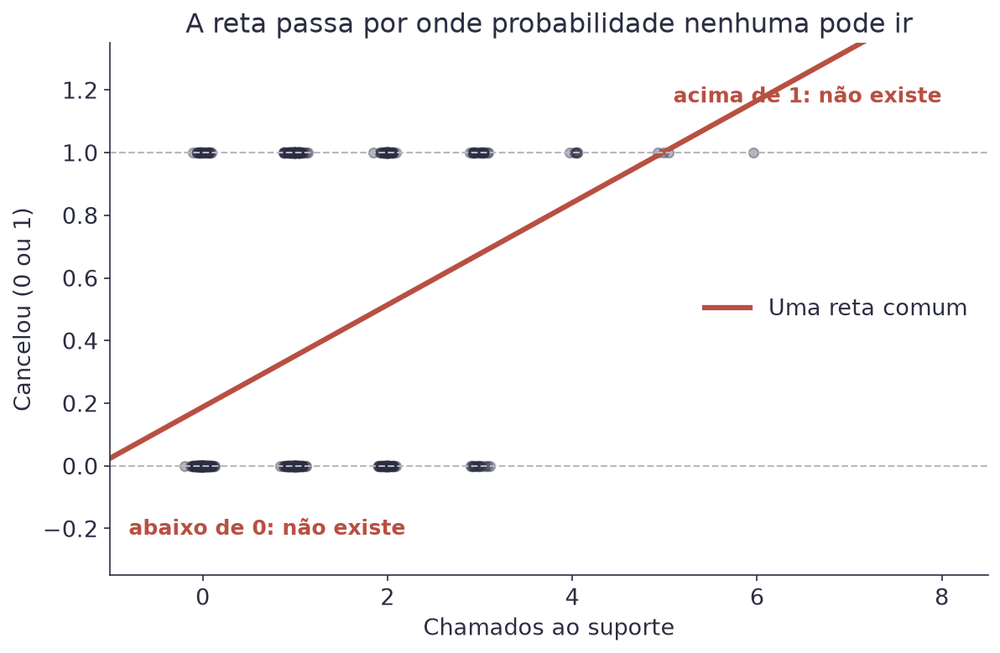
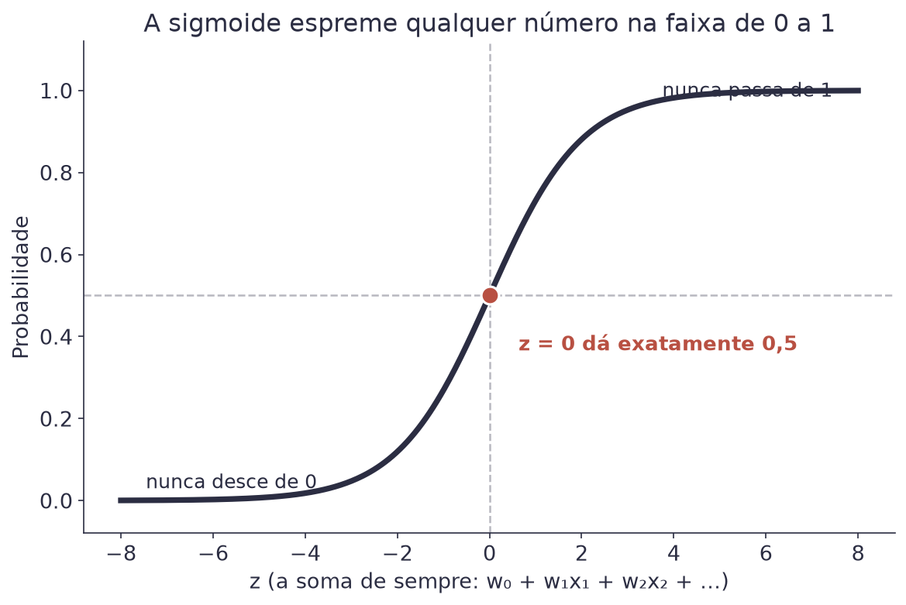
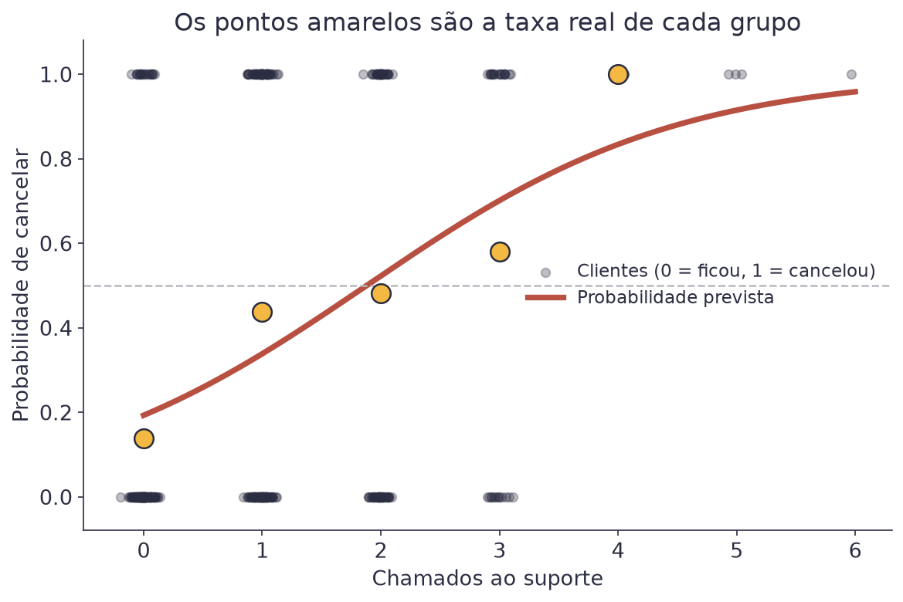
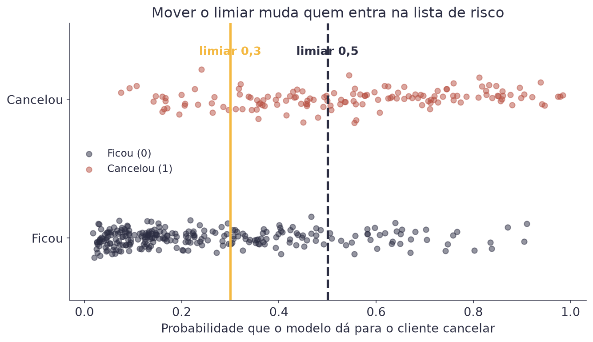
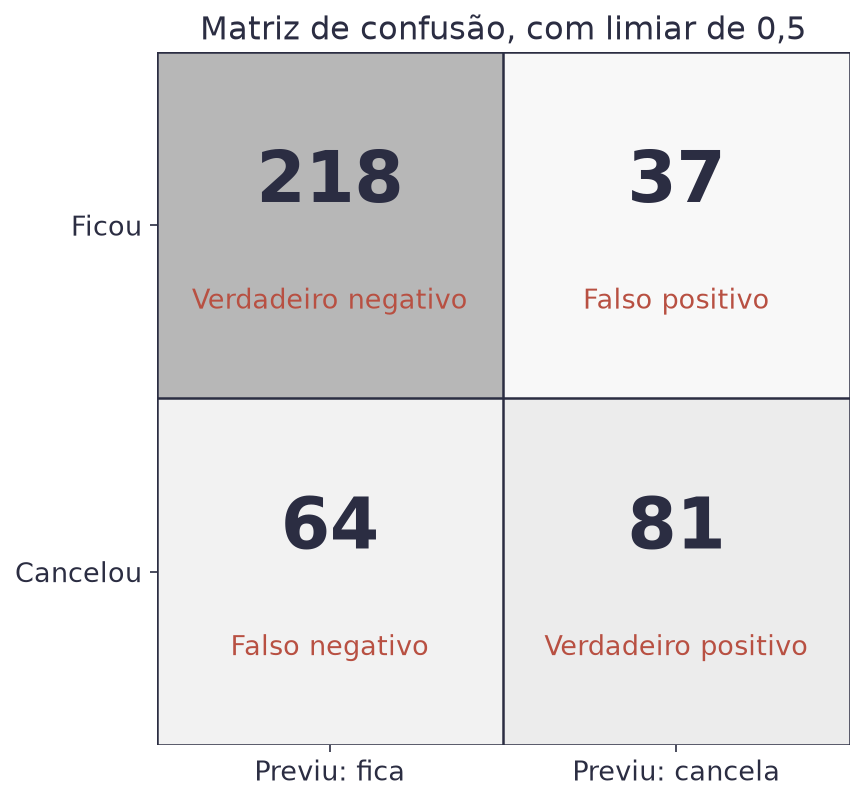
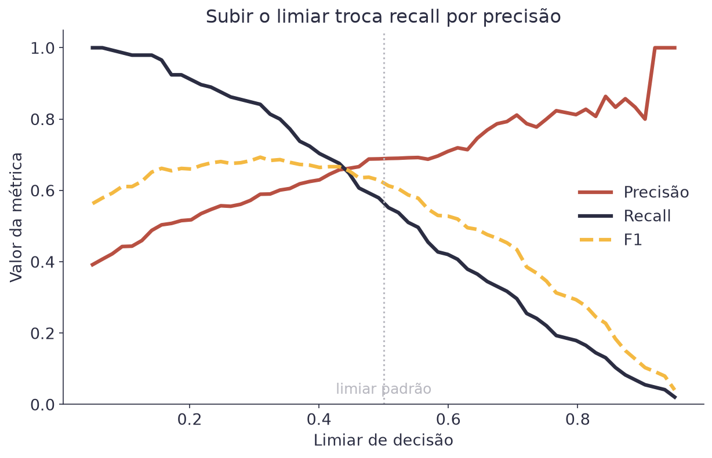
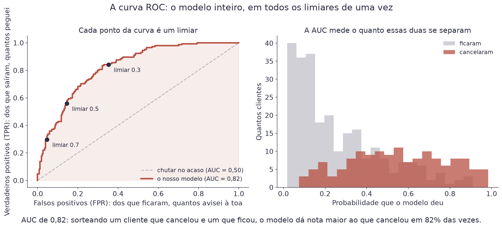
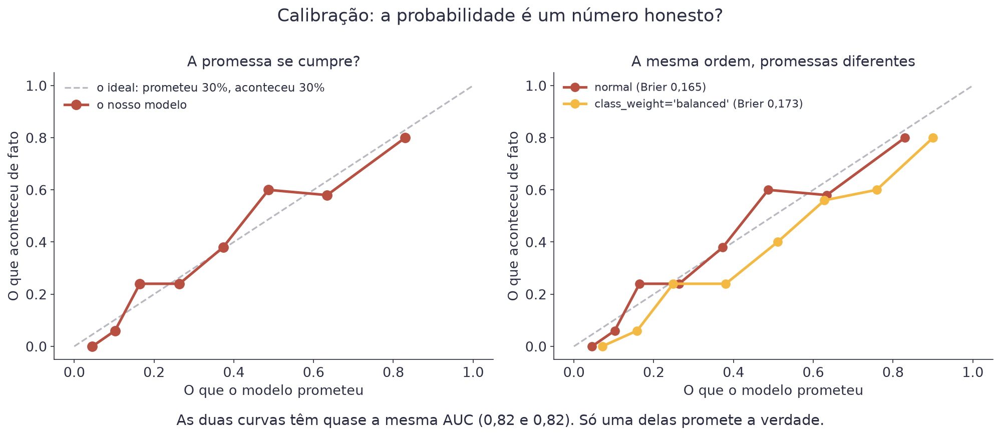
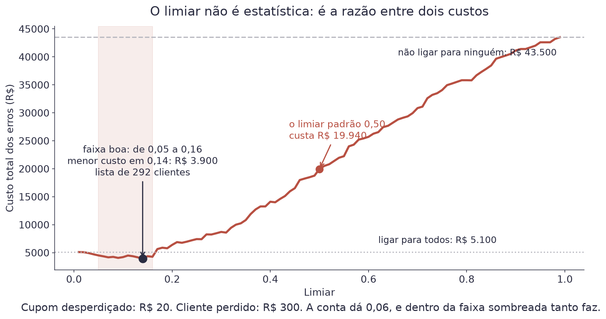

# Aula 3 — Regressão Logística


**O que você leva desta aula**

Você vai aprender a prever uma categoria em vez de um número, usando a
mesma soma de sempre esmagada pela função sigmoide. Vai aprender a ler os
coeficientes em chances, a escolher o limiar de decisão, e a medir acertos
com acurácia, precisão, recall e F1.


## Para que serve

Uma empresa de streaming quer saber quem está prestes a cancelar. Não
adianta descobrir depois: quando o cliente cancela, ele já foi. A pergunta
útil é outra. Quem, entre os clientes de hoje, tem mais chance de cancelar
no mês que vem?

Essa pergunta não pede um número como preço ou aluguel. Ela pede uma
resposta de duas opções: cancela ou não cancela. Chamamos isso de
**classificação**, e o modelo mais simples para resolver é a **regressão
logística**.

O dataset desta aula tem 400 clientes, com quatro informações sobre cada
um: tempo de casa, valor mensal, chamados ao suporte e plano. A coluna
`cancelou` vale 1 para quem cancelou e 0 para quem ficou. No total, 36%
cancelaram.

## Por que a reta não serve

A tentação é usar a regressão da Aula 1, com 0 e 1 no lugar do preço. Veja
o que acontece.

<figure><figcaption>A reta não sabe que existe um teto em 1 e um chão em 0.</figcaption></figure>

A reta não tem freio. Para quem nunca ligou para o suporte, ela prevê um
valor negativo. Para quem ligou seis vezes, prevê mais que 1. Probabilidade
negativa não existe, e probabilidade acima de 100% também não.

Precisamos de uma função que aceite qualquer número na entrada e devolva
sempre algo entre 0 e 1.

## A função sigmoide

Essa função existe, tem formato de S, e se chama **sigmoide**.

$$\sigma(z) = \frac{1}{1 + e^{-z}}$$

| Símbolo | Significado |
|---|---|
| `σ` | a letra grega sigma minúscula, o nome da função |
| `z` | qualquer número, positivo ou negativo, que entra na função |
| `e` | o número de Euler, aproximadamente 2,718 |
| `σ(z)` | o resultado, sempre entre 0 e 1: uma probabilidade |

<figure><figcaption>Qualquer número entra; sempre sai algo entre 0 e 1.</figcaption></figure>

Três exemplos para pegar o jeito. Com `z = 0`, a conta dá `1/(1+1) = 0,5`.
Com `z = 2`, dá 0,88. Com `z = −2`, dá 0,12. Números bem grandes chegam
perto de 1 sem nunca encostar, e bem negativos chegam perto de 0 pelo
mesmo motivo.

Por que essa curva, e não qualquer outra em formato de S? Duas razões
honestas. A primeira é conveniência: a derivada dela é simples, e o
gradiente descendente da Aula 1 agradece. A segunda é a que importa para
você: com essa curva, cada coeficiente ganha uma leitura em chances de
aposta, que aparece daqui a pouco. Outras curvas em S existem, e não têm
essa leitura.

## O modelo logístico

Agora junte as duas peças. A soma de sempre produz o `z`, e a sigmoide
transforma esse `z` em probabilidade.

$$P(\text{cancelar}) = \sigma(z) \qquad \text{com} \qquad z = w_0 + w_1 x_1 + \dots + w_p x_p$$

| Símbolo | Significado |
|---|---|
| `P(cancelar)` | a probabilidade de o cliente cancelar, de 0 a 1 |
| `z` | a mesma soma da Aula 2, sem nenhuma novidade |
| `xⱼ`, `wⱼ` | a informação do cliente e o peso dela |

A parte de dentro é idêntica à regressão múltipla. O que muda é a casca:
antes o resultado da soma era a previsão; agora ele passa pela sigmoide e
vira probabilidade.

O treino também segue a mesma receita: uma função de perda e gradiente
descendente. A perda deixa de ser o MSE e passa a ser a *log loss*, que
pune com força quem erra com muita confiança. A ideia de descer a serra
não muda em nada.

Veja a curva ajustada usando só os chamados ao suporte:

<figure><figcaption>Os pontos amarelos são a taxa real de cada grupo. A curva passa por eles.</figcaption></figure>

## Interpretando os coeficientes

Estes são os pesos que o modelo desta aula encontrou:

| Variável | Coeficiente | Direção |
|---|---|---|
| tempo de casa (meses) | −0,079 | mais tempo de casa, menos risco |
| valor mensal (R$) | +0,011 | mais caro, mais risco |
| chamados ao suporte | +0,996 | cada chamado aumenta bastante o risco |
| plano Padrão (vs. Básico) | −0,184 | risco um pouco menor |
| plano Premium (vs. Básico) | −0,505 | risco bem menor |

O sinal você já sabe ler: positivo empurra a probabilidade para cima,
negativo puxa para baixo. O tamanho é que engana. O coeficiente não soma
probabilidade, porque a sigmoide não é reta. Ele soma no `z`, e o efeito
no fim depende de onde o cliente já estava.

Existe uma leitura exata, e ela usa **chances** (*odds*), no sentido de
aposta: 3 para 1, 1 para 2.

$$\frac{p}{1 - p} = e^{z}$$

| Símbolo | Significado |
|---|---|
| `p` | a probabilidade de cancelar |
| `1 − p` | a probabilidade de ficar |
| `p / (1 − p)` | a chance: quantas vezes cancelar é mais provável que ficar |

Com essa forma, cada coeficiente ganha uma tradução simples. Somar 1 na
variável `xⱼ` multiplica a chance por `e` elevado a `wⱼ`.

Exemplo com os chamados ao suporte, cujo coeficiente é 0,996. O número `e`
elevado a 0,996 dá 2,71. Ou seja: cada chamado a mais **multiplica por
2,7 a chance de o cliente cancelar**, com tudo o mais parado. Para o tempo
de casa, `e` elevado a −0,079 dá 0,92: cada mês a mais multiplica a chance
por 0,92, que é o mesmo que reduzir 8%.

Dois clientes de verdade, calculados com esse modelo:

| Cliente | Perfil | Probabilidade |
|---|---|---|
| Em risco | 6 meses de casa, R$ 130, 3 chamados, Premium | 0,95 |
| Tranquilo | 36 meses de casa, R$ 40, 0 chamados, Básico | 0,05 |

## Da probabilidade à decisão

O modelo devolve uma probabilidade, mas a equipe de retenção precisa de
uma lista de nomes. Alguém tem que decidir onde cortar. Esse ponto de
corte se chama **limiar** (*threshold*).

<figure><figcaption>Cada ponto é um cliente. Mover a linha muda quem entra na lista de risco.</figcaption></figure>

O limiar padrão é 0,5, mas ele não tem nada de sagrado. Ele só é o padrão
porque é o meio. Escolher o limiar é uma decisão de negócio, e a próxima
seção mostra o que se ganha e o que se perde ao mexer nele.

## A matriz de confusão

Antes das métricas, o quadro que gera todas elas. Com o limiar em 0,5, os
400 clientes se distribuem assim:

<figure><figcaption>As quatro caixas em que todo cliente cai.</figcaption></figure>

| Caixa | Quantos | O que aconteceu |
|---|---|---|
| Verdadeiro positivo (VP) | 81 | o modelo avisou e o cliente cancelou |
| Falso positivo (FP) | 37 | o modelo avisou e o cliente ficou |
| Falso negativo (FN) | 64 | o modelo não avisou e o cliente cancelou |
| Verdadeiro negativo (VN) | 218 | o modelo não avisou e o cliente ficou |

Os dois erros custam coisas diferentes. Um falso positivo gasta um cupom
de desconto com quem ia ficar de qualquer jeito. Um falso negativo perde o
cliente. Qual dos dois dói mais é uma pergunta da empresa, não da
estatística.

## As quatro métricas

### Acurácia: a fração de acertos

$$\text{acurácia} = \frac{VP + VN}{VP + VN + FP + FN}$$

| Símbolo | Significado |
|---|---|
| numerador | os acertos: avisou e cancelou, ou não avisou e ficou |
| denominador | todos os clientes |

No nosso caso: `(81 + 218) / 400 = 0,75`. O modelo acerta 75% das vezes.


**Erro do dia**

Comemorar uma acurácia de 75% sem olhar mais nada. Neste dataset, 64% dos
clientes não cancelaram. Um modelo preguiçoso que responde "ninguém
cancela" para todo mundo acerta 64% e não serve para nada. A acurácia
sozinha não distingue esse modelo do seu. Sempre compare a acurácia com a
taxa da classe mais comum, e sempre olhe as outras métricas.


### Precisão e recall

$$\text{precisão} = \frac{VP}{VP + FP} \qquad \text{recall} = \frac{VP}{VP + FN}$$

| Símbolo | Significado |
|---|---|
| precisão | dos clientes que o modelo apontou, quantos realmente cancelaram |
| recall | dos clientes que cancelaram, quantos o modelo conseguiu apontar |
| `VP`, `FP`, `FN` | as caixas da matriz de confusão |

No nosso caso: precisão de `81 / 118 = 0,69` e recall de `81 / 145 = 0,56`.
Traduzindo: quando o modelo aponta alguém, ele acerta 69% das vezes; e ele
pega 56% de todos os cancelamentos que aconteceram.

Repare que as duas respondem a perguntas diferentes. Precisão é sobre a
lista que você gerou. Recall é sobre o problema inteiro que existe lá
fora.

### F1: as duas num número só

$$F_1 = 2 \cdot \frac{\text{precisão} \cdot \text{recall}}{\text{precisão} + \text{recall}}$$

| Símbolo | Significado |
|---|---|
| `F₁` | a média harmônica entre precisão e recall |
| média harmônica | um tipo de média que puxa o resultado para o menor dos dois |

No nosso caso: `F₁ = 0,62`. O valor fica sempre entre a precisão e o
recall, e mais perto do pior dos dois. É por isso que ele serve como
número único: para o F1 subir, os dois precisam ir bem.

## Escolhendo o limiar

Agora junte tudo. Baixar o limiar significa avisar mais gente, o que pega
mais cancelamentos (recall sobe) e erra mais alarmes (precisão cai).

<figure><figcaption>Uma sobe, a outra desce. O F1 procura o equilíbrio entre as duas.</figcaption></figure>

Compare os dois limiares no mesmo modelo:

| Limiar | Acurácia | Precisão | Recall | F1 | Lista de risco |
|---|---|---|---|---|---|
| 0,50 | 0,75 | 0,69 | 0,56 | 0,62 | 118 clientes |
| 0,30 | 0,72 | 0,58 | 0,84 | 0,68 | 212 clientes |

Baixar o limiar para 0,30 derrubou a acurácia e a precisão, e mesmo assim
foi a melhor escolha para este problema. Com 0,30, o modelo pega 84% dos
cancelamentos em vez de 56%. Se o cupom de desconto é barato e perder
cliente é caro, essa troca compensa.

A pergunta não é "qual limiar é o correto". É "qual erro custa mais caro
para nós".

## A curva ROC: todos os limiares de uma vez

A tabela acima compara dois limiares. Existem infinitos. A **curva ROC**
mostra todos ao mesmo tempo.

Ela é um gráfico de dois números, e os dois você já calculou:

$$\text{TPR} = \frac{VP}{VP + FN} \qquad \text{FPR} = \frac{FP}{FP + VN}$$

| Símbolo | Significado |
|---|---|
| TPR | dos que cancelaram, quantos o modelo pegou. É o recall |
| FPR | dos que ficaram, quantos o modelo acusou à toa |
| `VP`, `FP`, `FN`, `VN` | as quatro caixas da matriz de confusão |

Exemplo, com o limiar em 0,50: o modelo pega 56% dos cancelamentos (TPR)
e acusa à toa 15% de quem ia ficar (FPR). Esse par vira um ponto. Varie o
limiar de 1 até 0, marque todos os pontos, e você tem a curva:

<figure><figcaption>Cada ponto da curva é um limiar. A área embaixo dela resume o modelo num número.</figcaption></figure>

| Limiar | TPR (pego dos que saíram) | FPR (acuso dos que ficaram) |
|---|---|---|
| 0,70 | 30% | 5% |
| 0,50 | 56% | 15% |
| 0,30 | 84% | 35% |
| 0,20 | 91% | 49% |

A diagonal tracejada é o modelo que chuta. Quanto mais a curva sobe em
direção ao canto de cima à esquerda, melhor: ali você pega muitos
cancelamentos incomodando pouca gente.

### AUC: a área embaixo da curva

O resumo da curva num número só é a **AUC** (*area under the curve*). A
nossa dá **0,82**. E ela tem uma leitura exata, que é a melhor coisa desta
seção:

> Sorteie um cliente que cancelou e um que ficou. A AUC é a probabilidade
> de o modelo ter dado nota maior ao que cancelou.

Isso não é analogia: é o que a AUC mede. Dá para conferir, e conferimos.
Sorteamos 200.000 pares desses e contamos: o cancelador recebeu nota maior
em **82,3%** das vezes. A AUC calculada pela fórmula é 82,3%.

| AUC | O que significa |
|---|---|
| 0,50 | o modelo ordena tão bem quanto uma moeda |
| 0,82 | o nosso: acerta a ordem em 4 de cada 5 pares |
| 1,00 | ordena perfeitamente, o que costuma ser sinal de vazamento |

O painel da direita da figura mostra a mesma coisa por outro ângulo: as
duas distribuições de probabilidade se sobrepõem bastante, e é essa
sobreposição que impede a AUC de subir mais.


**A vantagem e o limite da AUC**

Ela não depende de limiar nenhum, então serve para comparar modelos antes
de decidir a operação. E ela não depende de quantos casos positivos
existem, então não cai na armadilha da acurácia.

O limite é o outro lado da mesma moeda: **a AUC só enxerga a ordem**. Se
você somar 0,3 a todas as probabilidades, a ordem não muda e a AUC fica
idêntica, mesmo que os números virem mentira. É por isso que existe a
próxima seção.


## Calibração: a probabilidade é um número honesto?

O modelo diz que um cliente tem 30% de chance de cancelar. Pergunta justa:
de cem clientes a quem ele deu 30%, quantos cancelam de fato?

Se a resposta for perto de trinta, o modelo é **calibrado**. As
probabilidades dele são promessas que se cumprem, e você pode multiplicá-las
por dinheiro. Se a resposta for cinquenta, o número 30% é só um lugar na
fila, e não uma probabilidade.

Para conferir, agrupe os clientes por probabilidade prevista e compare com
o que aconteceu:

<figure><figcaption>Quanto mais perto da diagonal, mais honesta a probabilidade.</figcaption></figure>

| O modelo prometeu | Cancelaram de fato |
|---|---|
| 4,5% | 0,0% |
| 10,2% | 6,0% |
| 16,4% | 24,0% |
| 26,4% | 24,0% |
| 37,3% | 38,0% |
| 48,7% | 60,0% |
| 63,4% | 58,0% |
| 83,0% | 80,0% |

Não é perfeito, e é bom o suficiente. Repare que as duas piores linhas são
as de 16,4% e 48,7%, e que cada faixa dessas tem só cinquenta clientes: com
tão poucos, o "aconteceu" balança sozinho. É o mesmo motivo pelo qual você
não julga uma moeda por dez lançamentos.

A regressão logística costuma sair bem calibrada de fábrica, porque a
função de perda que ela minimiza pune exatamente a probabilidade errada.

### O Brier: calibração num número

$$\text{Brier} = \frac{1}{n}\sum_{i=1}^{n}(p_i - y_i)^2$$

| Símbolo | Significado |
|---|---|
| `pᵢ` | a probabilidade que o modelo deu ao cliente `i` |
| `yᵢ` | o que aconteceu: 1 se cancelou, 0 se ficou |
| resultado | quanto menor, melhor; 0 seria a perfeição |

É o MSE da Aula 1, aplicado à probabilidade. O nosso dá **0,165**. Ele
sozinho não diz muito; ele serve para comparar duas versões do mesmo
modelo.

### O que quebra a calibração

Aqui está a demonstração que vale a seção inteira. Treinamos o mesmo
modelo com `class_weight="balanced"`, uma opção comum para dar mais peso à
classe minoritária:

| | AUC | Brier | Probabilidade média |
|---|---|---|---|
| Normal | 0,8233 | 0,165 | 0,363 |
| `class_weight="balanced"` | 0,8229 | 0,173 | 0,457 |
| A verdade | | | 0,362 |

A AUC é praticamente idêntica: **a ordenação não mudou nada**. Mas a
probabilidade média saltou de 0,363 para 0,457, enquanto a taxa real de
cancelamento é 0,362. O segundo modelo passou a achar que quase metade da
base vai embora.

Se você usar esse modelo para ordenar uma lista de ligações, tanto faz. Se
usar para calcular quanto dinheiro está em risco, ele erra em 26%.


**Erro do dia**

Usar `class_weight="balanced"`, reamostragem ou SMOTE e depois tratar a
saída como probabilidade. Essas técnicas mudam de propósito a proporção de
classes que o modelo enxerga, e a probabilidade sai inflada. Elas não são
erradas: erradas são as contas de dinheiro feitas em cima delas.

O conserto se chama recalibração, e no scikit-learn é o
`CalibratedClassifierCV`. Um teste rápido antes: compare a probabilidade
média prevista com a taxa real. Se as duas não baterem, o modelo não está
calibrado.


## O limiar é a razão entre dois custos

Agora dá para fechar a decisão que ficou em aberto. Suponha, para o Clube:

| Erro | Custo |
|---|---|
| Falso positivo: cupom para quem ia ficar | R$ 20 |
| Falso negativo: cliente que foi embora | R$ 300 |

Com esses dois números, escolher o limiar deixa de ser opinião. Para cada
limiar, conte os dois erros e some o prejuízo:

$$\text{custo} = FP \cdot 20 + FN \cdot 300$$

| Símbolo | Significado |
|---|---|
| `FP` | quantos falsos positivos aquele limiar produz |
| `FN` | quantos falsos negativos |
| resultado | o prejuízo total, em reais |

<figure><figcaption>O limiar padrão de 0,50 custa cinco vezes o melhor limiar.</figcaption></figure>

| Estratégia | Lista | Custo |
|---|---|---|
| Não ligar para ninguém | 0 | R$ 43.500 |
| Limiar padrão de 0,50 | 118 | R$ 19.940 |
| **Melhor limiar (0,14)** | **292** | **R$ 3.900** |
| Ligar para todo mundo | 400 | R$ 5.100 |

Trocar 0,50 por 0,14 economiza **R$ 16.040**, e nenhuma linha do modelo
mudou. Só a régua de decisão.

Existe até uma conta fechada para o limiar ideal:

$$\text{limiar}^{*} = \frac{\text{custo}_{FP}}{\text{custo}_{FP} + \text{custo}_{FN}}$$

| Símbolo | Significado |
|---|---|
| `custo_FP` | o preço de acusar quem ia ficar: R$ 20 |
| `custo_FN` | o preço de deixar passar quem foi embora: R$ 300 |
| resultado | o limiar a partir do qual vale a pena agir |

A leitura em português: aja sempre que a chance de perder o cliente valer
mais que o preço do cupom. Com 20 e 300, ela dá 0,06. O mínimo que medimos caiu em 0,14, e os dois
concordam mais do que parece: qualquer limiar entre 0,05 e 0,16 custa
entre R$ 3.900 e R$ 4.500. A faixa é plana, e é isso que você leva para a
reunião, não a segunda casa decimal.

Repare na última linha da tabela, que é desconfortável e verdadeira.
**Ligar para todo mundo custa R$ 5.100, quase tão bem quanto o modelo.**
Quando um erro custa quinze vezes o outro, a decisão quase se resolve
sozinha, e o modelo agrega pouco. Descobrir isso antes de construir o
modelo economiza mais que o modelo.


**Sobre estes números**

Todos vêm dos mesmos 400 clientes com que o modelo treinou, então são um
pouco otimistas. Medimos a diferença: separando 30% dos clientes, a AUC
cai de 0,83 no treino para 0,80 no teste. Pequena aqui, e a Aula 2 mostra
por que ela nem sempre é.


## Explique sem olhar

O teste mais honesto de que você entendeu é tentar explicar sem ler.
Feche esta página e responda em voz alta, como se explicasse para um
colega. Onde travar, é ali que falta entender: volte à seção.

1. O que a sigmoide faz com um número que a reta jogaria acima de 1?
2. Por que 75% de acurácia pode ser um resultado ruim neste dataset?
3. O que acontece com precisão e recall quando você baixa o limiar, e por quê?
4. O que a AUC mede, e o que ela é incapaz de enxergar?
5. Como você descobre, em dois minutos, se as probabilidades do seu modelo são honestas?

## Cola da aula

| Conceito | O que significa |
|---|---|
| Classificação | prever uma categoria em vez de um número |
| Sigmoide | função em S que transforma qualquer número em algo entre 0 e 1 |
| `z` | a soma de sempre, `w₀ + w₁x₁ + ...`, antes da sigmoide |
| Chance (*odds*) | `p / (1 − p)`: quantas vezes cancelar é mais provável que ficar |
| `e` elevado a `wⱼ` | o fator que multiplica a chance quando `xⱼ` sobe 1 |
| Limiar | o ponto de corte que transforma probabilidade em decisão |
| Matriz de confusão | as quatro caixas: VP, FP, FN, VN |
| Acurácia | fração de acertos, enganosa quando uma classe domina a outra |
| Precisão | dos apontados, quantos eram de verdade |
| Recall | dos que eram de verdade, quantos o modelo apontou |
| F1 | um número só, que só sobe se precisão e recall subirem |
| TPR e FPR | dos que saíram quantos peguei; dos que ficaram quantos acusei |
| Curva ROC | todos os limiares num gráfico só |
| AUC | a chance de o modelo ordenar certo um par sorteado |
| Calibração | a probabilidade prometida acontece na frequência prometida |
| Brier | o MSE da probabilidade: mede calibração num número |
| Limiar por custo | escolher o corte pela razão entre o custo dos dois erros |

## Materiais

- **Notebook desta aula, no Google Colab:** 
- Slides desta aula: entregues em sala.
- Dataset: [`assinaturas.csv`](https://github.com/klein-natan/nanodegree-AI-Atitus/blob/main/data/assinaturas.csv)

Se ainda não sabe como abrir o notebook, veja
[Antes de começar](../antes-de-comecar.md) primeiro.

## Para ir além

- [`LogisticRegression` no scikit-learn](https://scikit-learn.org/stable/modules/generated/sklearn.linear_model.LogisticRegression.html): a classe usada no notebook desta aula.
- [Curva ROC e AUC no scikit-learn](https://scikit-learn.org/stable/auto_examples/model_selection/plot_roc.html): exemplos prontos, incluindo o caso de mais de duas classes, que esta aula não cobre.
- [Calibração de probabilidades no scikit-learn](https://scikit-learn.org/stable/modules/calibration.html): como diagnosticar e corrigir um modelo descalibrado, com o `CalibratedClassifierCV`.
- [Regressão logística, visualmente (MLU-Explain)](https://mlu-explain.github.io/logistic-regression/): a sigmoide e o limiar, interativos.
- [Precisão e recall, visualmente (MLU-Explain)](https://mlu-explain.github.io/precision-recall/): mova o limiar e veja as quatro caixas se redistribuírem.
- [Glossário](../glossario.md): para revisar qualquer termo novo desta aula.
