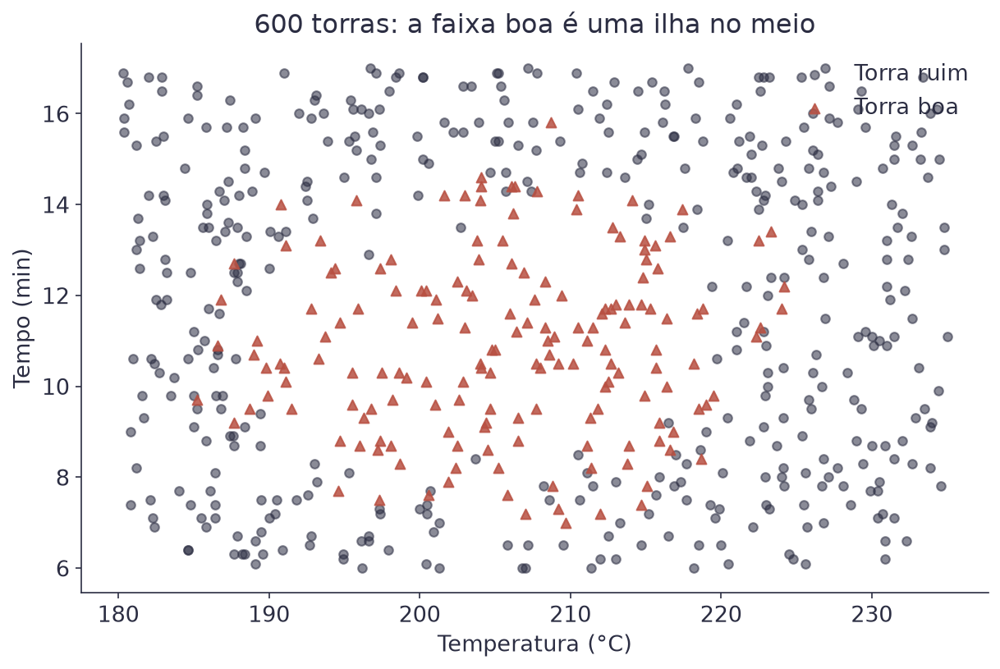
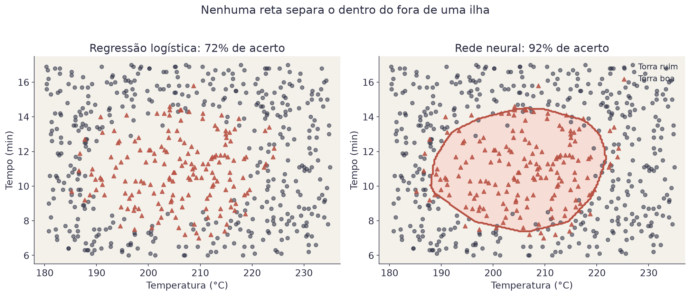
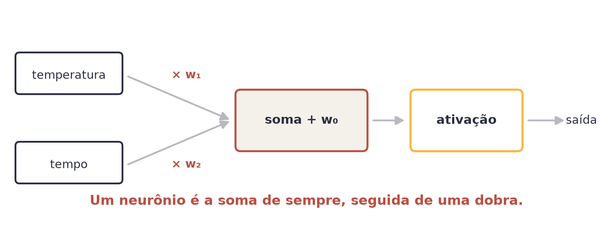
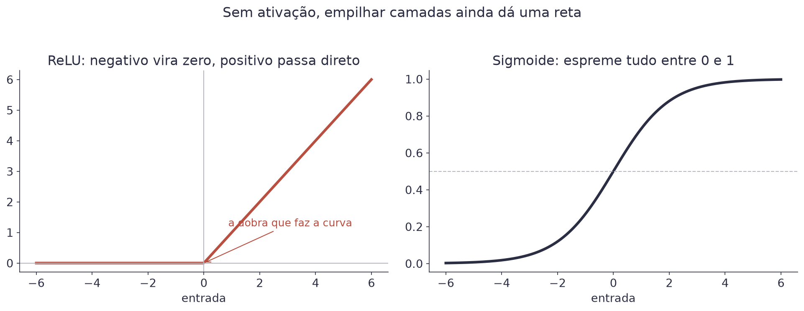
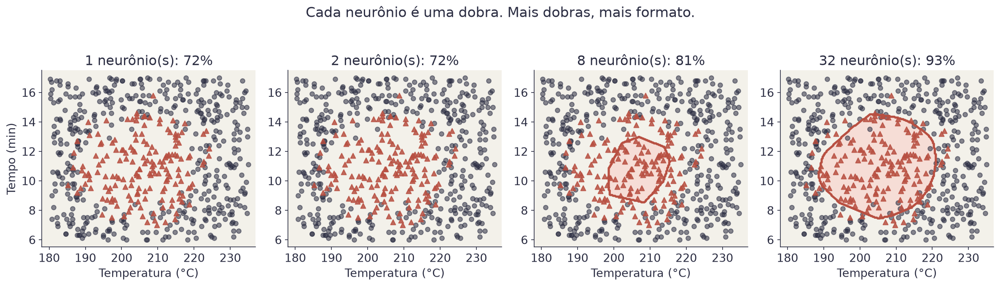
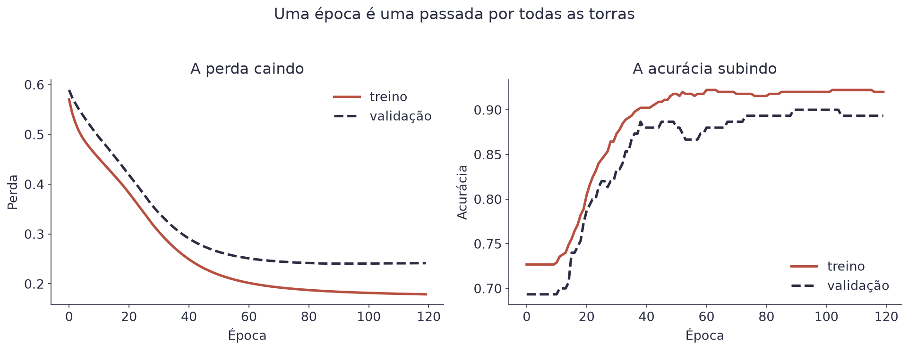

# Aula 7 — Fundamentos de Redes Neurais


**O que você leva desta aula**

Você vai entender o que é um neurônio (spoiler: é a soma da Aula 2 com uma
dobra em cima), por que empilhar neurônios resolve problemas que uma reta
não resolve, e como treinar uma rede em cinco linhas de Keras.


## Para que serve

O Clube do Café torra os próprios grãos. Cada torra tem dois botões: a
temperatura do tambor e o tempo. Errar qualquer um dos dois estraga o lote.

Quente demais queima. Frio demais deixa o grão verde. Rápido demais não
desenvolve o açúcar. Devagar demais amarga. O ponto bom fica numa faixa no
meio, e é isso que o gráfico mostra:

<figure><figcaption>600 torras. As boas formam uma ilha, não uma metade.</figcaption></figure>

Olhe para essa figura e tente traçar uma reta que separe os triângulos dos
círculos. Não existe. É essa impossibilidade que abre o assunto de hoje.

## Por que a reta não basta

Vamos provar. Treine uma regressão logística nesses dados, do jeito da
Aula 3, e olhe o que ela decide.

<figure><figcaption>A logística desiste e chuta "ruim" para todo mundo. A rede fecha a ilha.</figcaption></figure>

A regressão logística acertou 71,8% das torras. Parece razoável até você
comparar com o modelo preguiçoso da Aula 3: como 71,8% das torras são
ruins, responder "ruim" para todo mundo dá exatamente os mesmos 71,8%.

Ela não aprendeu nada. E não é culpa dela: a fronteira que ela sabe
desenhar é uma reta, e nenhuma reta separa o dentro do fora de uma ilha.

A rede neural da direita, com duas camadas de 16 neurônios, chega a 91,8%.
A diferença não está no esforço nem nos dados. Está no formato da
fronteira que cada modelo consegue desenhar.

## O que é um neurônio

Aqui está a boa notícia: você já sabe o que é.

<figure><figcaption>Entrada vezes peso, soma, e uma dobra no fim.</figcaption></figure>

$$a = f(w_0 + w_1 x_1 + w_2 x_2)$$

| Símbolo | Significado |
|---|---|
| `x₁`, `x₂` | as entradas: temperatura e tempo |
| `w₁`, `w₂` | os pesos, iguais aos das aulas de regressão |
| `w₀` | o viés (*bias*), o mesmo termo independente de sempre |
| `f` | a função de ativação: a dobra |
| `a` | a saída do neurônio, que vira entrada do próximo |

Compare com a regressão logística da Aula 3: `P = σ(w₀ + w₁x₁ + w₂x₂)`. É a
mesma conta. **Um neurônio com ativação sigmoide é uma regressão
logística.** Uma rede neural é um monte deles, empilhados.

Exemplo com números: se `w₀ = −3`, `w₁ = 0,02`, `w₂ = 0,1`, uma torra de
205 °C e 11 minutos dá `−3 + 4,10 + 1,10 = 2,20` antes da ativação.

## A dobra: funções de ativação

Se a ativação não existisse, empilhar camadas não adiantaria nada. Somar
retas dá reta, e você voltaria ao problema do começo.

<figure><figcaption>A ReLU é a dobra mais usada hoje. A sigmoide você já conhece.</figcaption></figure>

$$\text{ReLU}(z) = \max(0, z)$$

| Símbolo | Significado |
|---|---|
| `z` | o resultado da soma, antes da ativação |
| `max(0, z)` | devolve `z` se ele é positivo, e 0 se é negativo |

Exemplo: `ReLU(2,20) = 2,20`. `ReLU(−1,4) = 0`.

Não parece grande coisa, mas é o suficiente. Cada neurônio com ReLU
introduz uma dobra na fronteira. Com dobras suficientes, a fronteira
contorna qualquer formato. Repare no salto entre 2 e 8 neurônios: é ali
que a fronteira deixa de ser uma reta.

<figure><figcaption>Com 1 ou 2 neurônios, nada muda. Com 8 aparece uma ilha pequena demais; com 32, o contorno certo.</figcaption></figure>

Onde usar cada uma, na prática:

| Onde | Ativação | Por quê |
|---|---|---|
| Camadas do meio | ReLU | rápida, e é a dobra que cria o formato |
| Saída, para sim ou não | sigmoide | devolve probabilidade entre 0 e 1 |
| Saída, para um número | nenhuma | o valor sai como está |

## A rede inteira, em cinco linhas

```python
modelo = keras.Sequential([
    keras.layers.Input(shape=(2,)),
    keras.layers.Dense(16, activation="relu"),
    keras.layers.Dense(16, activation="relu"),
    keras.layers.Dense(1, activation="sigmoid"),
])
```

Lendo de cima para baixo: entram 2 números, viram 16, viram 16 de novo, e
saem como 1 probabilidade. `Dense` quer dizer que **todo** neurônio da
camada recebe **todas** as saídas da camada anterior.

Essa rede tem 337 pesos. Você pode contar: 2×16+16 na primeira camada,
16×16+16 na segunda, 16×1+1 na saída. Cada um deles é um número que o
treino vai ajustar, exatamente como ajustava os dois pesos da Aula 1.

## Como ela aprende (é a Aula 1 de novo)

Nada de novo aqui, e vale dizer isso em voz alta:

| Peça | Na Aula 1 | Agora |
|---|---|---|
| O que ajusta | 2 pesos | 337 pesos |
| Função de perda | MSE | log loss (a da Aula 3) |
| Como ajusta | gradiente descendente | gradiente descendente |
| A regra | `w ← w − α · inclinação` | a mesma, para cada peso |

A perda usada para sim ou não é a **entropia cruzada binária**, que a Aula
3 já usava com outro nome:

$$\text{perda} = -\frac{1}{n}\sum_{i=1}^{n}\left[y_i \log(\hat{y}_i) + (1 - y_i)\log(1 - \hat{y}_i)\right]$$

| Símbolo | Significado |
|---|---|
| `yᵢ` | o rótulo real da torra `i`: 1 para boa, 0 para ruim |
| `ŷᵢ` | a probabilidade que a rede deu |
| `log` | o logaritmo, que castiga com força quem erra com confiança |

Exemplo: se a rede diz 0,9 para uma torra boa, a parcela dela é
`−log(0,9) = 0,105`. Se ela diz 0,1 para a mesma torra boa, a parcela vira
`−log(0,1) = 2,303`. Vinte e duas vezes pior.

A única novidade técnica é o nome do cálculo que distribui a culpa entre as
camadas: **retropropagação** (*backpropagation*). Ela responde "o quanto
cada um dos 337 pesos contribuiu para o erro" aplicando a regra da cadeia
de trás para frente. O Keras faz isso sozinho, e neste curso você não vai
implementá-la à mão.

## Época, lote e a curva de treino

Três palavras que aparecem em toda saída de treino:

| Palavra | O que é |
|---|---|
| Lote (*batch*) | quantos exemplos entram por vez antes de ajustar os pesos |
| Época (*epoch*) | uma passada completa por todos os exemplos |
| Passo | um ajuste dos pesos, feito uma vez por lote |

Com 600 torras e lote de 32, uma época tem 19 passos. Em 120 épocas, são
2.280 ajustes.

<figure><figcaption>A curva de treino é o painel de instrumentos: você olha para ela antes de olhar qualquer outra coisa.</figcaption></figure>

Repare que existem duas linhas em cada gráfico. A de treino usa as torras
que a rede viu; a de validação usa 25% que ela nunca viu. Enquanto as duas
caem juntas, está tudo bem.


**Erro do dia**

Treinar sem normalizar as entradas. Aqui a temperatura vai a 235 e o tempo
a 17: uma escala é catorze vezes a outra. A rede até aprende, mas devagar e
mal, porque o gradiente fica dominado pela variável de número maior. A
correção é uma linha, antes do treino: subtraia a média e divida pelo
desvio padrão de cada coluna. Faça isso **sempre** em rede neural.


## Quando a rede não é a resposta

A rede venceu por 20 pontos aqui, mas isso não é regra.

| Situação | O que costuma ganhar |
|---|---|
| Fronteira reta, poucas variáveis | regressão logística, que é mais simples de explicar |
| Tabelas grandes, muitas colunas | árvores e florestas, que quase sempre batem redes |
| Imagem, áudio, texto | redes, com folga |
| Poucos dados (centenas de linhas) | modelos simples: rede grande decora |

A rede tem uma desvantagem que importa: ela não te dá um coeficiente para
interpretar. Na Aula 2 você lia "cada m² soma R$ 25". Aqui não existe frase
equivalente. Você ganhou formato e perdeu explicação.

## Explique sem olhar

O teste mais honesto de que você entendeu é tentar explicar sem ler.
Feche esta página e responda em voz alta, como se explicasse para um
colega. Onde travar, é ali que falta entender: volte à seção.

1. O que um neurônio com sigmoide tem a ver com a regressão logística da Aula 3?
2. O que aconteceria se você empilhasse camadas sem função de ativação?
3. O que significa a curva de validação subir enquanto a de treino cai?

## Cola da aula

| Conceito | O que significa |
|---|---|
| Neurônio | a soma de pesos, seguida de uma ativação |
| Ativação | a dobra que permite fronteiras que não são retas |
| ReLU | negativo vira zero, positivo passa direto |
| Camada densa | todos os neurônios recebem todas as entradas |
| Retropropagação | o cálculo que distribui a culpa do erro entre os pesos |
| Época | uma passada por todos os exemplos |
| Lote | quantos exemplos entram antes de cada ajuste |
| Normalizar | pôr as colunas na mesma escala, antes de treinar |
| Curva de treino | o gráfico que você olha antes de acreditar no modelo |

## Materiais

- **Notebook desta aula, no Google Colab:** [](https://colab.research.google.com/github/klein-natan/nanodegree-AI-Atitus/blob/main/notebooks/aula-07-redes-neurais.ipynb)
- Slides desta aula: entregues em sala.
- Dataset: [`torra_cafe.csv`](https://github.com/klein-natan/nanodegree-AI-Atitus/blob/main/data/torra_cafe.csv)

## Para ir além

- [Guia do Keras Sequential](https://keras.io/guides/sequential_model/): a documentação oficial, com exemplos curtos.
- [Playground de redes neurais](https://playground.tensorflow.org/): desenhe fronteiras no navegador, mexendo em camadas e ativações com o mouse.
- [But what is a neural network? (3Blue1Brown)](https://www.youtube.com/watch?v=aircAruvnKk): o vídeo que mais gente usou para entender o neurônio pela primeira vez. Em inglês, com legendas.
- [Glossário](../glossario.md): para revisar qualquer termo novo desta aula.
