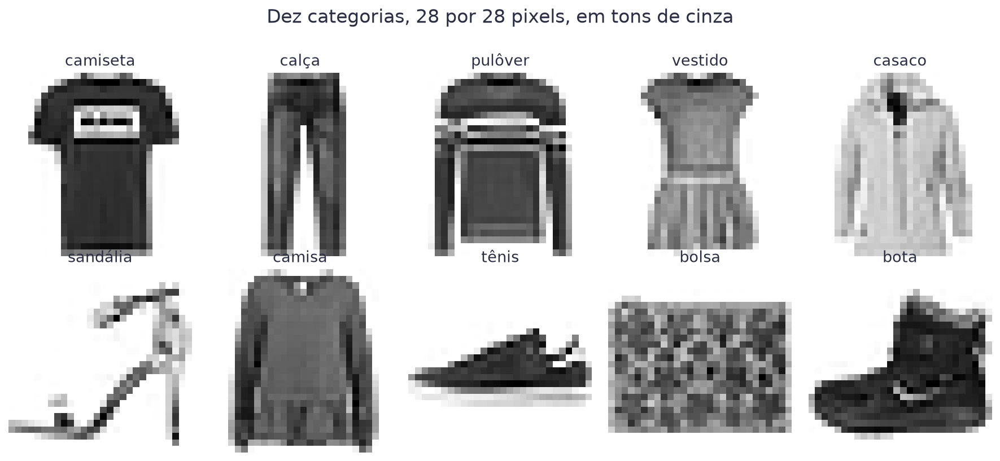
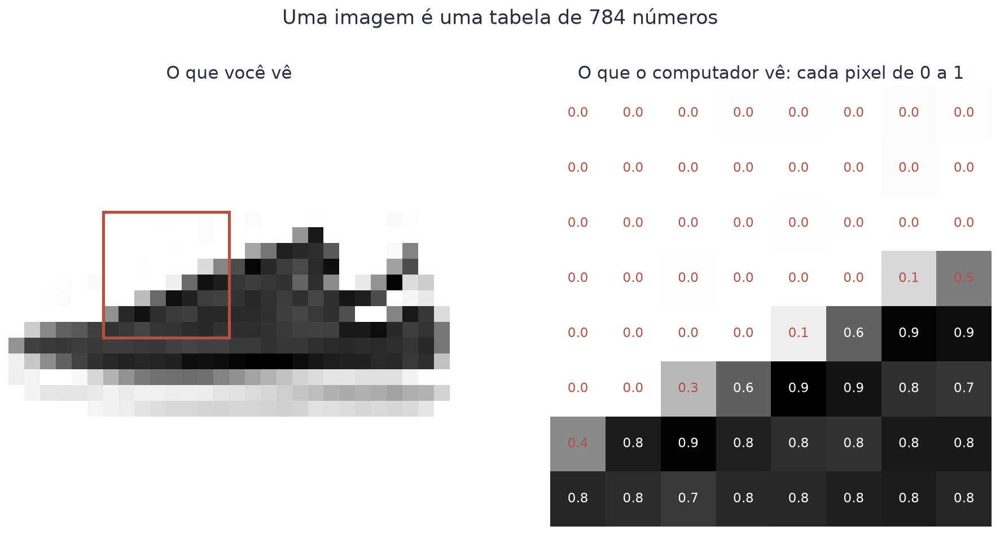
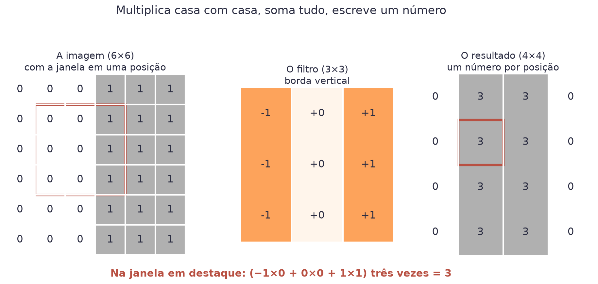
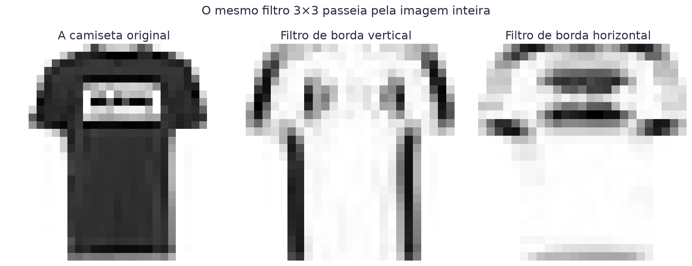
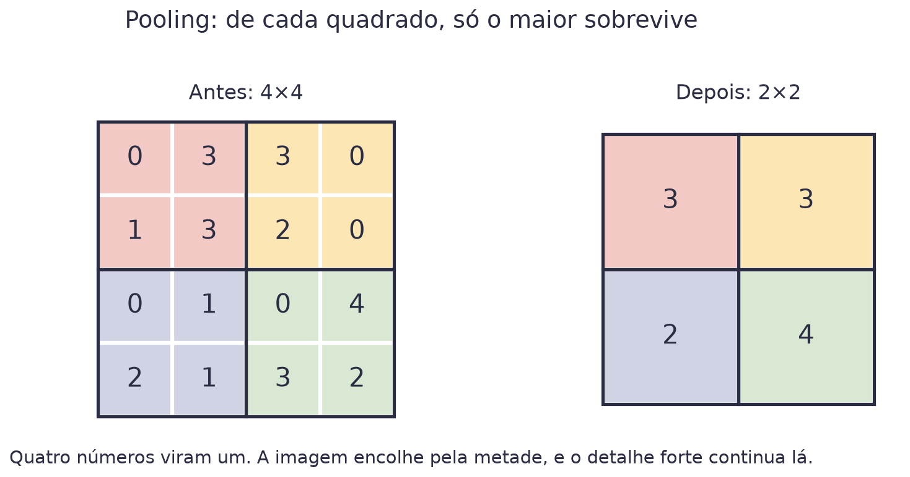
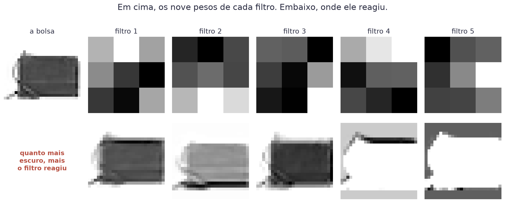
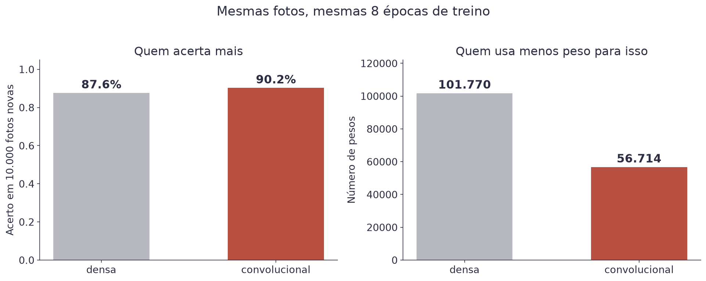
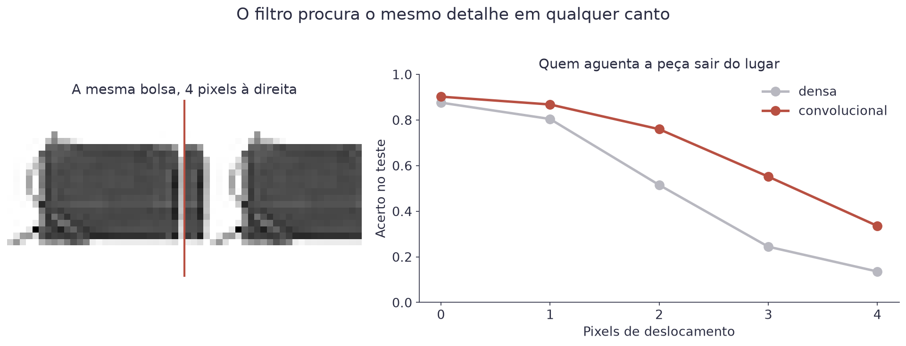
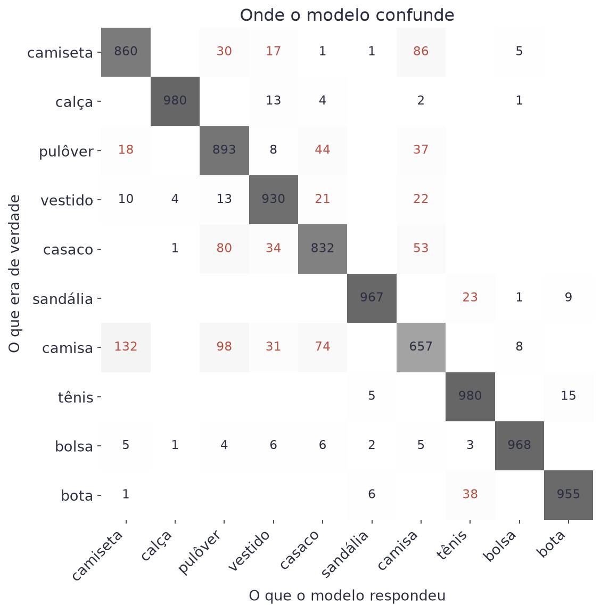

# Aula 8 — Redes Convolucionais


**O que você leva desta aula**

Você vai entender por que a rede da Aula 7 é ruim para olhar fotos, o que
um filtro 3×3 faz (com a conta na mão), e como montar uma rede
convolucional que etiqueta roupa melhor usando quase metade dos pesos.


## Para que serve

Um brechó online recebe milhares de fotos por semana. Alguém precisa
etiquetar cada peça: isso é camiseta, isso é bota, isso é bolsa. Uma
pessoa leva três segundos por foto e erra pouco. O problema é a escala.

Vamos construir o etiquetador. As fotos são as do Fashion-MNIST, um
conjunto público de 70.000 fotos de roupa em dez categorias:

<figure><figcaption>Dez categorias, 28 por 28 pixels, em tons de cinza.</figcaption></figure>

## A foto por dentro

Antes de qualquer modelo, olhe o que existe ali de verdade.

<figure><figcaption>Cada quadradinho da foto é um número. Preto é 1, branco é 0.</figcaption></figure>

Uma foto de 28 por 28 é uma tabela de 784 números. Nada além disso. O que
você chama de "bico do tênis" é uma região onde alguns números vizinhos
são altos ao mesmo tempo.

Guarde a palavra **vizinhos**. É nela que a aula inteira se apoia.

## Por que a rede da Aula 7 é ruim nisso

A rede densa espera uma linha de números, não uma tabela. Para alimentá-la,
você achata (*flatten*) a foto: pega as 28 linhas e emenda uma na outra,
formando uma fila de 784 entradas.

Aí está o problema. Depois de achatar, o pixel que ficava logo acima de
outro vai parar 28 casas adiante na fila. Para a rede, os dois viraram
entradas quaisquer, tão relacionadas quanto duas colunas de uma planilha.
A vizinhança sumiu.


**O teste do embaralhamento**

Escolha uma ordem aleatória e embaralhe os 784 pixels de todas as fotos,
sempre com a mesma ordem. Uma pessoa não reconhece mais nada. A rede densa
aprende exatamente igual, porque para ela a ordem nunca significou nada.


Essa rede não é inútil. Treinada nas 60.000 fotos, ela acerta 87,6%. Mas
gasta 101.770 pesos para chegar lá, quase todos na primeira camada, que
liga cada um dos 784 pixels a cada um dos 128 neurônios.

## A janela que passeia

A convolução resolve o problema de um jeito quase bobo. Em vez de olhar a
foto inteira de uma vez, você olha um quadradinho de 3 por 3 por vez, e
faz sempre a mesma conta.

Esse quadradinho de nove pesos é o **filtro** (*kernel*). Cada resultado é
a soma de nove multiplicações:

$$s_{i,j} = \sum_{a=0}^{2}\sum_{b=0}^{2} k_{a,b} \cdot x_{i+a,\,j+b}$$

| Símbolo | Significado |
|---|---|
| `x` | a foto, com `xᵢⱼ` sendo o pixel da linha `i`, coluna `j` |
| `k` | o filtro, com os nove pesos `k₀₀` até `k₂₂` |
| `sᵢⱼ` | o número que sai quando a janela para na posição `i`, `j` |
| `a`, `b` | percorrem as três linhas e as três colunas do filtro |

Exemplo, com a janela parada em cima de uma borda:

<figure><figcaption>Multiplica casa com casa, soma tudo, escreve um número. Depois desliza uma casa e repete.</figcaption></figure>

A imagem da esquerda é escura de um lado e clara do outro. O filtro tem
uma coluna de `−1`, uma de `0` e uma de `+1`. Na janela em destaque, cada
linha contribui com `(−1×0) + (0×0) + (1×1) = 1`, e as três linhas somam
3. Nas janelas que ficam inteiras dentro do lado escuro, tudo dá zero.

Esse filtro só reage onde a imagem muda. Ele encontra bordas verticais.

Agora rode o mesmo filtro numa foto de verdade, uma janela por vez, até
cobrir tudo:

<figure><figcaption>Mesma camiseta, dois filtros. À esquerda ele achou as laterais; à direita, a gola e a barra.</figcaption></figure>

O resultado é uma imagem nova, chamada **mapa de ativação**: um mapa de
onde aquele detalhe aparece.

## Três ideias em uma

A convolução parece um detalhe técnico, mas ela muda três coisas de uma
vez:

| Ideia | O que significa |
|---|---|
| Vizinhança | cada conta usa só pixels que estão juntos, então "estar perto" volta a valer |
| Peso compartilhado | os mesmos 9 pesos servem para a foto toda, em vez de 9 pesos por posição |
| Mesmo detalhe em qualquer lugar | se a peça sair do centro, o filtro a encontra do mesmo jeito |

O peso compartilhado é o que deixa a rede pequena. Uma camada com 16
filtros de 3×3 tem 160 pesos ao todo, e olha 784 pixels. A primeira camada
da rede densa tinha 100.480 para o mesmo trabalho.

## Pooling: encolher sem perder o que importa

Depois de cada convolução, a rede encolhe a imagem. O jeito mais comum é o
**pooling máximo** (*max pooling*): divida em quadrados de 2 por 2 e
guarde só o maior número de cada um.

<figure><figcaption>Quatro números viram um. O detalhe forte sobrevive, a posição exata dele não.</figcaption></figure>

Duas coisas acontecem. A imagem fica com um quarto do tamanho, o que
deixa tudo mais rápido. E a resposta passa a ser "achei essa borda por
aqui", em vez de "achei essa borda no pixel 14". Essa imprecisão é
proposital, e é ela que faz a rede aguentar a peça sair do lugar.

## Os filtros que ela aprende sozinha

Você não escolhe os nove pesos de cada filtro. Eles são pesos como
quaisquer outros, e o gradiente descendente da Aula 1 os ajusta durante o
treino. A rede decide sozinha quais detalhes vale a pena procurar.

<figure><figcaption>Cinco dos 16 filtros da primeira camada, e onde cada um reagiu na mesma bolsa.</figcaption></figure>

Repare que eles não fazem a mesma coisa. Uns reagem no corpo da bolsa,
outros só na borda de cima. Ninguém programou isso.

## A rede convolucional inteira

```python
modelo = keras.Sequential([
    keras.layers.Input(shape=(28, 28, 1)),
    keras.layers.Conv2D(16, 3, activation="relu"),
    keras.layers.MaxPooling2D(2),
    keras.layers.Conv2D(32, 3, activation="relu"),
    keras.layers.MaxPooling2D(2),
    keras.layers.Flatten(),
    keras.layers.Dense(64, activation="relu"),
    keras.layers.Dense(10, activation="softmax"),
])
```

O `1` no final de `shape=(28, 28, 1)` é o **canal**: quantos números tem
cada pixel. Foto em tons de cinza tem um. Foto colorida tem três, um para
vermelho, um para verde e um para azul.

| Camada | O que sai dela | Pesos |
|---|---|---|
| `Conv2D(16, 3)` | 16 mapas de 26×26 | 160 |
| `MaxPooling2D(2)` | 16 mapas de 13×13 | 0 |
| `Conv2D(32, 3)` | 32 mapas de 11×11 | 4.640 |
| `MaxPooling2D(2)` | 32 mapas de 5×5 | 0 |
| `Flatten` | uma fila de 800 números | 0 |
| `Dense(64)` | 64 números | 51.264 |
| `Dense(10, softmax)` | 10 probabilidades | 650 |

São 56.714 pesos, contra 101.770 da densa. E olhe onde eles estão: as duas
camadas de convolução, que fazem o trabalho de enxergar, usam 4.800. Todo
o resto está na parte densa do final, que só junta as pistas e vota.

Ler a tabela de cima para baixo conta a história: a imagem vai encolhendo
e o número de mapas vai crescendo. No começo a rede procura bordas. No
fim, ela procura combinações de bordas.

## A saída: dez probabilidades

Nas aulas anteriores a resposta era sim ou não, e a sigmoide dava conta.
Aqui são dez categorias. A função que resolve isso é a **softmax**: ela
recebe dez números soltos e devolve dez probabilidades que somam 1.

$$P_j = \frac{e^{z_j}}{\sum_{k=1}^{10} e^{z_k}}$$

| Símbolo | Significado |
|---|---|
| `zⱼ` | o número cru que a última camada produziu para a categoria `j` |
| `e` | o número de Euler, 2,718 |
| `Pⱼ` | a probabilidade final da categoria `j` |
| o denominador | a soma de todas as dez parcelas, que força o total a dar 1 |

Exemplo com três categorias, para caber na conta. Os números crus foram 2,
1 e 0. Elevando `e` a cada um: 7,39, 2,72 e 1,00. A soma é 11,11. As
probabilidades ficam 0,67, 0,24 e 0,09. A maior ganha, e a resposta é a
primeira categoria.

## O resultado

Mesmas 60.000 fotos, mesmas 8 épocas de treino, mesmo otimizador:

<figure><figcaption>A convolucional acerta 2,6 pontos a mais usando quase metade dos pesos.</figcaption></figure>

Dois pontos e meio parece pouco. Em 10.000 fotos, são 260 peças
etiquetadas certo que antes iam erradas.

## Por que ela ganha: o teste do deslocamento

O número de acerto não explica nada sozinho. Aqui está o teste que
explica. Pegue as mesmas fotos de teste e empurre cada uma alguns pixels
para o lado. A peça é a mesma, só mudou de lugar.

<figure><figcaption>Com dois pixels de deslocamento, a densa desaba para 51,5% e a convolucional segura 76,0%.</figcaption></figure>

| Deslocamento | Densa | Convolucional |
|---|---|---|
| nenhum | 87,6% | 90,2% |
| 1 pixel | 80,4% | 86,8% |
| 2 pixels | 51,5% | 76,0% |
| 4 pixels | 13,6% | 33,6% |

A densa aprendeu "o pixel 350 costuma ser escuro em foto de calça". Mude a
peça de lugar e essa regra morre. A convolucional aprendeu "existe uma
borda vertical em algum canto", e a regra sobrevive.

As duas pioram, e isso também é honesto: nenhuma das duas viu foto
deslocada durante o treino. A diferença está na velocidade da queda.

## Onde ela erra

Acerto médio esconde tudo. A matriz de confusão mostra o que aconteceu com
cada categoria:

<figure><figcaption>Linha é o que a peça era; coluna é o que o modelo respondeu. Fora da diagonal, é erro.</figcaption></figure>

| Como ler | O que dizer |
|---|---|
| Calça: 98,0% | silhueta única, ninguém confunde |
| Camisa: 65,7% | a pior de todas, de longe |
| Camisa virou camiseta | 132 vezes |
| Casaco virou pulôver | 80 vezes |

Todo o erro se concentra num canto só: camisa, camiseta, pulôver e casaco.
São quatro peças de tronco, todas com dois braços e uma gola, em 28 por 28
pixels e sem cor. Uma pessoa erraria as mesmas.

Isso muda a conversa com o cliente. Em vez de "o modelo tem 90%", você diz
"o modelo é confiável em oito categorias e precisa de revisão humana em
quatro". A segunda frase é útil, e só a matriz de confusão te dá ela.


**Erro do dia**

Esquecer o canal. A `Conv2D` espera um bloco de formato `(n, 28, 28, 1)`,
e o Keras entrega as fotos como `(n, 28, 28)`. O erro que aparece fala de
dimensões incompatíveis e assusta. A correção é uma linha:
`x_treino.reshape(-1, 28, 28, 1)`. O `-1` quer dizer "descubra quantas
fotos são".


## Quando a convolução não serve

| Situação | O que usar |
|---|---|
| Imagem, som, vídeo | convolução, com folga |
| Planilha com colunas independentes | árvores, ou a regressão das aulas 2 e 3 |
| Texto | modelos de atenção, não convolução |
| Menos de mil imagens | aproveitar uma rede já treinada por outra pessoa |

Vale registrar o custo. Um modelo de imagem sério não treina em oito
épocas num notebook. Ele usa milhões de fotos, placas de vídeo e dias de
processamento. O que você treina em sala é a versão pequena da mesma
ideia, e ela funciona pelo mesmo motivo.

## Materiais

- **Notebook desta aula, no Google Colab:** [](https://colab.research.google.com/github/klein-natan/nanodegree-AI-Atitus/blob/main/notebooks/aula-08-redes-convolucionais.ipynb)
- Slides desta aula: entregues em sala.
- Dados: o Fashion-MNIST vem dentro do Keras, com `keras.datasets.fashion_mnist.load_data()`. Não há arquivo para baixar.

## Para ir além

- [Fashion-MNIST no GitHub](https://github.com/zalandoresearch/fashion-mnist): a origem do conjunto, com a licença e a descrição das dez categorias.
- [Convolutions, de Victor Powell](https://setosa.io/ev/image-kernels/): mexa nos nove pesos de um filtro e veja o efeito na hora, no navegador.
- [CNN Explainer](https://poloclub.github.io/cnn-explainer/): uma rede convolucional inteira rodando no navegador. Clique em cada camada e veja o filtro passear.
- [Glossário](../glossario.md): para revisar qualquer termo novo desta aula.
