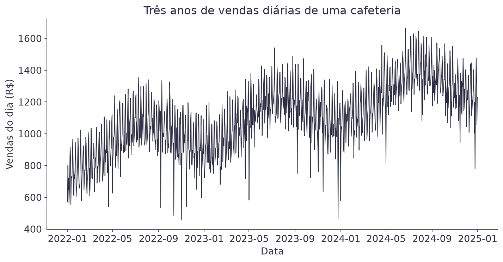
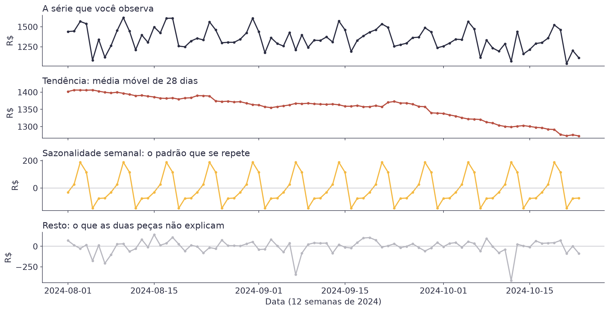
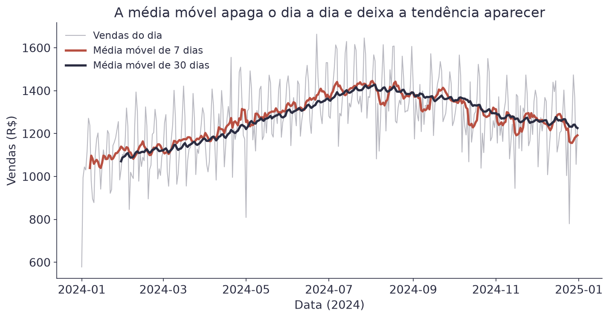
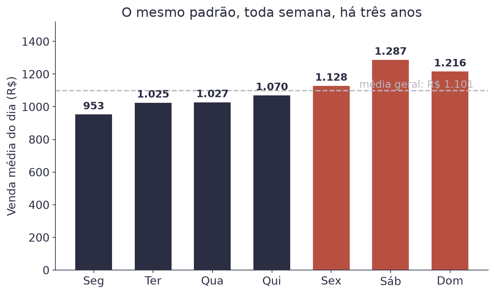
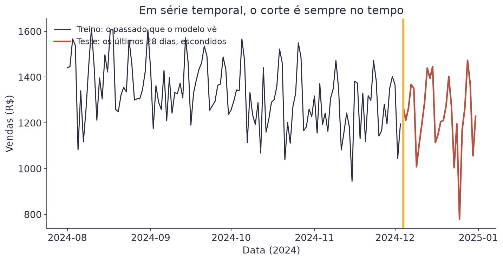
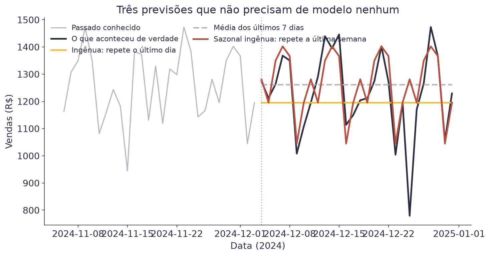

# Aula 4 — Conceitos de Séries Temporais


**O que você leva desta aula**

Você vai aprender a ler um gráfico ao longo do tempo, separando o que ele
tem de tendência, de padrão que se repete e de ruído. Vai aprender também
a fazer três previsões sem modelo nenhum, e a medir qualquer previsão sem
enganar a si mesmo.


## Para que serve

Uma cafeteria perto de escritórios abre todo dia e precisa decidir quanto
comprar de leite, quantos pães encomendar e quantas pessoas escalar. Errar
para cima é desperdício. Errar para baixo é cliente indo embora.

A pergunta é simples: quanto vamos vender amanhã? A diferença para as
aulas anteriores é que agora a ordem dos dados importa. O que aconteceu
ontem ajuda a explicar hoje, e uma linha da tabela não pode trocar de
lugar com outra.

Isso é uma **série temporal**: uma sequência de valores medidos ao longo
do tempo, em intervalos regulares. Vendas por dia, acessos por hora,
temperatura por minuto.

O dataset desta aula tem 1.096 dias de vendas, de janeiro de 2022 a
dezembro de 2024.

<figure><figcaption>Três anos de vendas. Parece bagunça, mas tem três padrões escondidos.</figcaption></figure>

## As três peças de qualquer série

Toda série temporal pode ser lida como uma soma de peças. As três que
importam nesta aula:

- **Tendência**: para onde o negócio caminha no longo prazo. Aqui, para
  cima: a venda média foi de R$ 938 por dia em 2022 para R$ 1.267 em 2024.
- **Sazonalidade**: um padrão que se repete em intervalos fixos. Esta
  série tem duas. Uma semanal (sábado vende mais que segunda) e uma anual
  (o inverno vende mais café que o verão: R$ 1.222 contra R$ 976 por dia).
- **Resto**: o que sobra depois de tirar as duas primeiras. Parte é ruído
  puro, parte é evento (um feriado, uma chuva forte, uma obra na rua).

Ampliando doze semanas, dá para ver as três peças separadas:

<figure><figcaption>A mesma janela de 12 semanas, decomposta em três peças.</figcaption></figure>

Repare no último painel. Aqueles dois mergulhos fundos não são ruído: são
feriados, quando os escritórios fecham e a cafeteria vende R$ 719 em vez
dos R$ 1.109 de um dia comum.

## A média móvel

Como se separa a tendência do resto? A ferramenta mais simples é a **média
móvel**: em vez de olhar o valor de cada dia, você olha a média dos
últimos dias.

$$\text{MM}_k(t) = \frac{1}{k}\sum_{i=0}^{k-1} y_{t-i}$$

| Símbolo | Significado |
|---|---|
| `k` | o tamanho da janela: quantos dias entram na média |
| `t` | o dia que você está olhando |
| `yₜ₋ᵢ` | o valor de `i` dias atrás |
| `MMₖ(t)` | a média móvel de `k` dias, no dia `t` |

Exemplo com uma janela de 3 dias. Se as vendas foram R$ 900, R$ 1.100 e
R$ 1.000, a média móvel do terceiro dia é `(900 + 1.100 + 1.000) / 3 =
1.000`.

A janela decide o que você enxerga. Uma janela de 7 dias apaga a diferença
entre os dias da semana e deixa o mês aparecer. Uma de 30 dias apaga
também o mês e deixa só o rumo do ano.

<figure><figcaption>Quanto maior a janela, mais lisa a linha, e menos detalhe sobra.</figcaption></figure>

Uma janela de 7 dias é a escolha natural aqui, porque a sazonalidade
principal é semanal. A regra vale em geral: use uma janela do tamanho do
ciclo que você quer apagar.

## O padrão semanal

Vale olhar a sazonalidade semanal de frente. Basta tirar a média de cada
dia da semana ao longo dos três anos.

<figure><figcaption>Sábado vende R$ 334 a mais que segunda, todas as semanas, há três anos.</figcaption></figure>

| Dia | Venda média |
|---|---|
| Segunda | R$ 953 |
| Terça | R$ 1.025 |
| Quarta | R$ 1.027 |
| Quinta | R$ 1.070 |
| Sexta | R$ 1.128 |
| Sábado | R$ 1.287 |
| Domingo | R$ 1.216 |

Esse desenho é estável, e é exatamente por isso que ele serve para prever.
Um padrão que se repete há três anos provavelmente se repete na semana que
vem.

## A regra de ouro: o corte é no tempo

Aqui mora o erro mais caro do assunto inteiro.

Nas aulas anteriores, separar treino e teste era sorteio: pegue 80% das
linhas ao acaso para treinar e 20% para testar. Em série temporal isso
está **errado**. Sortear linhas significa treinar com dados de dezembro
para prever novembro, e ninguém prevê o passado.

O corte é sempre no tempo. O treino é tudo até uma data, e o teste é o que
vem depois.

<figure><figcaption>Treino de um lado, teste do outro. Nunca embaralhado.</figcaption></figure>


**Erro do dia**

Usar `train_test_split` do scikit-learn numa série temporal, com o
`shuffle` no valor padrão. O código roda, as métricas saem ótimas, e o
resultado não vale nada: o modelo viu o futuro durante o treino. Isso se
chama **vazamento de dados** (*data leakage*), e o sintoma é sempre o
mesmo. Um desempenho excelente no teste que não se repete na vida real.


## Três previsões sem modelo nenhum

Antes de treinar qualquer coisa, faça as previsões mais burras possíveis.
Elas são a régua: um modelo que não vence essas três não está pagando o
próprio trabalho.

| Previsão de referência | Regra |
|---|---|
| Ingênua (*naïve*) | amanhã vai ser igual a hoje |
| Média móvel | amanhã vai ser a média dos últimos 7 dias |
| Sazonal ingênua | amanhã vai ser igual ao mesmo dia da semana passada |

As três, escritas como fórmula:

$$\hat{y}_{t+1} = y_t \qquad \hat{y}_{t+1} = \frac{1}{7}\sum_{i=0}^{6} y_{t-i} \qquad \hat{y}_{t+1} = y_{t-6}$$

| Símbolo | Significado |
|---|---|
| `ŷₜ₊₁` | a previsão para o dia seguinte |
| `yₜ` | o valor observado hoje |
| `yₜ₋₆` | o valor de seis dias atrás, o mesmo dia da semana passada |

Exemplo: no sábado a cafeteria vendeu R$ 1.300. Para o domingo, a ingênua
prevê os mesmos R$ 1.300. A sazonal ingênua prevê o que o domingo passado
vendeu.

<figure><figcaption>Só a sazonal ingênua acompanha o sobe e desce da semana.</figcaption></figure>

Nos últimos 28 dias, guardados como teste:

| Previsão | MAE | RMSE | MAPE |
|---|---|---|---|
| Ingênua | R$ 121,28 | R$ 156,45 | 10,3% |
| Média de 7 dias | R$ 115,93 | R$ 154,73 | 10,4% |
| Sazonal ingênua | R$ 63,78 | R$ 110,80 | 6,0% |

A sazonal ingênua erra quase metade das outras duas, e não usa modelo
nenhum: ela só repete a última semana. Qualquer modelo desta série tem que
começar batendo R$ 63,78 de MAE.

## MAPE: o erro em porcentagem

MAE, RMSE e MAPE você já conhece da Aula 1. Aqui o MAPE ganha uma
importância extra, e vale relembrar por quê: ele mede o erro como fração
do valor real, e por isso compara períodos de movimento diferente.

$$\text{MAPE} = \frac{100}{n}\sum_{t=1}^{n}\left|\frac{y_t - \hat{y}_t}{y_t}\right|$$

| Símbolo | Significado |
|---|---|
| `yₜ` | o valor real no dia `t` |
| `ŷₜ` | o valor previsto para o dia `t` |
| barras verticais | valor absoluto: o erro sempre conta positivo |
| resultado | o erro médio em porcentagem do valor real |

Exemplo: um erro de R$ 60 num dia de R$ 1.200 é 5%. O mesmo erro de R$ 60
num dia de R$ 600 é 10%. O MAPE conta o segundo como pior, e é isso que o
torna útil para comparar períodos de movimento diferente.

O cuidado com o MAPE: ele explode quando o valor real chega perto de zero.
Numa série que passa por zero, use MAE.

## Explique sem olhar

O teste mais honesto de que você entendeu é tentar explicar sem ler.
Feche esta página e responda em voz alta, como se explicasse para um
colega. Onde travar, é ali que falta entender: volte à seção.

1. Por que sortear linhas para o teste está errado numa série temporal?
2. Por que a sazonal ingênua erra quase metade da ingênua, sem usar modelo nenhum?
3. Qual janela de média móvel apaga o padrão semanal, e por quê?

## Cola da aula

| Conceito | O que significa |
|---|---|
| Série temporal | valores medidos ao longo do tempo, em que a ordem importa |
| Tendência | para onde a série caminha no longo prazo |
| Sazonalidade | padrão que se repete em intervalo fixo (semana, ano) |
| Média móvel | média dos últimos `k` valores, usada para suavizar |
| Corte no tempo | treino é o passado, teste é o futuro. Nunca sorteio |
| Vazamento de dados | quando o modelo enxerga o futuro durante o treino |
| Previsão ingênua | amanhã é igual a hoje |
| Sazonal ingênua | amanhã é igual ao mesmo dia da semana passada |
| MAPE | o erro médio em porcentagem do valor real |

## Materiais

- **Notebook desta aula, no Google Colab:** 
- Slides desta aula: entregues em sala.
- Dataset: [`vendas_cafeteria.csv`](https://github.com/klein-natan/nanodegree-AI-Atitus/blob/main/data/vendas_cafeteria.csv)

Se ainda não sabe como abrir o notebook, veja
[Antes de começar](../antes-de-comecar.md) primeiro.

## Para ir além

- [`rolling` no pandas](https://pandas.pydata.org/docs/reference/api/pandas.DataFrame.rolling.html): a função que calcula médias móveis em uma linha.
- [Forecasting: Principles and Practice](https://otexts.com/fpp3/): o livro gratuito de Hyndman e Athanasopoulos, referência da área. O capítulo 2 é esta aula inteira, em inglês.
- [Glossário](../glossario.md): para revisar qualquer termo novo desta aula.
