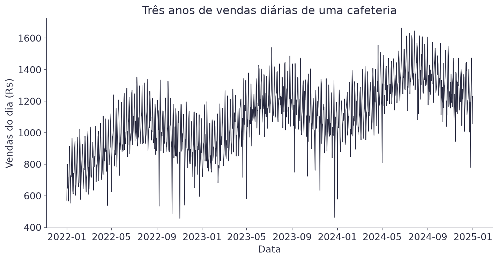
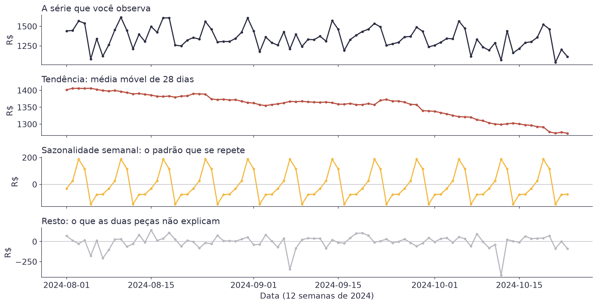
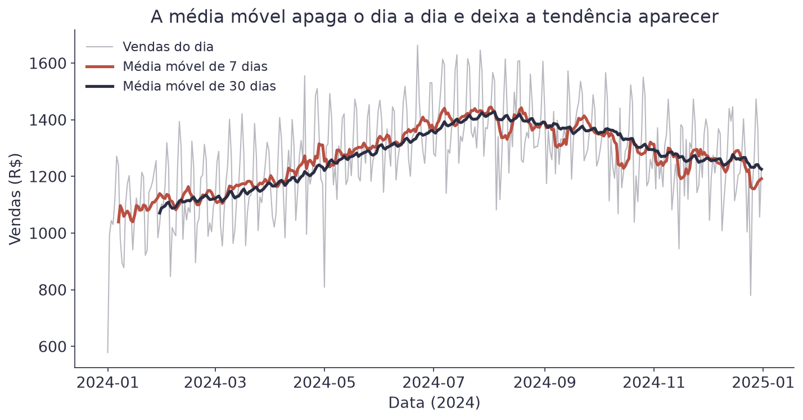
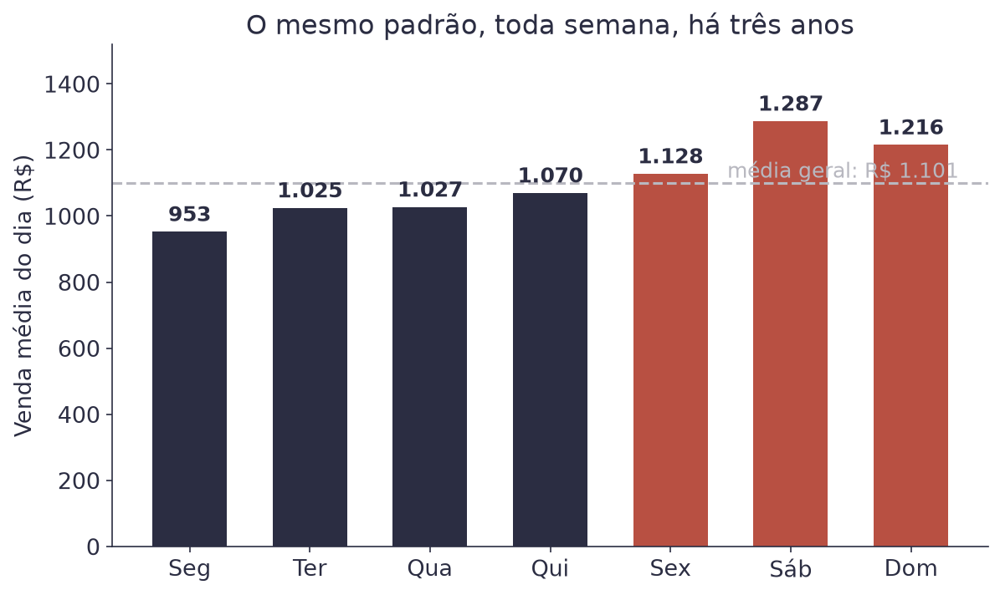
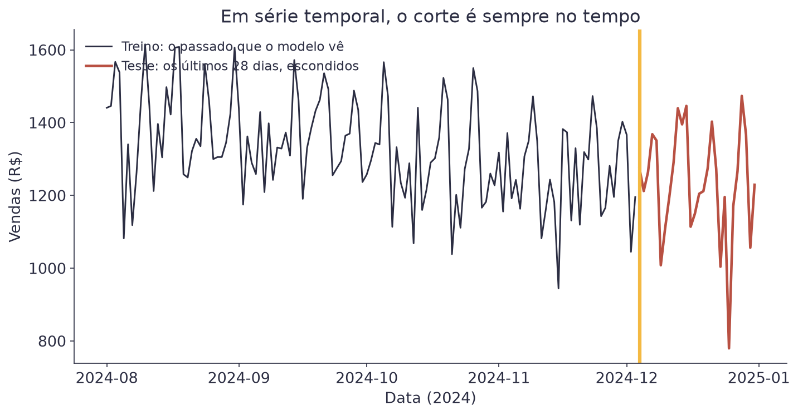
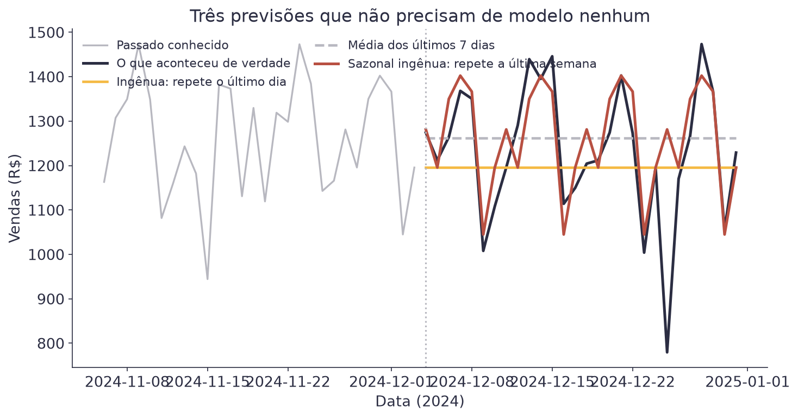
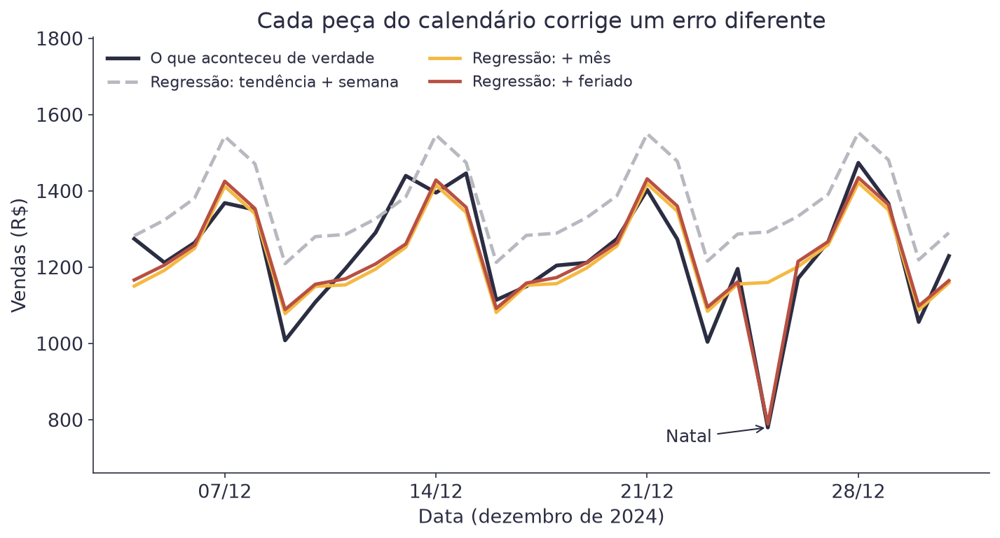
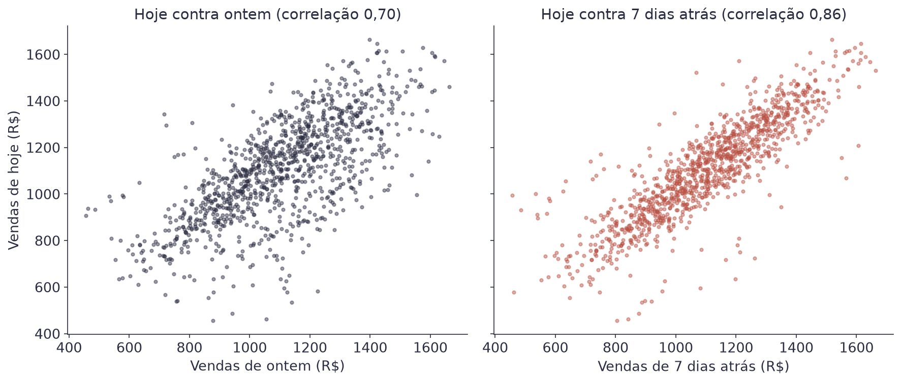
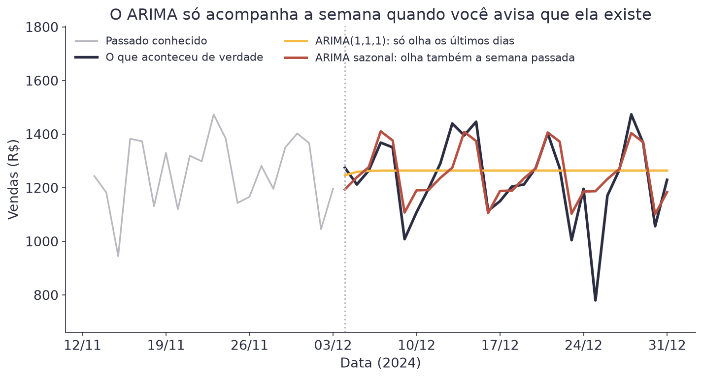
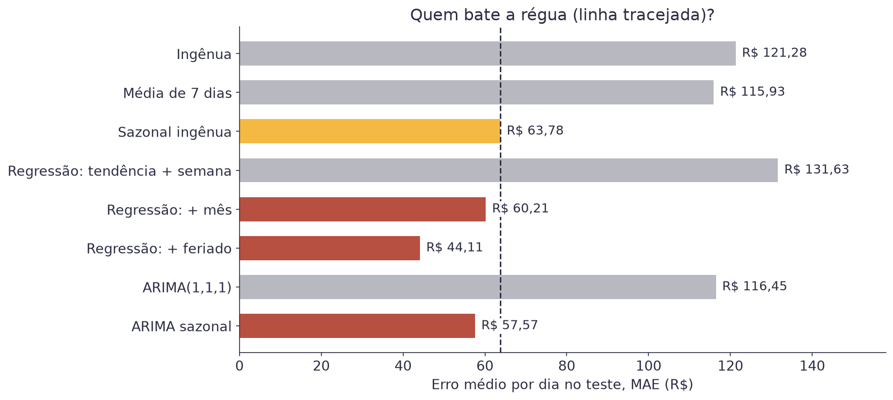

# Aula 5 — Conceitos de Séries Temporais


**O que você leva desta aula**

Você vai aprender a ler um gráfico ao longo do tempo, separando o que ele
tem de tendência, de padrão que se repete e de ruído. Vai fazer três
previsões sem modelo nenhum e usá-las como régua. Depois vai treinar os
dois primeiros modelos de verdade, uma regressão com o calendário e um
ARIMA, e ver quais deles vencem a régua.


## Para que serve

Uma cafeteria perto de escritórios abre todo dia e precisa decidir quanto
comprar de leite, quantos pães encomendar e quantas pessoas escalar. Errar
para cima é desperdício. Errar para baixo é cliente indo embora.

A pergunta é simples: quanto vamos vender amanhã? A diferença para as
aulas anteriores é que agora a ordem dos dados importa. O que aconteceu
ontem ajuda a explicar hoje, e uma linha da tabela não pode trocar de
lugar com outra.

Isso é uma **série temporal**: uma sequência de valores medidos ao longo
do tempo, em intervalos regulares. Vendas por dia, acessos por hora,
temperatura por minuto.

O dataset desta aula tem 1.096 dias de vendas, de janeiro de 2022 a
dezembro de 2024.

<figure><figcaption>Três anos de vendas. Parece bagunça, mas tem três padrões escondidos.</figcaption></figure>

## As três peças de qualquer série

Toda série temporal pode ser lida como uma soma de peças. As três que
importam nesta aula:

- **Tendência**: para onde o negócio caminha no longo prazo. Aqui, para
  cima: a venda média foi de R$ 938 por dia em 2022 para R$ 1.267 em 2024.
- **Sazonalidade**: um padrão que se repete em intervalos fixos. Esta
  série tem duas. Uma semanal (sábado vende mais que segunda) e uma anual
  (o inverno vende mais café que o verão: R$ 1.222 contra R$ 976 por dia).
- **Resto**: o que sobra depois de tirar as duas primeiras. Parte é ruído
  puro, parte é evento (um feriado, uma chuva forte, uma obra na rua).

Ampliando doze semanas, dá para ver as três peças separadas:

<figure><figcaption>A mesma janela de 12 semanas, decomposta em três peças.</figcaption></figure>

Repare no último painel. Aqueles dois mergulhos fundos não são ruído: são
feriados, quando os escritórios fecham e a cafeteria vende R$ 719 em vez
dos R$ 1.109 de um dia comum.

## A média móvel

Como se separa a tendência do resto? A ferramenta mais simples é a **média
móvel**: em vez de olhar o valor de cada dia, você olha a média dos
últimos dias.

$$\text{MM}_k(t) = \frac{1}{k}\sum_{i=0}^{k-1} y_{t-i}$$

| Símbolo | Significado |
|---|---|
| `k` | o tamanho da janela: quantos dias entram na média |
| `t` | o dia que você está olhando |
| `yₜ₋ᵢ` | o valor de `i` dias atrás |
| `MMₖ(t)` | a média móvel de `k` dias, no dia `t` |

Exemplo com uma janela de 3 dias. Se as vendas foram R$ 900, R$ 1.100 e
R$ 1.000, a média móvel do terceiro dia é `(900 + 1.100 + 1.000) / 3 =
1.000`.

A janela decide o que você enxerga. Uma janela de 7 dias apaga a diferença
entre os dias da semana e deixa o mês aparecer. Uma de 30 dias apaga
também o mês e deixa só o rumo do ano.

<figure><figcaption>Quanto maior a janela, mais lisa a linha, e menos detalhe sobra.</figcaption></figure>

Uma janela de 7 dias é a escolha natural aqui, porque a sazonalidade
principal é semanal. A regra vale em geral: use uma janela do tamanho do
ciclo que você quer apagar.

## O padrão semanal

Vale olhar a sazonalidade semanal de frente. Basta tirar a média de cada
dia da semana ao longo dos três anos.

<figure><figcaption>Sábado vende R$ 334 a mais que segunda, todas as semanas, há três anos.</figcaption></figure>

| Dia | Venda média |
|---|---|
| Segunda | R$ 953 |
| Terça | R$ 1.025 |
| Quarta | R$ 1.027 |
| Quinta | R$ 1.070 |
| Sexta | R$ 1.128 |
| Sábado | R$ 1.287 |
| Domingo | R$ 1.216 |

Esse desenho é estável, e é exatamente por isso que ele serve para prever.
Um padrão que se repete há três anos provavelmente se repete na semana que
vem.

## A regra de ouro: o corte é no tempo

Aqui mora o erro mais caro do assunto inteiro.

Nas aulas anteriores, separar treino e teste era sorteio: pegue 80% das
linhas ao acaso para treinar e 20% para testar. Em série temporal isso
está **errado**. Sortear linhas significa treinar com dados de dezembro
para prever novembro, e ninguém prevê o passado.

O corte é sempre no tempo. O treino é tudo até uma data, e o teste é o que
vem depois.

<figure><figcaption>Treino de um lado, teste do outro. Nunca embaralhado.</figcaption></figure>


**Erro do dia**

Usar `train_test_split` do scikit-learn numa série temporal, com o
`shuffle` no valor padrão. O código roda, as métricas saem ótimas, e o
resultado não vale nada: o modelo viu o futuro durante o treino. Isso se
chama **vazamento de dados** (*data leakage*), e o sintoma é sempre o
mesmo. Um desempenho excelente no teste que não se repete na vida real.


## Três previsões sem modelo nenhum

Antes de treinar qualquer coisa, faça as previsões mais burras possíveis.
Elas são a régua: um modelo que não vence essas três não está pagando o
próprio trabalho.

| Previsão de referência | Regra |
|---|---|
| Ingênua (*naïve*) | amanhã vai ser igual a hoje |
| Média móvel | amanhã vai ser a média dos últimos 7 dias |
| Sazonal ingênua | amanhã vai ser igual ao mesmo dia da semana passada |

As três, escritas como fórmula:

$$\hat{y}_{t+1} = y_t \qquad \hat{y}_{t+1} = \frac{1}{7}\sum_{i=0}^{6} y_{t-i} \qquad \hat{y}_{t+1} = y_{t-6}$$

| Símbolo | Significado |
|---|---|
| `ŷₜ₊₁` | a previsão para o dia seguinte |
| `yₜ` | o valor observado hoje |
| `yₜ₋₆` | o valor de seis dias atrás, o mesmo dia da semana passada |

Exemplo: no sábado a cafeteria vendeu R$ 1.300. Para o domingo, a ingênua
prevê os mesmos R$ 1.300. A sazonal ingênua prevê o que o domingo passado
vendeu.

<figure><figcaption>Só a sazonal ingênua acompanha o sobe e desce da semana.</figcaption></figure>

Nos últimos 28 dias, guardados como teste:

| Previsão | MAE | RMSE | MAPE |
|---|---|---|---|
| Ingênua | R$ 121,28 | R$ 156,45 | 10,3% |
| Média de 7 dias | R$ 115,93 | R$ 154,73 | 10,4% |
| Sazonal ingênua | R$ 63,78 | R$ 110,80 | 6,0% |

A sazonal ingênua erra quase metade das outras duas, e não usa modelo
nenhum: ela só repete a última semana. Qualquer modelo desta série tem que
começar batendo R$ 63,78 de MAE.

## MAPE: o erro em porcentagem

MAE, RMSE e MAPE você já conhece da Aula 1. Aqui o MAPE ganha uma
importância extra, e vale relembrar por quê: ele mede o erro como fração
do valor real, e por isso compara períodos de movimento diferente.

$$\text{MAPE} = \frac{100}{n}\sum_{t=1}^{n}\left|\frac{y_t - \hat{y}_t}{y_t}\right|$$

| Símbolo | Significado |
|---|---|
| `yₜ` | o valor real no dia `t` |
| `ŷₜ` | o valor previsto para o dia `t` |
| barras verticais | valor absoluto: o erro sempre conta positivo |
| resultado | o erro médio em porcentagem do valor real |

Exemplo: um erro de R$ 60 num dia de R$ 1.200 é 5%. O mesmo erro de R$ 60
num dia de R$ 600 é 10%. O MAPE conta o segundo como pior, e é isso que o
torna útil para comparar períodos de movimento diferente.

O cuidado com o MAPE: ele explode quando o valor real chega perto de zero.
Numa série que passa por zero, use MAE.

## O primeiro modelo: uma regressão com o calendário

A sazonal ingênua é boa, mas não sabe nada. Ela não sabe que o negócio
cresce, que dezembro vende menos que julho, nem que o Natal existe. Ela
só copia a semana passada.

Você já conhece uma ferramenta que aprende esse tipo de coisa: a
regressão múltipla da Aula 2. O truque é transformar o calendário em
colunas. Cada peça da série vira uma coluna da tabela.

| Peça da série | Coluna na tabela |
|---|---|
| Tendência | `dia_numero`: 0 no primeiro dia, 1 no segundo, e assim por diante |
| Sazonalidade semanal | uma variável indicadora por dia da semana, com a segunda como referência |
| Sazonalidade anual | uma variável indicadora por mês, com janeiro como referência |
| Feriado | a coluna `feriado`, que já vem no arquivo com 0 ou 1 |

As variáveis indicadoras são as mesmas colunas de 0 e 1 que você usou
para os bairros na Aula 2. Um sábado tem 1 na coluna do sábado e 0 nas
outras. A segunda-feira tem 0 em todas, porque é a categoria de
referência.

A regressão soma um peso para cada coluna, como sempre. Mostrando só
quatro das 19 colunas:

$$\hat{y}_t = w_0 + w_1 \cdot t + w_2 \cdot \text{sábado}_t + w_3 \cdot \text{feriado}_t + \dots$$

| Símbolo | Significado |
|---|---|
| `ŷₜ` | a venda prevista para o dia `t` |
| `t` | o número do dia, a coluna `dia_numero` |
| `w₁` | quanto a venda cresce a cada dia que passa: a tendência |
| `sábadoₜ`, `feriadoₜ` | colunas de 0 ou 1: valem 1 se o dia `t` é sábado, ou feriado |
| `w₂`, `w₃` | quanto um sábado soma, e quanto um feriado tira |

O modelo completo, treinado nos 1.068 dias de treino, aprendeu estes pesos
(entre outros):

| Peso | Valor | Tradução |
|---|---|---|
| `w₀` | R$ 603 | uma segunda de janeiro, no primeiro dia da série |
| `w₁` | R$ 0,45 por dia | cerca de R$ 164 a mais por dia de venda a cada ano |
| sábado | + R$ 337 | um sábado vende R$ 337 a mais que uma segunda |
| julho | + R$ 236 | julho vende R$ 236 a mais que janeiro |
| feriado | − R$ 387 | um feriado derruba a venda em R$ 387 |

Exemplo: o Natal de 2024 caiu numa quarta, o dia 1.089 da série, em
dezembro. A conta fica `603 + 0,45 × 1.089 + 80 + 1 − 387 ≈ 787`. Os R$ 80
são o peso da quarta, e o R$ 1 é o peso de dezembro. A cafeteria vendeu
R$ 780 naquele dia.

### Uma peça de cada vez

O jeito mais claro de ver o que cada coluna faz é treinar três versões,
cada uma com uma peça a mais, e medir as três nos mesmos 28 dias de teste.

<figure><figcaption>Sem o mês, a regressão erra para cima o mês inteiro. Sem o feriado, ela não vê o Natal.</figcaption></figure>

| Regressão | MAE | RMSE | MAPE |
|---|---|---|---|
| Tendência + semana | R$ 131,63 | R$ 159,24 | 11,7% |
| + mês | R$ 60,21 | R$ 95,17 | 5,5% |
| + feriado | R$ 44,11 | R$ 60,12 | 3,6% |

A primeira versão é **pior que todas as previsões de referência**. Ela
sabe o dia da semana e a tendência, mas não sabe que dezembro é baixa
temporada, e erra para cima o mês inteiro. Um modelo de verdade pode, sim,
perder da régua.

A coluna do mês conserta isso e já vence a régua. A coluna de feriado
acerta o Natal, e o erro médio cai para R$ 44. Cada peça que você conhece
do negócio vira uma coluna, e cada coluna conserta um erro diferente.

## O passado como variável: a ideia do ARIMA

A regressão com calendário usa a data para prever. Existe outro caminho:
usar as próprias vendas dos dias anteriores.

<figure><figcaption>Hoje se parece com ontem, e se parece ainda mais com o mesmo dia da semana passada.</figcaption></figure>

Uma coluna com o valor de alguns dias atrás se chama **defasagem**
(*lag*). Fazer uma regressão da série contra as próprias defasagens se
chama **autorregressão**, e é a primeira letra de um modelo clássico, o
**ARIMA**.

$$\hat{y}_t = w_0 + w_1 \cdot y_{t-1}$$

| Símbolo | Significado |
|---|---|
| `ŷₜ` | a venda prevista para hoje |
| `yₜ₋₁` | a venda de ontem, que já aconteceu |
| `w₀`, `w₁` | os pesos, aprendidos no treino como em qualquer regressão |

Exemplo, com pesos ilustrativos: se `w₀ = 350` e `w₁ = 0,7`, e ontem a
cafeteria vendeu R$ 1.200, a previsão para hoje é `350 + 0,7 × 1.200 =
1.190` reais.

As três letras do nome são três ideias, e cada uma tem um número que você
escolhe:

| Letra | Ideia | O número |
|---|---|---|
| AR (autorregressão) | prever usando os valores dos dias anteriores | `p`: quantos dias para trás |
| I (integração) | prever a **mudança** de um dia para o outro, e não o valor | `d`: quantas vezes tirar a diferença |
| MA (média móvel dos erros) | corrigir a previsão com os erros dos últimos dias | `q`: quantos erros para trás |

A letra I merece uma fórmula, porque ela é a mais estranha. Em vez de
olhar o valor, o modelo olha a diferença entre dois dias seguidos:

$$\Delta y_t = y_t - y_{t-1}$$

| Símbolo | Significado |
|---|---|
| `Δyₜ` | a mudança de ontem para hoje |
| `yₜ`, `yₜ₋₁` | as vendas de hoje e de ontem |

Exemplo: se ontem a cafeteria vendeu R$ 1.200 e hoje vendeu R$ 1.250, a
diferença é R$ 50. Uma série que sobe sem parar vira uma série de
diferenças que oscila em torno de um número fixo. É assim que o ARIMA lida
com a tendência.

O ARIMA mais simples, com `p = 1`, `d = 1` e `q = 1`, se escreve
ARIMA(1,1,1). No Python, com a biblioteca `statsmodels`, são duas linhas:

```python
modelo = ARIMA(treino["vendas"], order=(1, 1, 1)).fit()
previsao = modelo.forecast(28)
```

### A versão sazonal

Nesta série, o ARIMA(1,1,1) decepciona: MAE de R$ 116,45, empatado com a
previsão ingênua. Ele olha só os últimos dias, e por isso não enxerga a
semana.

A solução é a **versão sazonal**. Ela repete as mesmas três ideias com um
passo de 7 dias: compara hoje com o mesmo dia da semana passada, e não só
com ontem. O quarto número do `seasonal_order` é o tamanho do ciclo.

```python
modelo = ARIMA(treino["vendas"], order=(1, 1, 1),
               seasonal_order=(0, 1, 1, 7)).fit()
```

<figure><figcaption>O ARIMA simples vira uma reta. O sazonal acompanha a semana, mas não tem como saber do Natal.</figcaption></figure>

Com o ciclo de 7 dias, o erro cai para R$ 57,57, e o ARIMA vence a
régua. Mas repare no Natal: o ARIMA sazonal passa reto por ele. O modelo
só conhece o passado da série, e o passado recente não avisa que o dia
25 é feriado.

## O placar

Oito previsões, os mesmos 28 dias de teste:

<figure><figcaption>Três modelos batem a régua. Dois modelos de verdade perdem dela.</figcaption></figure>

| Previsão | MAE | RMSE | MAPE |
|---|---|---|---|
| Ingênua | R$ 121,28 | R$ 156,45 | 10,3% |
| Média de 7 dias | R$ 115,93 | R$ 154,73 | 10,4% |
| Sazonal ingênua (a régua) | R$ 63,78 | R$ 110,80 | 6,0% |
| Regressão: tendência + semana | R$ 131,63 | R$ 159,24 | 11,7% |
| Regressão: + mês | R$ 60,21 | R$ 95,17 | 5,5% |
| Regressão: + feriado | R$ 44,11 | R$ 60,12 | 3,6% |
| ARIMA(1,1,1) | R$ 116,45 | R$ 155,06 | 10,4% |
| ARIMA sazonal | R$ 57,57 | R$ 96,83 | 5,4% |

Três lições saem desta tabela:

1. **Ter um modelo não garante nada.** Dois modelos de verdade perderam
   para a cópia da semana passada. Sem a régua, você nunca saberia.
2. **O ciclo tem que entrar no modelo.** Tanto a regressão quanto o ARIMA
   só venceram quando alguém contou para eles que a semana existe.
3. **O que você sabe do negócio vale mais que o modelo.** O melhor
   resultado veio da regressão, o modelo mais simples, porque ela recebeu
   a lista de feriados. O ARIMA, olhando só o passado, não tinha como
   saber do Natal.

A marca a bater na próxima aula é R$ 44,11 de MAE.

## Materiais

- **Notebook desta aula, no Google Colab:** [](https://colab.research.google.com/github/klein-natan/nanodegree-AI-Atitus/blob/main/notebooks/aula-05-conceitos-series-temporais.ipynb)
- Slides desta aula: entregues em sala.
- Dataset: [`vendas_cafeteria.csv`](https://github.com/klein-natan/nanodegree-AI-Atitus/blob/main/data/vendas_cafeteria.csv)

Se ainda não sabe como abrir o notebook, veja
[Antes de começar](../antes-de-comecar.md) primeiro.

## Para ir além

- [`rolling` no pandas](https://pandas.pydata.org/docs/reference/api/pandas.DataFrame.rolling.html): a função que calcula médias móveis em uma linha.
- [Forecasting: Principles and Practice](https://otexts.com/fpp3/): o livro gratuito de Hyndman e Athanasopoulos, referência da área. Os capítulos 2, 5, 7 e 9 cobrem esta aula (gráficos, régua, regressão e ARIMA), em inglês.
- [ARIMA no statsmodels](https://www.statsmodels.org/stable/generated/statsmodels.tsa.arima.model.ARIMA.html): a documentação da classe usada no notebook.
