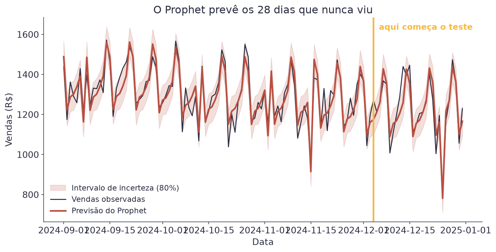
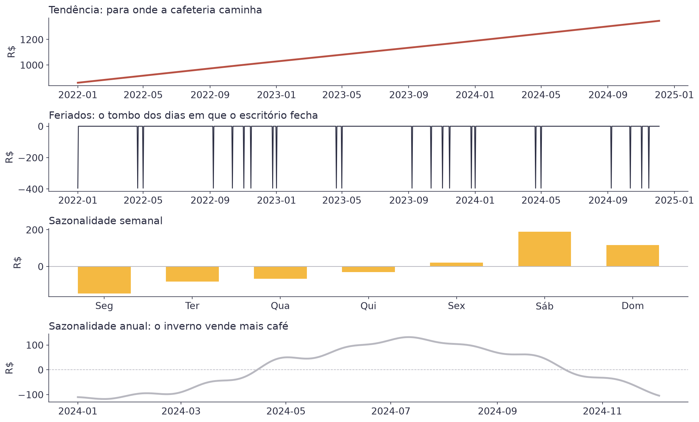
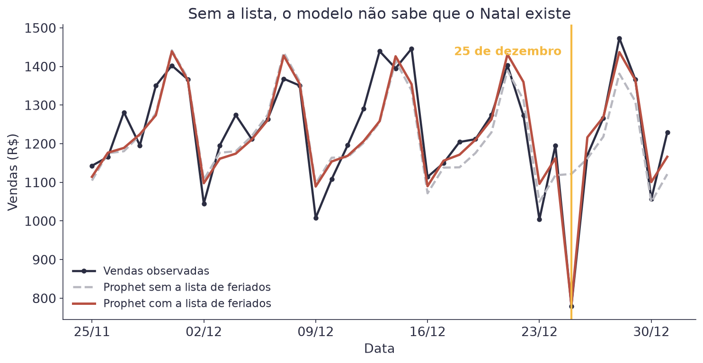
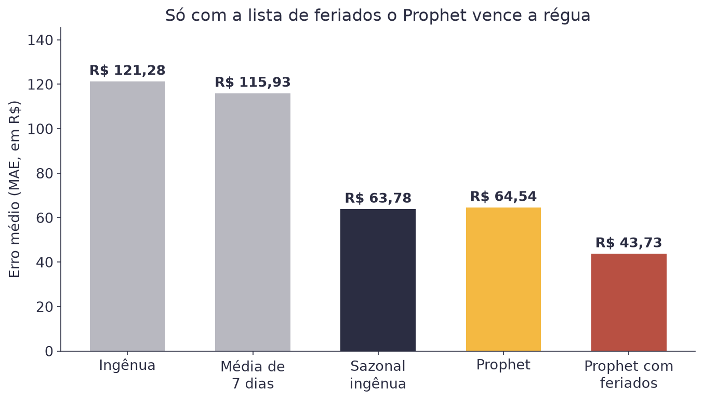
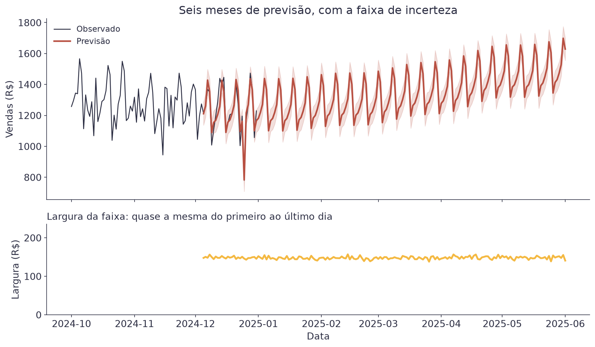
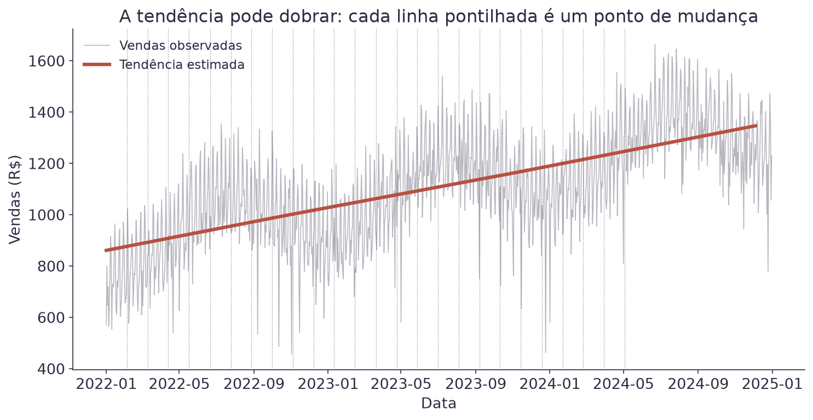

# Aula 6 — Séries Temporais com Prophet


**O que você leva desta aula**

Você vai treinar um modelo de série temporal em três linhas de código, ler
as peças que ele estimou sozinho, ensinar a ele o calendário de feriados,
e comparar o resultado com a régua da aula passada. Também vai aprender a
ler o intervalo de incerteza sem se enganar.


## Para que serve

Na aula passada, a melhor previsão para a cafeteria era repetir a semana
anterior. Ela erra R$ 63,78 por dia, em média, e não custa nada. É a
régua.

O problema é que ela não sabe nada. Não sabe que o negócio cresce, que
julho vende mais que janeiro, nem que no Natal a rua fica vazia. Ela só
copia.

Esta aula troca a cópia por um modelo que estima cada uma dessas peças
separadamente. O **Prophet** é uma biblioteca feita para isso, criada por
uma equipe da Meta, e pensada para séries de negócio: vendas, acessos,
pedidos. É a ferramenta que resolve a maior parte dos casos reais sem
exigir doutorado em estatística.

## O que o Prophet faz

A ideia é a mesma da Aula 5, agora escrita como modelo.

$$y(t) = g(t) + s(t) + h(t) + \varepsilon_t$$

| Símbolo | Significado |
|---|---|
| `y(t)` | o valor da série no dia `t` |
| `g(t)` | a tendência: para onde o negócio caminha |
| `s(t)` | as sazonalidades: o padrão da semana e o do ano |
| `h(t)` | os feriados e eventos especiais |
| `εₜ` | o resto, o que nenhuma das peças explica |

Exemplo, para uma quarta-feira de julho de 2025: a tendência dá R$ 1.320,
a sazonalidade semanal tira R$ 15, a anual soma R$ 110 e não há feriado. A
previsão é `1.320 − 15 + 110 = 1.415` reais.

Repare que é uma soma, como todos os modelos do curso. A diferença é que
cada parcela agora é uma função do tempo, e não um peso vezes uma coluna.

## O formato que ele exige

O Prophet só aceita a tabela com duas colunas, e com estes nomes exatos:

| Coluna | O que é |
|---|---|
| `ds` | a data (*datestamp*) |
| `y` | o valor que você quer prever |

Renomear as colunas é o primeiro passo de qualquer projeto com Prophet, e
é onde mais gente trava na primeira vez.

```python
serie = dados.rename(columns={"data": "ds", "vendas": "y"})
```

## Três linhas para treinar e prever

```python
modelo = Prophet()
modelo.fit(treino)
futuro = modelo.make_future_dataframe(periods=28)
previsao = modelo.predict(futuro)
```

`make_future_dataframe` cria a tabela de datas que você quer prever,
incluindo o histórico. `predict` devolve uma tabela com uma linha por dia
e várias colunas, das quais três importam agora: `yhat` (a previsão),
`yhat_lower` e `yhat_upper` (as bordas do intervalo de incerteza).

<figure><figcaption>À direita da linha amarela, o modelo está prevendo dias que nunca viu.</figcaption></figure>

## As peças que ele estimou sozinho

A parte mais útil do Prophet não é a previsão: é poder abrir o modelo e
olhar cada peça separada.

<figure><figcaption>As mesmas três peças da Aula 5, agora estimadas por conta própria.</figcaption></figure>

Compare com o que você já sabia da aula passada. A tendência sobe. O
sábado é o melhor dia e a segunda é o pior. O meio do ano vende mais que o
começo. O modelo chegou nisso sozinho, sem ninguém contar.

Esse quadro é o que você leva para uma reunião. Ele responde perguntas de
negócio ("o crescimento continua?", "vale abrir aos domingos?") melhor do
que qualquer número único de previsão.

## Feriados: o que o modelo não adivinha

Uma coisa o Prophet não descobre sozinho: o calendário. Ele não sabe que
25 de dezembro é diferente dos outros dias.

<figure><figcaption>A linha cinza segue reto no Natal. A vermelha sabe que o escritório fecha.</figcaption></figure>

Para ensinar o calendário, você entrega uma tabela de feriados:

```python
feriados = pd.DataFrame({
    "holiday": "feriado_nacional",
    "ds": datas_dos_feriados,
})
modelo = Prophet(holidays=feriados)
```

Essa lista pode ir além do calendário oficial. Promoções, greves, jogos
importantes, qualquer data que a sua série "sente" entra ali.

## O resultado contra a régua

Agora o teste que importa, nos mesmos 28 dias escondidos da aula passada:

| Previsão | MAE | RMSE | MAPE |
|---|---|---|---|
| Ingênua | R$ 121,28 | R$ 156,45 | 10,3% |
| Média de 7 dias | R$ 115,93 | R$ 154,73 | 10,4% |
| Sazonal ingênua (a régua) | R$ 63,78 | R$ 110,80 | 6,0% |
| Prophet, sem feriados | R$ 64,54 | R$ 92,91 | 5,7% |
| Prophet, com feriados | R$ 43,73 | R$ 60,22 | 3,5% |

<figure><figcaption>Sem o calendário, o Prophet empata com a cópia da semana passada.</figcaption></figure>

Leia a tabela com atenção, porque ela guarda a lição da aula. O Prophet
recém-instalado, sem nenhum ajuste, **empata** com a previsão que só copia
a semana anterior. O que faz ele ganhar é a lista de feriados, que não vem
do modelo: vem de você, que conhece o negócio.

O RMSE conta uma parte adicional da história. Mesmo empatado no MAE, o
Prophet sem feriados já tem RMSE bem menor (R$ 92,91 contra R$ 110,80).
Ele erra parecido na média, mas erra menos nos dias ruins.


**Erro do dia**

Rodar o Prophet, ver um gráfico bonito com faixa de incerteza e concluir
que o modelo é bom, sem nunca comparar com a régua. Um gráfico de previsão
sempre parece convincente. A régua é o que separa um modelo útil de um
enfeite caro.


## O intervalo de incerteza

Toda linha de `yhat` vem acompanhada de `yhat_lower` e `yhat_upper`. Eles
formam a faixa em torno da previsão, e por padrão cobrem 80% dos casos.

É o mesmo intervalo de predição da Aula 1, com dois ajustes. Lá a faixa
era `ŷ ± 2s`, com uma largura só para toda a reta; aqui ela muda de dia
para dia, e a promessa é 80% em vez de 95%. A pergunta que ela responde
continua sendo a mesma: onde cai **um** dia, e não a média de muitos.

<figure><figcaption>Seis meses de previsão. A largura da faixa fica em torno de R$ 150 o tempo todo.</figcaption></figure>

A faixa soma duas incertezas. Uma é o barulho do dia a dia, que não some
nunca: dois sábados de julho não vendem exatamente o mesmo. A outra é a
dúvida sobre para onde a tendência vai, e essa cresce com o horizonte.

Nesta série, a primeira domina. A tendência é tão regular que a dúvida
sobre ela pesa pouco, e por isso a faixa quase não abre, mesmo prevendo
seis meses à frente. Em uma série com tendência instável, a faixa abriria
bem mais.

Duas leituras práticas. A primeira: a faixa não é garantia. No nosso
teste, 75% dos dias caíram dentro dela, com a faixa prometendo 80%. É o
esperado, e serve de aviso: um dia em cada cinco fica de fora.

A segunda, mais importante: a faixa só conhece o que já aconteceu. Ela não
tem como prever um concorrente novo na esquina, uma greve de ônibus ou uma
obra na rua. O risco de prever seis meses à frente vem desses eventos,
não da largura da faixa.

Use a faixa para conversar sobre risco. "A previsão é R$ 1.200, mas pode
ficar entre R$ 1.130 e R$ 1.280" é uma frase muito mais útil para quem vai
comprar leite do que um número solto.

## Quando a tendência dobra

O Prophet não obriga a tendência a ser uma reta. Ele permite que ela mude
de inclinação em alguns pontos, chamados **pontos de mudança**
(*changepoints*).

<figure><figcaption>Por padrão, 25 pontos candidatos nos primeiros 80% da série.</figcaption></figure>

Esse é o motivo de o Prophet lidar bem com negócios que mudam de patamar.
Uma loja que abriu uma filial, um site que ganhou tráfego depois de uma
campanha: a tendência dobra, e o modelo acompanha.

O cuidado é o oposto. Se você deixar o modelo dobrar demais, ele começa a
seguir o ruído e a previsão fica instável. O parâmetro
`changepoint_prior_scale` controla essa liberdade: quanto maior, mais o
modelo aceita dobrar.

## Quando o Prophet não é a resposta

Ele resolve a maioria dos casos de negócio, mas não todos.

| Situação | Por quê |
|---|---|
| Séries muito curtas | com menos de dois ciclos completos, não há sazonalidade para estimar |
| Dados de alta frequência com muita estrutura | séries de segundos ou de mercado financeiro pedem outras ferramentas |
| Quando outras variáveis explicam mais que o tempo | se preço e promoção mandam mais que o calendário, um modelo de regressão pode servir melhor |

## Materiais

- **Notebook desta aula, no Google Colab:** [](https://colab.research.google.com/github/klein-natan/nanodegree-AI-Atitus/blob/main/notebooks/aula-06-series-temporais-prophet.ipynb)
- Slides desta aula: entregues em sala.
- Dataset: [`vendas_cafeteria.csv`](https://github.com/klein-natan/nanodegree-AI-Atitus/blob/main/data/vendas_cafeteria.csv)

O notebook desta aula instala o Prophet na primeira célula, com
`pip install prophet`. A Aula 4 também instala o Optuna no Colab.

## Para ir além

- [Documentação do Prophet](https://facebook.github.io/prophet/docs/quick_start.html): o guia oficial, com exemplos em Python e R.
- [Validação cruzada no Prophet](https://facebook.github.io/prophet/docs/diagnostics.html): como testar em várias janelas de tempo em vez de uma só.
- [Forecasting: Principles and Practice](https://otexts.com/fpp3/): os capítulos 5 e 7 explicam as previsões de referência e os modelos de regressão no tempo, em inglês.
- [Glossário](../glossario.md): para revisar qualquer termo novo desta aula.
