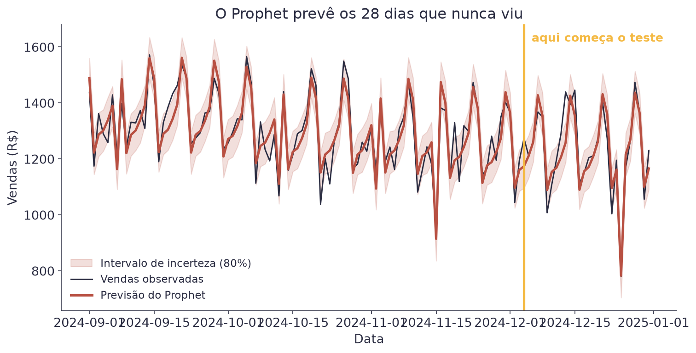
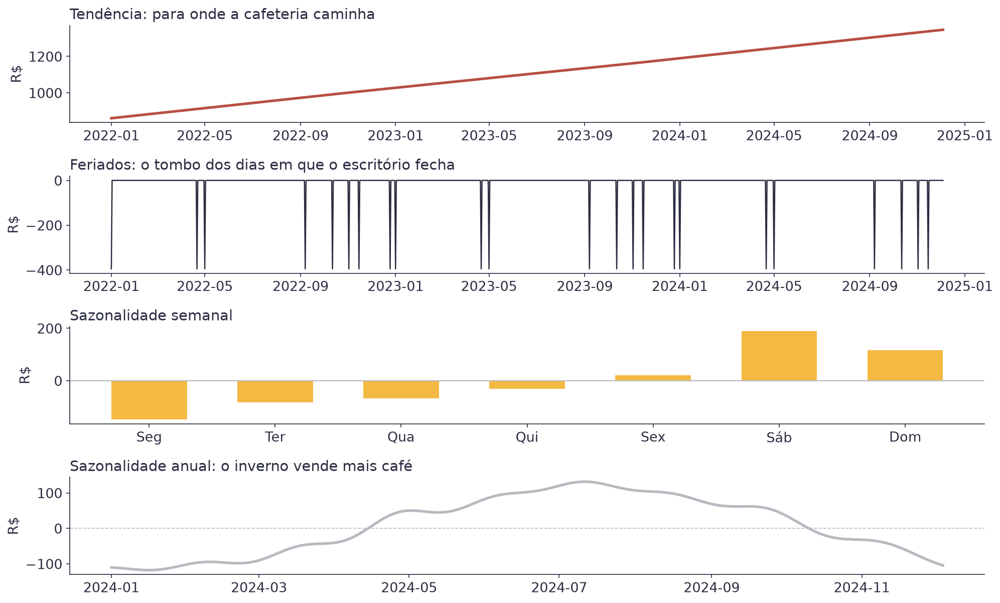
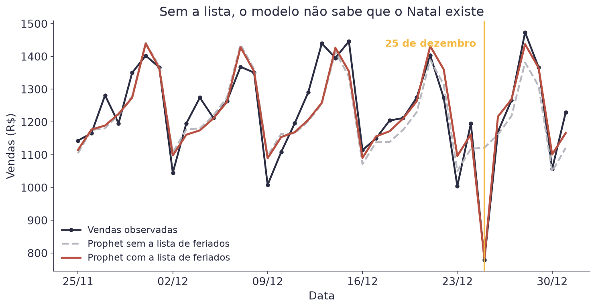
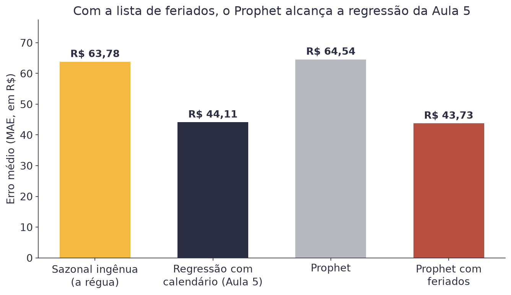
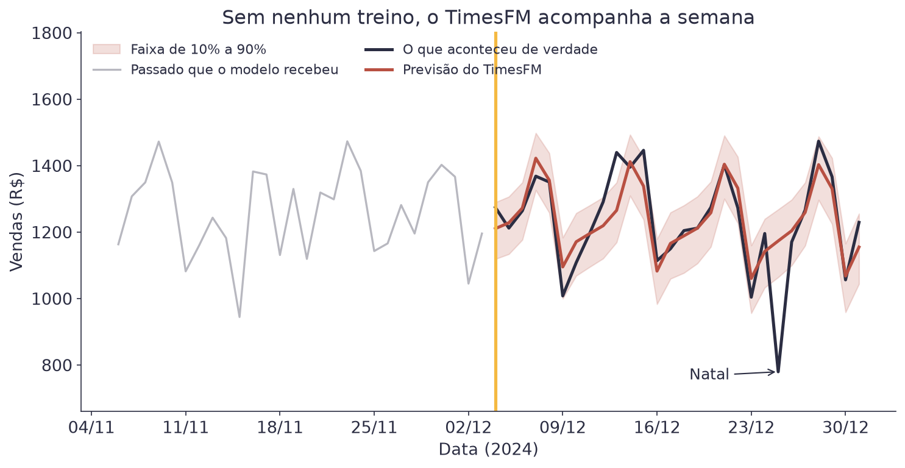
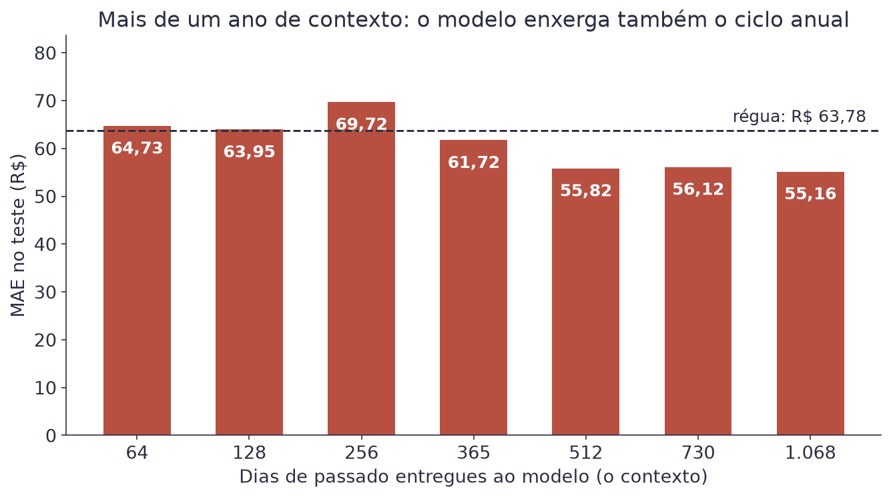
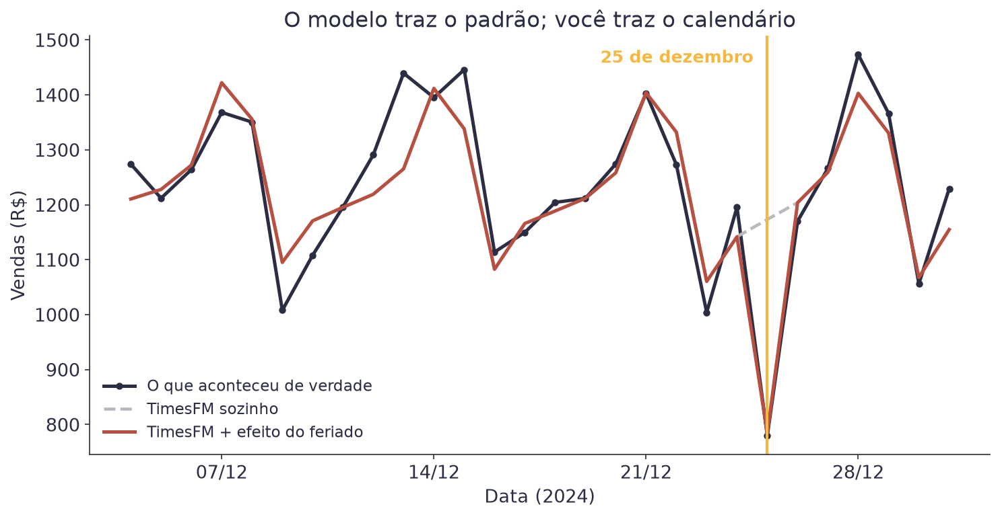
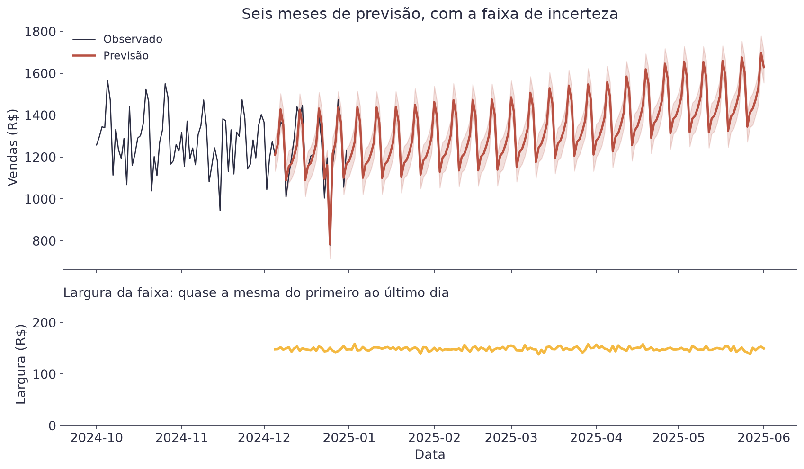
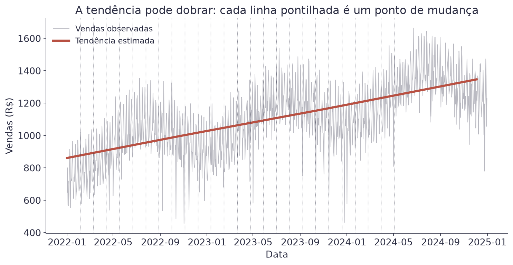
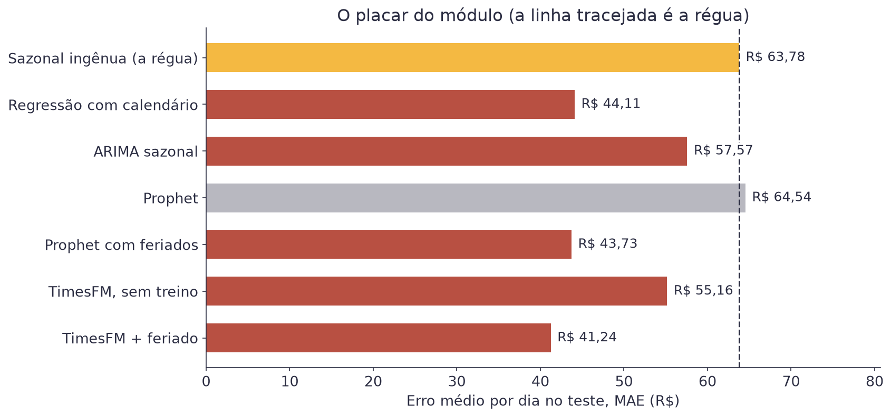

# Aula 6 — Séries Temporais com Prophet e TimesFM


**O que você leva desta aula**

Você vai treinar o Prophet em três linhas, ler as peças que ele estimou
sozinho e ensinar a ele o calendário de feriados. Depois vai usar o
TimesFM, um modelo pré-treinado que prevê a série sem treino nenhum. No
fim, vai comparar tudo com a régua e decidir qual ferramenta usar em cada
situação.


## Para que serve

Na aula passada, a cafeteria ganhou uma régua e dois modelos. A régua
copia a semana anterior e erra R$ 63,78 por dia. O ARIMA sazonal erra
R$ 57,57. E a regressão com calendário, com 19 colunas montadas à mão,
erra R$ 44,11.

Montar essas colunas deu trabalho. Você precisou decidir que o mês
importava, criar as variáveis indicadoras e lembrar da coluna de feriado.
Esta aula testa dois atalhos:

- O **Prophet**, uma biblioteca que monta a regressão com calendário por
  você.
- O **TimesFM**, um modelo que já viu milhões de séries e prevê esta sem
  treinar nada.

A pergunta é a mesma da aula passada: eles batem a régua? E batem os
R$ 44,11?

## O que o Prophet faz

Uma equipe da Meta criou o Prophet pensando em séries de negócio: vendas,
acessos, pedidos. A ideia é a mesma da Aula 5, escrita
como modelo.

$$y(t) = g(t) + s(t) + h(t) + \varepsilon_t$$

| Símbolo | Significado |
|---|---|
| `y(t)` | o valor da série no dia `t` |
| `g(t)` | a tendência: para onde o negócio caminha |
| `s(t)` | as sazonalidades: o padrão da semana e o do ano |
| `h(t)` | os feriados e eventos especiais |
| `εₜ` | o resto, o que nenhuma das peças explica |

Exemplo, para uma quarta-feira de julho de 2025: a tendência dá R$ 1.320,
a sazonalidade semanal tira R$ 15, a anual soma R$ 110 e não há feriado. A
previsão é `1.320 − 15 + 110 = 1.415` reais.

Repare que é a regressão com calendário da aula passada, com as mesmas
peças. A diferença é que você não monta nenhuma coluna. O Prophet cria
sozinho as curvas da semana e do ano, e ainda deixa a tendência mudar de
inclinação.

## O formato que ele exige

O Prophet só aceita a tabela com duas colunas, e com estes nomes exatos:

| Coluna | O que é |
|---|---|
| `ds` | a data (*datestamp*) |
| `y` | o valor que você quer prever |

Renomear as colunas é o primeiro passo de qualquer projeto com Prophet, e
é onde mais gente trava na primeira vez.

```python
serie = dados.rename(columns={"data": "ds", "vendas": "y"})
```

## Três linhas para treinar e prever

```python
modelo = Prophet()
modelo.fit(treino)
futuro = modelo.make_future_dataframe(periods=28)
previsao = modelo.predict(futuro)
```

`make_future_dataframe` cria a tabela de datas que você quer prever,
incluindo o histórico. `predict` devolve uma tabela com uma linha por dia
e várias colunas, das quais três importam agora: `yhat` (a previsão),
`yhat_lower` e `yhat_upper` (as bordas do intervalo de incerteza).

<figure><figcaption>À direita da linha amarela, o modelo está prevendo dias que nunca viu.</figcaption></figure>

## As peças que ele estimou sozinho

A parte mais útil do Prophet não é a previsão: é poder abrir o modelo e
olhar cada peça separada.

<figure><figcaption>As mesmas três peças da Aula 5, agora estimadas por conta própria.</figcaption></figure>

Compare com o que você já sabia da aula passada. A tendência sobe. O
sábado é o melhor dia e a segunda é o pior. O meio do ano vende mais que o
começo. O modelo chegou nisso sozinho, sem ninguém contar.

Esse quadro é o que você leva para uma reunião. Ele responde perguntas de
negócio ("o crescimento continua?", "vale abrir aos domingos?") melhor do
que qualquer número único de previsão.

## Feriados: o que o modelo não adivinha

Uma coisa o Prophet não descobre sozinho: o calendário. Ele não sabe que
25 de dezembro é diferente dos outros dias.

<figure><figcaption>A linha cinza segue reto no Natal. A vermelha sabe que o escritório fecha.</figcaption></figure>

Para ensinar o calendário, você entrega uma tabela de feriados:

```python
feriados = pd.DataFrame({
    "holiday": "feriado_nacional",
    "ds": datas_dos_feriados,
})
modelo = Prophet(holidays=feriados)
```

Essa lista pode ir além do calendário oficial. Promoções, greves, jogos
importantes, qualquer data que a sua série "sente" entra ali.

## O Prophet contra a régua

Agora o teste que importa, nos mesmos 28 dias escondidos da aula passada:

| Previsão | MAE | RMSE | MAPE |
|---|---|---|---|
| Sazonal ingênua (a régua) | R$ 63,78 | R$ 110,80 | 6,0% |
| Regressão com calendário (Aula 5) | R$ 44,11 | R$ 60,12 | 3,6% |
| Prophet, sem feriados | R$ 64,54 | R$ 92,91 | 5,7% |
| Prophet, com feriados | R$ 43,73 | R$ 60,22 | 3,5% |

<figure><figcaption>Sem o calendário, o Prophet empata com a cópia da semana passada. Com ele, alcança a regressão.</figcaption></figure>

Leia a tabela com atenção, porque ela guarda duas lições.

A primeira: o Prophet recém-instalado, sem nenhum ajuste, **empata** com
a previsão que só copia a semana anterior. O que faz ele ganhar é a lista
de feriados, que não vem do modelo. Vem de você, que conhece o negócio.

A segunda: com a lista, o Prophet chega praticamente ao mesmo número da
regressão da Aula 5. Não é coincidência. Os dois modelos somam as mesmas
peças. O Prophet economiza o trabalho de montar as colunas, e entrega de
brinde a faixa de incerteza e a tendência que dobra.


**Erro do dia**

Rodar o Prophet, ver um gráfico bonito com faixa de incerteza e concluir
que o modelo é bom, sem nunca comparar com a régua. Um gráfico de previsão
sempre parece convincente. A régua é o que separa um modelo útil de um
enfeite caro.


## Um modelo que nunca viu esta cafeteria: o TimesFM

Todos os modelos até aqui aprenderam com a série da cafeteria. Existe
outro caminho, que chegou à área de séries temporais nos últimos anos: um
**modelo de fundação** (*foundation model*).

A ideia vem dos modelos de linguagem, que você vai construir mais adiante
no curso. Um modelo de linguagem leu uma quantidade enorme de texto e
aprendeu a prever a próxima palavra. O **TimesFM**, do Google, leu uma
quantidade enorme de séries temporais e aprendeu a prever o próximo
pedaço de uma série. Só a primeira versão já tinha lido cerca de 100
bilhões de pontos, de buscas no Google, visitas à Wikipédia e muitas
outras fontes.

Como ele já viu séries com semanas, anos, tendências e quedas de todo
tipo, ele consegue prever uma série nova sem treinar nela. Isso se chama
previsão **zero-shot**: você entrega o passado, e ele devolve o futuro.

O TimesFM 2.5 tem 231 milhões de pesos e roda no processador do Colab em
poucos segundos. Ele vem do Hugging Face, pela biblioteca `transformers`:

```python
modelo = TimesFm2_5ModelForPrediction.from_pretrained("google/timesfm-2.5-200m-transformers")
historico = torch.tensor(treino["y"].to_numpy(), dtype=torch.float32)
saida = modelo(past_values=[historico])
previsao = saida.mean_predictions[0, :28]
```

Repare no que **não** aparece: nenhum `fit`. O modelo não aprende nada com
a cafeteria. Ele só lê o histórico e escreve os próximos dias.

<figure><figcaption>Sem nenhum treino, o TimesFM reproduz o padrão da semana. Só o Natal escapa.</figcaption></figure>

O resultado: MAE de R$ 55,16. Sem treinar nada, o TimesFM bate a régua,
bate o ARIMA sazonal e bate o Prophet sem feriados.

E tem mais. Tirando o Natal da conta, o erro dele nos outros 27 dias é de
R$ 42,62, o menor de todos os modelos. Nos dias comuns, ele é o melhor da
turma. O problema é um dia só: no Natal, ele previu R$ 1.173, e a
cafeteria vendeu R$ 780.

### O contexto: quanto passado você entrega

O TimesFM não tem pesos para treinar, mas tem uma escolha importante: o
**contexto**, o número de dias de passado que você entrega a ele. A versão
2.5 aceita até 16 mil pontos.

<figure><figcaption>Com mais de um ano de passado, o modelo enxerga também a onda anual.</figcaption></figure>

Com 64 ou 128 dias, ele só enxerga a semana, e empata com a régua. A
partir de 512 dias, ele enxerga um ano inteiro e mais um pedaço, e
descobre que dezembro é baixa temporada. Na dúvida, entregue todo o
histórico que você tem.

### Juntando os dois mundos

O TimesFM traz o padrão. O calendário, ele não tem como saber: ninguém
contou a ele que o dia 25 é feriado. A solução é somar à previsão dele o
efeito do feriado, medido no treino.

$$\hat{y}_t = \text{TimesFM}_t + w_1 \cdot \text{feriado}_t$$

| Símbolo | Significado |
|---|---|
| `TimesFMₜ` | a previsão do TimesFM para o dia `t` |
| `feriadoₜ` | vale 1 se o dia `t` é feriado, e 0 se não é |
| `w₁` | o efeito do feriado: a venda média de um feriado menos a de um dia comum, no treino |

No treino, um feriado vendeu, em média, R$ 389,68 a menos que um dia
comum. Então `w₁ = −389,68`. Exemplo, no Natal: `1.173 − 390 = 783`
reais. A cafeteria vendeu R$ 780.

Nos outros 27 dias, `feriadoₜ` vale 0 e a previsão fica igual. Com esse
único ajuste, o erro médio cai para **R$ 41,24**, o melhor resultado do
módulo.

<figure><figcaption>Um modelo que viu milhões de séries, mais uma coluna que só você conhece.</figcaption></figure>

## O intervalo de incerteza

Toda linha de `yhat` do Prophet vem acompanhada de `yhat_lower` e
`yhat_upper`. Eles formam a faixa em torno da previsão, e por padrão
cobrem 80% dos casos.

É o mesmo intervalo de predição da Aula 1, com dois ajustes. Lá a faixa
era `ŷ ± 2s`, com uma largura só para toda a reta; aqui ela muda de dia
para dia, e a promessa é 80% em vez de 95%. A pergunta que ela responde
continua sendo a mesma: onde cai **um** dia, e não a média de muitos.

<figure><figcaption>Seis meses de previsão. A largura da faixa fica em torno de R$ 150 o tempo todo.</figcaption></figure>

A faixa soma duas incertezas. Uma é o barulho do dia a dia, que não some
nunca: dois sábados de julho não vendem exatamente o mesmo. A outra é a
dúvida sobre para onde a tendência vai, e essa cresce com o horizonte.
Nesta série, a primeira domina, e por isso a faixa quase não abre.

O TimesFM também devolve uma faixa. Em vez de uma borda de baixo e uma de
cima, ele devolve **quantis**: o valor abaixo do qual devem ficar 10% dos
dias, 20%, e assim por diante até 90%. Entre o quantil de 10% e o de 90%
cabem 80% dos casos, a mesma promessa do Prophet.

| Faixa de 80% no teste | Dias dentro | Largura média |
|---|---|---|
| Prophet com feriados | 75% | cerca de R$ 150 |
| TimesFM | 89% | cerca de R$ 191 |

O TimesFM é mais cauteloso: a faixa dele é mais larga e erra menos. As
duas cumprem a promessa de perto, e nenhuma é garantia.

A lição mais importante vale para as duas: a faixa só conhece o que já
aconteceu. Ela não tem como prever um concorrente novo na esquina, uma
greve de ônibus ou uma obra na rua. O risco de prever seis meses à frente
vem desses eventos, não da largura da faixa.

Use a faixa para conversar sobre risco. "A previsão é R$ 1.200, mas pode
ficar entre R$ 1.130 e R$ 1.280" é uma frase muito mais útil para quem vai
comprar leite do que um número solto.

## Quando a tendência dobra

O Prophet não obriga a tendência a ser uma reta. Ele permite que ela mude
de inclinação em alguns pontos, chamados **pontos de mudança**
(*changepoints*).

<figure><figcaption>Por padrão, 25 pontos candidatos nos primeiros 80% da série.</figcaption></figure>

Esse é o motivo de o Prophet lidar bem com negócios que mudam de patamar.
Uma loja que abriu uma filial, um site que ganhou tráfego depois de uma
campanha: a tendência dobra, e o modelo acompanha.

O cuidado é o oposto. Se você deixar o modelo dobrar demais, ele começa a
seguir o ruído e a previsão fica instável. O parâmetro
`changepoint_prior_scale` controla essa liberdade: quanto maior, mais o
modelo aceita dobrar.

## O placar do módulo

<figure><figcaption>Os três melhores têm uma coisa em comum: o calendário de feriados.</figcaption></figure>

| Previsão | MAE | RMSE | MAPE |
|---|---|---|---|
| Sazonal ingênua (a régua) | R$ 63,78 | R$ 110,80 | 6,0% |
| Regressão com calendário (Aula 5) | R$ 44,11 | R$ 60,12 | 3,6% |
| ARIMA sazonal (Aula 5) | R$ 57,57 | R$ 96,83 | 5,4% |
| Prophet, sem feriados | R$ 64,54 | R$ 92,91 | 5,7% |
| Prophet, com feriados | R$ 43,73 | R$ 60,22 | 3,5% |
| TimesFM, sem treino | R$ 55,16 | R$ 93,67 | 5,1% |
| TimesFM + efeito do feriado | R$ 41,24 | R$ 56,90 | 3,3% |

Os três melhores resultados vieram de ferramentas bem diferentes: uma
regressão da Aula 2, uma biblioteca de negócio e uma rede neural gigante.
O que eles têm em comum é o calendário de feriados, que nenhum deles
descobriu sozinho.

Repare também que os três ficaram entre R$ 41 e R$ 44. Esse é,
provavelmente, o piso desta série: o barulho do dia a dia, que nenhum
modelo prevê.

## Qual ferramenta usar

| Ferramenta | Use quando | Cuidado |
|---|---|---|
| A régua | sempre, antes de qualquer modelo | ela não é o fim, é o começo |
| Regressão com calendário | você conhece as causas e quer ler um peso por causa | você monta cada coluna |
| ARIMA | a série depende muito do próprio passado, e pouco do calendário | não sabe de nada que o passado não mostre |
| Prophet | série de negócio com semana, ano e feriados | sem a lista de feriados, pode empatar com a régua |
| TimesFM | você precisa de uma boa previsão rápido, ou tem muitas séries | não conhece o seu calendário, e é um modelo pesado |

## Materiais

- **Notebook desta aula, no Google Colab:** [](https://colab.research.google.com/github/klein-natan/nanodegree-AI-Atitus/blob/main/notebooks/aula-06-series-temporais-prophet.ipynb)
- Slides desta aula: entregues em sala.
- Dataset: [`vendas_cafeteria.csv`](https://github.com/klein-natan/nanodegree-AI-Atitus/blob/main/data/vendas_cafeteria.csv)

O notebook desta aula confere, na primeira célula, se o Prophet e uma
versão recente do `transformers` estão instalados. Na primeira vez que
roda o TimesFM, o Colab baixa o modelo, cerca de 1 GB.

## Para ir além

- [Documentação do Prophet](https://facebook.github.io/prophet/docs/quick_start.html): o guia oficial, com exemplos em Python e R.
- [TimesFM no Hugging Face](https://huggingface.co/google/timesfm-2.5-200m-transformers): a página do modelo usado na aula, com o artigo que o descreve.
- [Forecasting: Principles and Practice](https://otexts.com/fpp3/): os capítulos 5 e 7 explicam as previsões de referência e os modelos de regressão no tempo, em inglês.
