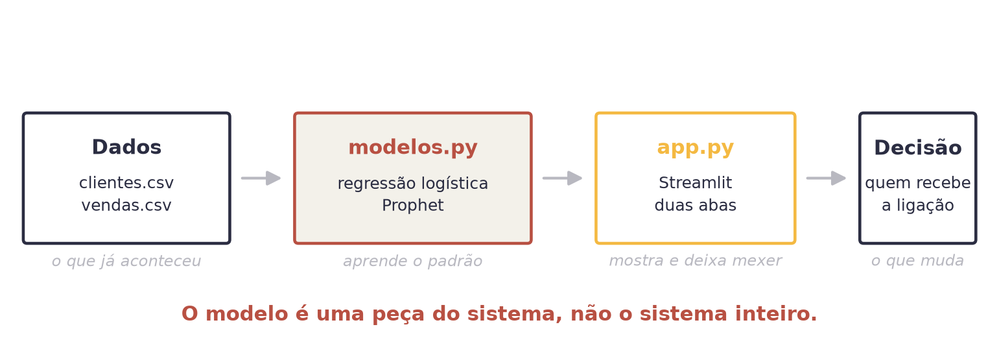
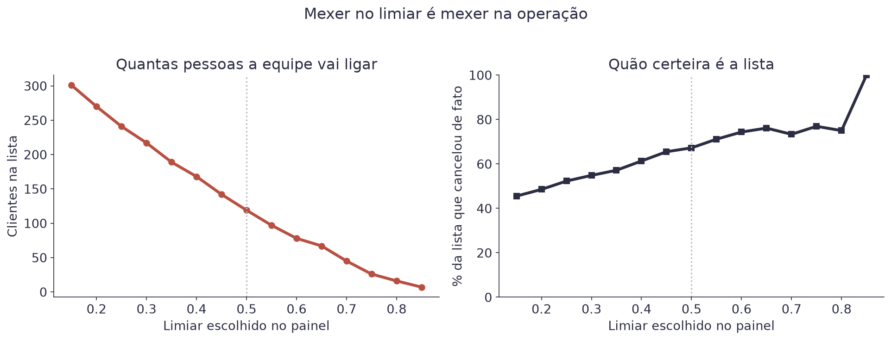
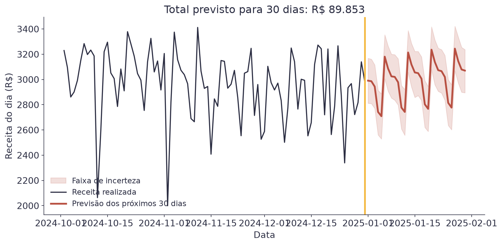
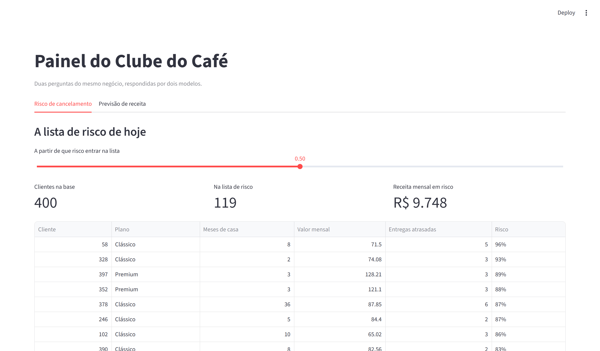
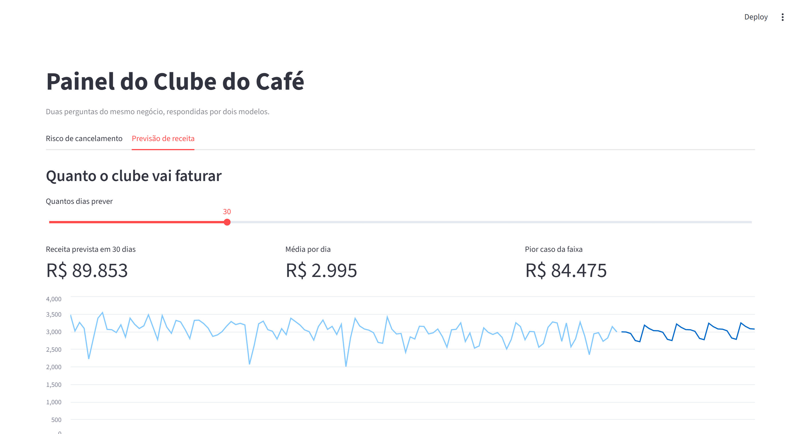

# Aula 6 — Um Sistema de Ponta a Ponta


**O que você leva desta aula**

Você vai construir, do zero, um sistema que junta um classificador e uma
previsão de série temporal numa tela só. Vai rodar tudo na sua máquina, no
VS Code, e sair da aula com um painel funcionando que qualquer pessoa da
empresa conseguiria usar.


## Para que serve

Nas cinco aulas anteriores você treinou modelos em notebooks. O notebook é
ótimo para aprender e para experimentar, mas ninguém entrega um notebook
para a equipe de atendimento.

Um modelo só vira útil quando alguém que não sabe programar consegue fazer
uma pergunta e receber uma resposta. É disso que esta aula trata: o
caminho do modelo até a decisão.

O negócio da vez é o **Clube do Café**, uma assinatura mensal de café em
grãos. Ele tem duas perguntas, e você já sabe responder as duas:

| Pergunta | Modelo | Aula |
|---|---|---|
| Quais assinantes correm risco de cancelar? | Regressão logística | Aula 3 |
| Quanto o clube vai faturar no próximo mês? | Prophet | Aula 5 |

O que muda hoje é o entorno. As duas respostas vão morar na mesma tela, e
a tela vai rodar no seu computador.

## O modelo é uma peça, não o sistema

Esta é a ideia que organiza a aula inteira.

<figure><figcaption>O caminho completo: dos arquivos de dados até a ligação que alguém faz.</figcaption></figure>

Repare que o modelo ocupa uma caixa das quatro. Nos projetos reais essa
proporção se mantém: a maior parte do trabalho está em levar dados até o
modelo e em levar a resposta do modelo até quem decide.

O sistema desta aula tem quatro arquivos, e cada um faz uma coisa só.

| Arquivo | Responsabilidade |
|---|---|
| `dados/clientes.csv` e `dados/vendas.csv` | o que já aconteceu |
| `modelos.py` | carrega, treina e prevê. Não sabe nada de tela |
| `app.py` | desenha a tela. Não sabe nada de modelo |
| `requirements.txt` | as quatro bibliotecas que o sistema usa |

Essa separação não é frescura. Quando a previsão sai errada, você sabe em
que arquivo procurar. Quando a tela precisa de um botão novo, você mexe em
um arquivo só.

## Antes da aula: deixe a máquina pronta

A instalação é a parte mais chata e a mais fácil de resolver com
antecedência. Faça isso antes, com calma.

Você precisa de **Python 3.10 ou mais novo** e do **VS Code**. Para
conferir a versão do Python, abra o terminal e digite `python --version`
(no macOS e no Linux, às vezes é `python3 --version`).

Depois baixe a pasta do sistema, crie o ambiente virtual e instale as
bibliotecas:

```bash
python -m venv .venv
```

No Windows, ative com `.venv\Scripts\activate`. No macOS e no Linux, com
`source .venv/bin/activate`. Deu certo quando aparece `(.venv)` no começo
da linha.

```bash
pip install -r requirements.txt
```

A instalação leva de dois a cinco minutos. O Prophet é o mais demorado.


**Erro do dia**

Rodar `pip install` sem o ambiente virtual ativo, e depois `streamlit`
responder `command not found`. O sintoma é sempre esse, e a causa quase
sempre é a mesma: a linha do terminal não começa com `(.venv)`. Ative o
ambiente e repita. Em aula, esse é o problema número um.


## Os dois modelos, em oito funções

O `modelos.py` inteiro cabe numa tela. Ele tem oito funções curtas, e
nenhuma delas faz mais de uma coisa.

| Função | O que faz |
|---|---|
| `carregar_clientes` | lê o CSV de assinantes |
| `carregar_vendas` | lê o CSV de receita diária |
| `preparar_tabela` | transforma o plano em colunas de 0 e 1 |
| `treinar_classificador` | ajusta a regressão logística |
| `calcular_risco` | devolve a probabilidade de cancelar de cada cliente |
| `risco_de_um_cliente` | faz o mesmo para um cliente digitado na tela |
| `treinar_previsor` | ajusta o Prophet, com a lista de feriados |
| `prever` | devolve a previsão dos próximos dias |

Nada aqui é novo. É o mesmo código das Aulas 3 e 5, agora com nome, guardado
num arquivo em vez de espalhado por células de notebook.

Uma linha merece atenção, porque ela resolve um problema clássico:

```python
tabela = tabela.reindex(columns=modelo.feature_names_in_, fill_value=0)
```

Quando a tela manda um cliente só, o `get_dummies` cria colunas para o
plano daquele cliente, e só. O `reindex` põe as colunas na mesma ordem do
treino e preenche com zero o que faltar. Sem essa linha, o modelo recebe as
colunas trocadas e devolve um número sem sentido.

## O limiar é uma decisão de operação

O classificador devolve uma probabilidade. Quem transforma probabilidade em
lista de ligações é o limiar, e no painel ele é um controle deslizante.

<figure><figcaption>Mexer no limiar muda quantas pessoas a equipe liga, e quão certeira é a lista.</figcaption></figure>

Com os 400 assinantes do Clube do Café:

| Limiar | Clientes na lista | Receita mensal em risco | Da lista, cancelaram de fato |
|---|---|---|---|
| 0,40 | 168 | R$ 13.265 | 61% |
| 0,50 | 119 | R$ 9.748 | 67% |

Suba o limiar e a lista encolhe, mas fica mais certeira. Desça e você
alcança mais gente que ia cancelar, ao custo de ligar para quem ia ficar.

Por isso o limiar mora na tela, e não escondido no código. Quem decide o
tamanho da operação é a pessoa que vai fazer as ligações, não o modelo.

## A previsão que o painel mostra

O segundo modelo é o Prophet da Aula 5, treinado nos 731 dias de receita do
clube, com a lista de feriados.

<figure><figcaption>Trinta dias à frente, com a faixa de incerteza que a Aula 5 ensinou a ler.</figcaption></figure>

O painel resume isso em três números: R$ 89.853 previstos para os próximos
30 dias, R$ 2.995 por dia em média, e R$ 84.475 no pior caso da faixa. O
terceiro é o que interessa para quem vai assumir um compromisso de compra.

## A tela, em seis comandos

O `app.py` usa seis comandos do Streamlit. Seis. É todo o vocabulário que
esta aula precisa.

| Comando | O que faz |
|---|---|
| `st.title` e `st.subheader` | escrevem títulos |
| `st.tabs` | cria as abas |
| `st.slider` e `st.selectbox` | pedem um número e uma opção |
| `st.metric` | mostra um número grande, com rótulo |
| `st.dataframe` | mostra uma tabela |
| `st.line_chart` | desenha um gráfico de linha |

O Streamlit funciona de um jeito diferente do que você talvez espere: toda
vez que alguém mexe num controle, ele **roda o arquivo inteiro de novo**,
de cima para baixo. É isso que faz a tela reagir sem você escrever nada de
interface.

Isso traz um problema óbvio: treinar os dois modelos a cada clique deixaria
o painel lento. A solução é uma linha:

```python
@st.cache_resource
def preparar_sistema():
    ...
```

Com ela, o Streamlit guarda o resultado e só executa a função na primeira
vez. Os cliques seguintes reaproveitam os modelos já treinados.

<figure><figcaption>A primeira aba: a lista de risco de hoje, e um simulador logo abaixo.</figcaption></figure>

<figure><figcaption>A segunda aba: quanto o clube fatura nos próximos dias.</figcaption></figure>

## O que este sistema ainda não é

O painel funciona, mas ele não está pronto para uma empresa depender dele.
Vale saber a diferença.

| O que falta | Por quê |
|---|---|
| Retreinar sozinho | os modelos aprenderam com os dados de hoje. Daqui a três meses, o mundo mudou |
| Guardar o que previu | sem registro, você nunca descobre se as previsões estavam certas |
| Monitorar a entrada | se o CSV chegar com uma coluna a menos, o painel quebra na cara do usuário |
| Rodar em algum lugar | hoje ele roda na sua máquina. Para a equipe usar, precisa de um servidor |
| Controlar quem vê | a lista tem nome de cliente e valor de contrato |

Nenhum desses itens é difícil sozinho. Juntos, eles são a diferença entre
um protótipo e um produto, e é neles que mora a maior parte do trabalho de
quem faz sistemas de dados.

## Explique sem olhar

O teste mais honesto de que você entendeu é tentar explicar sem ler.
Feche esta página e responda em voz alta, como se explicasse para um
colega. Onde travar, é ali que falta entender: volte à seção.

1. Por que o modelo é uma caixa das quatro, e não o sistema inteiro?
2. O que a linha do `reindex` corrige, e o que aconteceria sem ela?
3. Por que o limiar mora na tela, e não no código?

## Cola da aula

| Conceito | O que significa |
|---|---|
| Ambiente virtual (`.venv`) | uma caixa de bibliotecas só deste projeto |
| `requirements.txt` | a lista de bibliotecas, para qualquer máquina repetir |
| Separação de arquivos | `modelos.py` pensa, `app.py` mostra |
| `streamlit run app.py` | o comando que sobe o painel |
| Reexecução | a cada clique, o Streamlit roda o arquivo inteiro de novo |
| `@st.cache_resource` | guarda o modelo treinado entre uma execução e outra |
| Limiar na tela | quem decide o tamanho da operação é quem opera |
| Protótipo x produto | falta retreino, registro, monitoramento e servidor |

## Materiais

- **O roteiro da aula**: [`projeto-aula-06/README.md`](https://github.com/klein-natan/nanodegree-AI-Atitus/blob/main/projeto-aula-06/README.md). Esta é a única aula sem slides: o próprio README do projeto guia a aula inteira, do setup ao último desafio.
- O sistema completo: [`projeto-aula-06/`](https://github.com/klein-natan/nanodegree-AI-Atitus/tree/main/projeto-aula-06)
- **Notebook de apoio, no Google Colab:** [](https://colab.research.google.com/github/klein-natan/nanodegree-AI-Atitus/blob/main/notebooks/aula-06-sistema-ponta-a-ponta.ipynb)
- Dados: [`clube_cafe_clientes.csv`](https://github.com/klein-natan/nanodegree-AI-Atitus/blob/main/data/clube_cafe_clientes.csv) e [`clube_cafe_vendas.csv`](https://github.com/klein-natan/nanodegree-AI-Atitus/blob/main/data/clube_cafe_vendas.csv)

Para baixar o sistema sem instalar o Git, use o botão verde `Code` do
GitHub e escolha `Download ZIP`. Descompacte e abra a pasta
`projeto-aula-06` no VS Code.

## Para ir além

- [Documentação do Streamlit](https://docs.streamlit.io/library/api-reference): a lista completa de comandos, com exemplo de cada um.
- [Streamlit Community Cloud](https://streamlit.io/cloud): publica o painel na internet a partir de um repositório do GitHub, de graça.
- [Primeiros passos com Streamlit](https://docs.streamlit.io/get-started): o tutorial oficial, que constrói um painel do zero em meia hora.
- [Glossário](../glossario.md): para revisar qualquer termo novo desta aula.
